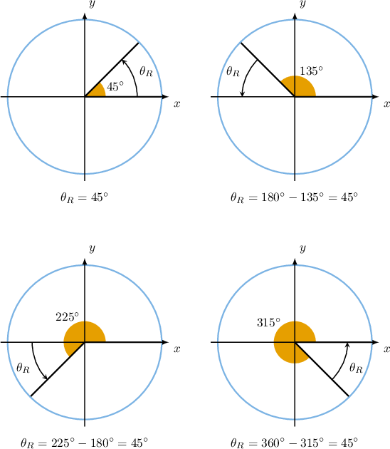
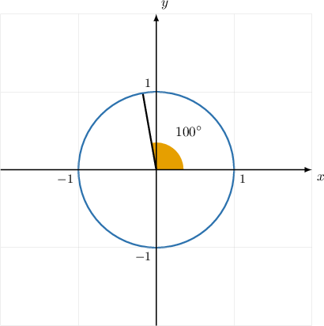
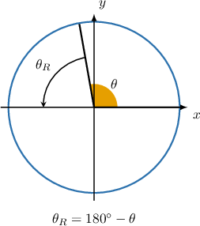
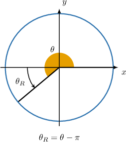
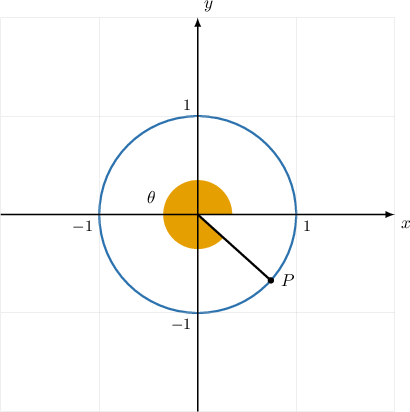
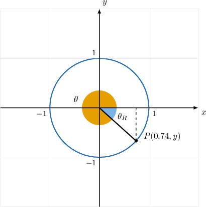
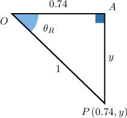
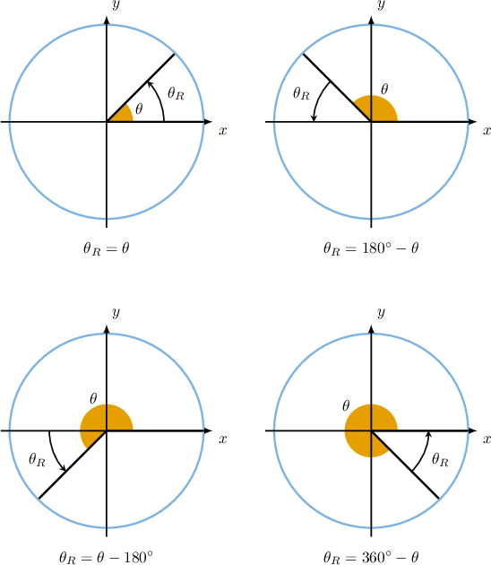

# Calculating Reference Angles

Source: https://www.mathacademy.com/topics/1456?courseId=111
Topic ID: 1456

## Prerequisites

- [Angles in the Coordinate Plane](./1848-angles-in-the-coordinate-plane.md)

## Lesson

### Introduction

Suppose that we have an angle in the coordinate plane positioned in the usual way. Its **reference angle**, denoted is the smallest positive acute angle formed with the -axis.

For example, let's consider the angles and These angles lie in the first, second, third, and fourth quadrants, respectively. And each of these angles has a reference angle as shown below.

**Note:** Any reference angle always lies between and inclusively:

### Example: Calculating a Reference Angle in Degrees

#### Question

The diagram above shows the angle $\theta = 100^\circ$ in the coordinate plane. What is its reference angle $\theta_R?$

#### Explanation

The reference angle, denoted $\theta_R,$ is the angle that $\theta=100^\circ$ makes with the $x$-axis.

Since $\theta$ is in the second quadrant, its reference angle is given by

$$

\begin{aligned}𝜃_{𝑅} & =180^{∘}−𝜃 \\ & =180^{∘}−100^{∘} \\ & =80^{∘}.\end{aligned}

$$

### Example: Calculating a Reference Angle in Radians

#### Question

If the angle $\theta = \dfrac{11\pi}{9}$ is represented in the coordinate plane in the usual way, then what is its reference angle?

#### Explanation

To help us to visualize the angle, we first convert the measure of the angle into degrees.

To convert the measure of an angle in radians to an equivalent measure in degrees, we multiply the measure in radians by $\dfrac{180^\circ}{\pi}.$ This gives

$$

\left(\dfrac{11\pi} {9}\right) \cdot \left(\dfrac {180^\circ} {\pi}\right) = 220^\circ.

$$

Therefore $\dfrac{11\pi} {9}$ is equivalent to $220^\circ,$ which lies in the third quadrant.

The reference angle, denoted $\theta_R,$ is the angle that $\theta$ makes with the $x$-axis.

As $\theta$ is in the third quadrant, its reference angle is given by

$$

\theta_R = \theta - \pi.

$$

Therefore,

$$

\begin{aligned}𝜃_{𝑅} & =\frac{11𝜋}{9}−𝜋=\frac{2𝜋}{9}.\end{aligned}

$$

### Example: Calculating a Reference Angle Given the Coordinates of a Point on the Unit Circle

#### Question

The diagram above shows a unit circle and the angle $\theta$ is measured in the usual way. Given that the $x$-coordinate of the point $P$ is $0.74,$ calculate the reference angle $\theta_R$ in degrees to the nearest integer.

#### Explanation

First, we create a right triangle by drawing a vertical line from $P$ to the $x$-axis.

So we have the following triangle, where $\theta_R$ is the reference angle of $\theta.$

We know that the hypotenuse has a length of $1$ because it is a radius of the unit circle.

Now, using the triangle above, we have

$$

\cos \theta_R = \dfrac{0.74}{1} = 0.74.

$$

Therefore,

$$

\theta_R = \arccos\left(0.74\right) \approx 42^\circ.

$$

### Example: Finding All of the Angles With a Given Reference Angle

#### Question

An angle $\theta$ in the coordinate plane (measured in the usual way) has a reference angle $\theta_R = 30^\circ.$ Which of the following cannot be $\theta?$

1. $30^\circ$

2. $150^\circ$

3. $240^\circ$

4. $330^\circ$

#### Explanation

Let's remind ourselves of the relationship between $\theta_R$ and $\theta.$

Using $\theta_R = 30^\circ,$ let's calculate all possible values of $\theta.$

- If $\theta$ lies in the first quadrant, then

- If $\theta$ lies in the second quadrant, then

- If $\theta$ lies in the third quadrant, then

- If $\theta$ lies in the fourth quadrant, then

Therefore, $\theta$ cannot be equal to $240^\circ.$
