# Graph Transformations of Square Root Functions

Source: https://www.mathacademy.com/topics/1540?courseId=111
Topic ID: 1540

## Prerequisites

- [Graphing the Square Root Function](./2038-graphing-the-square-root-function.md)
- [Combining Reflections With Other Graph Transformations](./2841-combining-reflections-with-other-graph-transformations.md)

## Lesson

### Introduction

The graph of the square root function $y=\sqrt{x}$ is shown below.

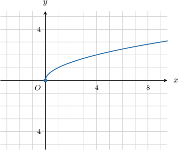

In this lesson, we will learn how to apply graph transformations to the square root function. Let's start by considering translations.

### Vertical and Horizontal Translations

We can move the graph of $y=\sqrt{x}$ up or down by adding or subtracting a number. For example, to obtain the graph of $y=\sqrt{x}-3$ we perform the following transformations:

- Take the graph of $y=\sqrt{x}.$

- Translate the graph **down** by $3$ units to get the graph of $y=\sqrt{x}-3.$

The result is the solid blue curve shown below.

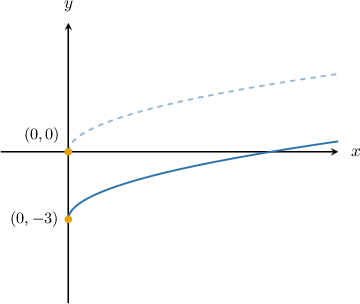

Similarly, we can also move the graph of $y=\sqrt{x}$ to the left or to the right by adding or subtracting a number to the variable $x$ under the square root. For instance, to obtain the graph of $y=\sqrt{x-3},$ we perform the following transformations:

- Take the graph of $y=\sqrt{x}.$

- Translate the graph to the **right** by $3$ units to get the graph of $y=\sqrt{x-3}.$

The result is the solid blue curve shown below.

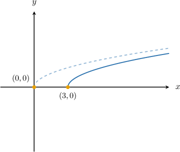

Remember:

- Shifting a function up/down/left/right does *not* change the shape of a graph.

- If $a$ is a positive number, then a transformation of the type $y=f(x\pm a)$ is *counter-intuitive*: $f(x+a)$ moves the graph to the *left* by $a$ units, while $f(x-a)$ moves the graph to the *right* by $a$ units.

### Example: Identifying a Square Root Function Containing One Translation

#### Question

Find the equation that generates the graph shown below.

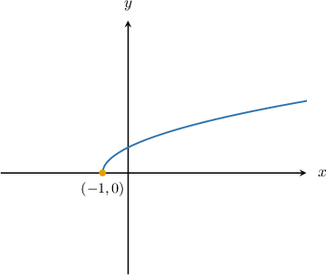

#### Explanation

To obtain the given graph, we perform the following transformations:

- Take the graph of $y=\sqrt{x}.$

- Translate the graph to the left by $1$ unit to get the graph of $y=\sqrt{x+1}.$

The result is the solid blue curve shown below.

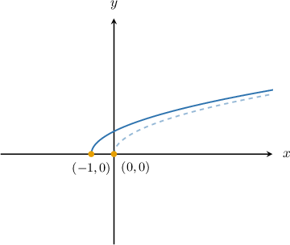

Therefore, the answer is $y=\sqrt{x+1}.$

### Example: Identifying a Square Root Function Containing Two Translations

#### Question

The graph below is a translation of $y=\sqrt{x}.$ Find the equation that generated the graph.

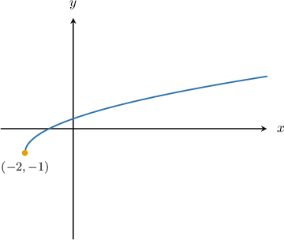

#### Explanation

To obtain the given graph, we can perform the following transformations:

- Take the graph of $y=\sqrt{x}.$

- Translate the graph to the left by $2$ units to get the graph of $y=\sqrt{x+2}.$

- Translate the result down by $1$ unit to get the graph of $y=\sqrt{x+2}-1.$

The result is the solid blue curve shown below.

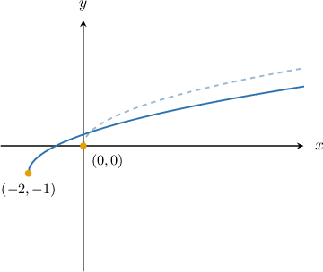

Therefore, the answer is $y=\sqrt{x+2}-1.$

### Reflections

We can reflect the graph of the square root function $y = \sqrt x$ in both the $x$ and $y$-axis.

Multiplying the $\sqrt x$ by $-1$ reflects the curve in the $x$-axis. The graph of $y=-\sqrt x$ is shown below.

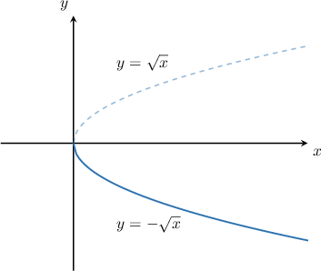

Multiplying the variable $x$ by $-1$ reflects the curve in the $y$-axis. The graph of $y=\sqrt{-x}$ is shown below.

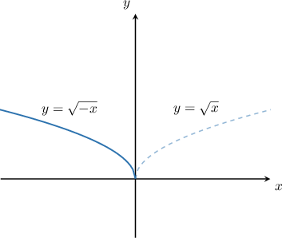

Note that $y=\sqrt{-x}$ is only defined for the negative numbers and zero.

Now, suppose we want to sketch the graph of $y= -\sqrt{x-2}+3.$

To obtain the graph of $y=-\sqrt{x-2},$ we can perform the following transformations:

- Take the graph of $y=\sqrt{x}.$

- Reflect the graph in the $x$-axis to get the graph of $y=-\sqrt{x}.$

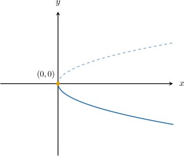

- Translate the result to the right by $2$ units to get the graph of $y=-\sqrt{x-2}.$

- Translate the result up by $3$ units to get the graph of $y=-\sqrt{x-2}+3.$

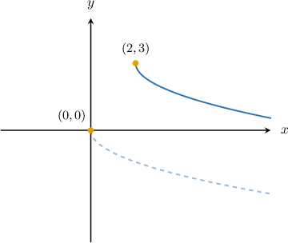

### Example: Graphing a Reflected Square Root Function Containing One Translation

#### Question

Sketch the graph of the function $f(x) =\sqrt{2-x}.$

#### Explanation

First, let's re-write the expression as follows:

$$

y=\sqrt{2-x}=\sqrt{-(x-2)}

$$

To obtain the graph of $y=\sqrt{-(x-2)},$ we can perform the following transformations:

- Take the graph of $y=\sqrt{x}.$

- Reflect the graph in the $y$-axis to get the graph of $y=\sqrt{-x}.$

The result is the solid blue curve shown below.

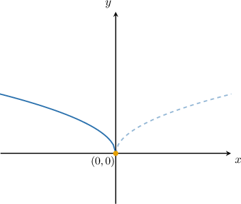

- Translate the result to the right by $2$ units to get the graph of $y=\sqrt{-(x-2)}.$

The result is the solid blue curve shown below.

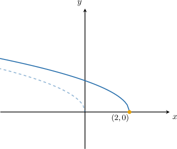

### Example: Graphing a Reflected Square Root Function Containing Two Translations

#### Question

Find the equation that generated the graph below.

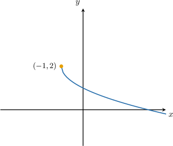

#### Explanation

To obtain the given graph, we can perform the following transformations:

- Take the graph of $y=\sqrt{x}.$

- Reflect the graph in the $x$-axis to get the graph of $y=-\sqrt{x}.$

The result is the solid blue curve shown below.

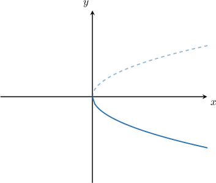

- Translate the result to the left by $1$ unit to get the graph of $y=-\sqrt{x+1}.$

- Translate the result up by $2$ units to get the graph of $y=-\sqrt{x+1}+2.$

The result is the solid blue curve shown below.

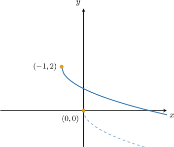

Therefore, the correct answer is $y = -\sqrt{x+1}+2.$
