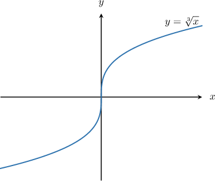
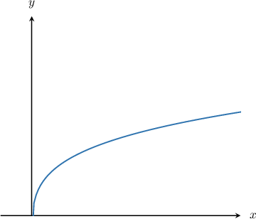
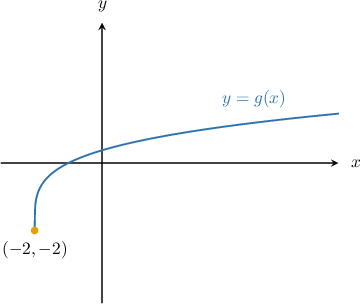
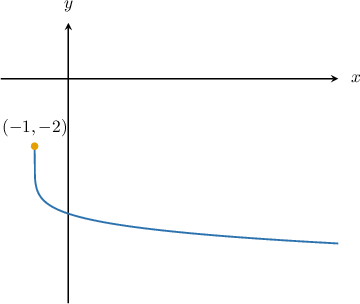

# The Domain of a Transformed Radical Function

Source: https://www.mathacademy.com/topics/1600?courseId=111
Topic ID: 1600

## Prerequisites

- [Graphing the Cube Root Function](./454-graphing-the-cube-root-function.md)
- [Properties of Transformed Square Root Functions](./1875-properties-of-transformed-square-root-functions.md)

## Lesson

### Introduction

In general, the domain of a radical function $f(x)=\sqrt[n]{x}$ depends on whether $n$ (called the **index**) is even or odd.

If $n$ is *odd*, then the domain of $f(x)$ is *always* $x\in (-\infty, \infty).$ For example, the domain of $f(x)= \sqrt[3]{x}$ is $x\in (-\infty, \infty).$

We can see this in the graph below: the function $f(x) = \sqrt[3]{x}$ extends across all values of $x.$

Now, suppose that we want to find the domain of a transformed radical function, such as

$$

g(x)= -\sqrt[3]{-x+2}.

$$

The domain of $\sqrt[3]{x}$ is $x\in (-\infty, \infty),$ and graph transformations will not change this interval. Therefore, we conclude that the domain of $g(x)$ is also $x \in (-\infty,\infty).$

### Example: Finding the Domain of a Transformed Radical Function With an Odd Index

#### Question

Find the domain of $f(x) = -4\sqrt[9]{-x-5} +10.$

#### Explanation

The domain of $y = \sqrt[9]{x}$ is $x \in (-\infty,\infty).$

Transformations do not change this interval. Therefore, the domain of $f(x)$ is $x \in (-\infty,\infty).$

### The Domain of a Radical Function With an Even Index

Let's go back to considering $f(x)=\sqrt[n]{x}.$

If $n$ is *even*, then the domain of $f(x)$ is *always* $x\in [0, \infty).$ For example, the domain of $f(x)= \sqrt[4]{x}\,$ is $x\in [0, \infty).$

We can see this in the graph below: the function $f(x) = \sqrt[4]{x}$ starts at $x=0$ and extends forever to the right.

Notice how similar this looks to the square root function! All curves of the form $y=\sqrt[n]{x}$ for even $n$ have this shape.

Now let's consider the function

$$

g(x)= 3\sqrt[4]{x+2} -2.

$$

To find the domain of $g(x) = 3\sqrt[4]{x+2} -2,$ we proceed in exactly the same way as with square roots: we set the expression under the radical sign to be greater than or equal to zero. This gives

$$

x+2 \ge 0.

$$

Solving this inequality, we get

$$

\begin{aligned}𝑥 & ≥−2.\end{aligned}

$$

Therefore, the domain of $y = g(x)$ is $x \in [-2, \infty).$

We can also see that this is true from the graph of the function. The graph of $y=g(x)$ is shown below.

In general, to find the domain of a radical function of the form $y = \sqrt[n]{f(x)},$ where $n$ is an even integer, we need to solve the inequality $f(x) \geq 0.$

### Example: Finding the Domain of a Transformed Radical Function With an Even Index

#### Question

Find the domain of $g(x) = -2\sqrt[6]{x+1}-2.$

#### Explanation

The domain of $y = \sqrt[6]{x}$ is

$$

x \ge 0.

$$

To find the domain of $g(x) = -2\sqrt[6]{x+1}-2,$ we replace $x$ with $x+1$ in the above inequality. This gives

$$

{x+1} \ge 0.

$$

Solving this inequality, we get

$$

\begin{aligned}𝑥+1 & ≥0 \\ 𝑥 & ≥−1\end{aligned}

$$

Therefore, the domain of $y = g(x)$ is $x \in [-1, \infty).$

We can also see that this is true from the graph of the function. The graph of $y=g(x)$ is shown below.

