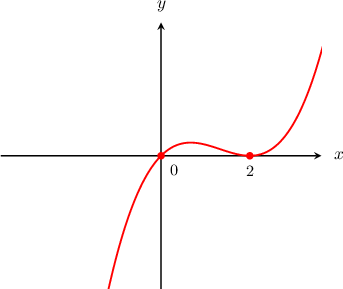
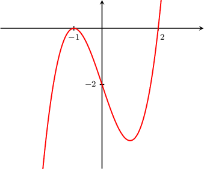
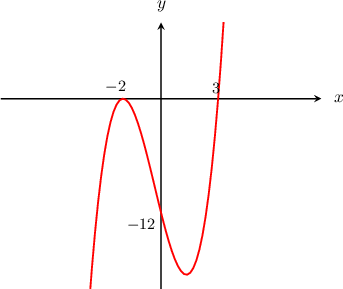
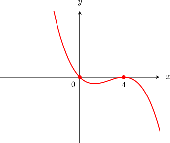
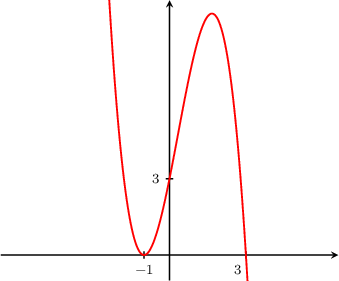
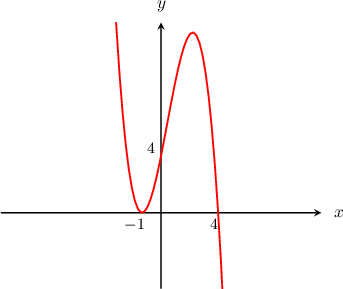

# Graphing Cubic Curves Containing a Double Root

Source: https://www.mathacademy.com/topics/1656?courseId=111
Topic ID: 1656

## Prerequisites

- [Multiplicities of the Roots of Polynomials](./88-multiplicities-of-the-roots-of-polynomials.md)
- [Graphing Cubic Curves Containing Three Distinct Real Roots](./1654-graphing-cubic-curves-containing-three-distinct-real-roots.md)

## Lesson

### Introduction

The graph of any cubic function $y = f(x)= ax^3 + bx^2 + cx +d,$ where $a >0,$ has a characteristic inverted ${\textsf{S}}$-shape, with $y$-values ranging from $-\infty$ to $+\infty.$ This means that every such function has *at least* one real root and *at most* three distinct roots.

For instance, suppose that we want to plot the graph of $y = x^3-4x^2 +4x.$ First, we need to find the roots, so we set $y=0$ and solve:

$$

\begin{aligned}𝑥^{3}−4𝑥^{2}+4𝑥 & =0 \\ 𝑥(𝑥^{2}−4𝑥+4) & =0 \\ 𝑥(𝑥−2)^{2} & =0\end{aligned}

$$

By the zero-product rule, we get two distinct roots: $x=0$ and $x=2.$

- The root $x=0$ is a *single* root: it has multiplicity ${\color{blue}1}$ because it comes from a factor $x^{\color{blue}1}$ whose exponent is ${\color{blue}1}.$

- The root $x=2$ is a *double* root: it has multiplicity ${\color{blue}2}$ because it comes from a factor $(x-2)^{\color{blue}2}$ whose exponent is ${\color{blue}2}.$

To graph the curve, we use the following principles:

- The curve passes through the $x$-axis at the single root (in this case, $x=0$).

- The curve touches the $x$-axis and turns around at the double root (in this case, $x=2$).

Because the leading coefficient is positive, the graph takes an inverted ${\textsf{S}}$-shape. Therefore, the graph looks as follows:

### Example: Graphing a Factored Cubic Curve with a Positive Leading Coefficient

#### Question

Graph the curve corresponding to the equation $y=f(x)$ where $f(x)=(x-2)(x+1)^2.$

#### Explanation

The equation is already in factored form, so by the zero-product rule, we deduce that it has a single root at $x=2$ and a double root at $x=-1.$

We also find the $y$-intercept of the curve by substituting the value $x=0$ into the equation:

$$

\begin{aligned}𝑦 & =(0−2)(0+1)^{2} \\ & =(−2)(1)^{2} \\ & =−2\end{aligned}

$$

So, the curve

- intercepts the $y$-axis at the point $(0,-2),$

- passes through the $x$-axis at the single root $x=2,$ and

- touches the $x$-axis and turns around at the double root $x=-1.$

Because the leading coefficient is positive, the graph takes an inverted ${\textsf{S}}$-shape. Therefore, the graph looks as follows:

### Example: Graphing an Expanded Cubic Curve with a Positive Leading Coefficient

#### Question

Given that $(x-3)$ is a factor of $f(x)=x^3+x^2-8x-12,$ graph the curve $y=f(x).$

#### Explanation

First, we need to factor the polynomial. We are told that $(x-3)$ is a factor of $f(x),$ so $(x-3)$ divides $f(x).$ To begin factoring $f(x),$ we can divide it by $(x-3)$ using synthetic division:

$$

\begin{aligned} & 𝑥^{3} & 𝑥^{2} & 𝑥^{1} & 𝑥^{0} \\ 3 & 1 & 1 & −8 & −12 \\ & & 3 & 12 & 12 \\ & 1 & 4 & 4 & 0\end{aligned}

$$

Therefore,

$$

\begin{aligned}\frac{𝑓(𝑥)}{𝑥−3} & =𝑥^{2}+4𝑥+4 \\ 𝑓(𝑥) & =(𝑥−3)(𝑥^{2}+4𝑥+4).\end{aligned}

$$

We can factor the quadratic factor even further, and get

$$

f(x) = (x-3)(x+2)^2.

$$

Now that we have the cubic in factored form, we can tell that it has a single root at $x=3$ and a double root at $x=-2.$

We also find the $y$-intercept of the curve by substituting the value $x=0$ into the equation:

$$

\begin{aligned}𝑦 & =(0−3)(0+2)^{2} \\ & =(−3)(2)^{2} \\ & =−12.\end{aligned}

$$

So, the curve

- intercepts the $y$-axis at $(0,-12),$

- passes through the $x$-axis at the single root $x=3,$ and

- touches the $x$-axis and turns around at the double root $x=-2.$

Because the leading coefficient is positive, the graph takes an inverted ${\textsf{S}}$-shape. Therefore, the graph looks as follows:

### Negative Cubic Curves With a Double Root

The graph of any cubic function $y = f(x)= ax^3 + bx^2 + cx +d,$ where $a <0,$ has a characteristic ${\textsf{S}}$-shape, with $y$-values ranging from $+\infty$ to $-\infty.$

For instance, suppose that we want to plot the graph of $y = -x^3+8x^2-16x.$ Then we set $y=0$ to find the roots as follows:

$$

\begin{aligned}−𝑥^{3}+8𝑥^{2}−16𝑥 & =0 \\ −𝑥(𝑥^{2}−8𝑥+16) & =0 \\ −𝑥(𝑥−4)^{2} & =0\end{aligned}

$$

By the zero-product rule, we get two distinct roots: $x=0$ and $x=4,$ where $x=0$ is a single root and $x=4$ is a double root.

To graph the curve, we use the following principles:

- The curve passes through the $x$-axis at the single root (in this case, $x=0$).

- The curve touches the $x$-axis and turns around at the double root (in this case, $x=4$).

Because the leading coefficient is negative, the graph takes an ${\textsf{S}}$-shape. Therefore, the graph looks as follows:

### Example: Graphing a Factored Cubic Curve with a Negative Leading Coefficient

#### Question

Graph the curve corresponding to the equation $y=f(x)$ where $f(x)=(3-x)(x+1)^2.$

#### Explanation

The equation is already in factored form, so by the zero-product rule, we deduce that it has a single root at $x=3$ and a double root at $x=-1.$

We also find the $y$-intercept of the curve by substituting the value $x=0$ into the equation:

$$

\begin{aligned}𝑦 & =(3−0)(0+1)^{2} \\ & =(3)(1)^{2} \\ & =3\end{aligned}

$$

So, the curve

- intercepts the $y$-axis at the point $(0,3),$

- passes through the $x$-axis at the single root $x=3,$ and

- touches the $x$-axis and turns around at the double root $x=-1.$

Notice that the leading coefficient is **. If we were to expand the parentheses, we'd get the following:

$$

\begin{aligned}𝑓(𝑥) & =(3−𝑥)(𝑥+1)^{2} \\ & =−𝑥^{3}+𝑥^{2}+⋯\end{aligned}

$$

Because the leading coefficient is negative, the graph takes an ${\textsf{S}}$-shape. Therefore, the graph looks as follows:

### Example: Graphing an Expanded Cubic Curve with a Negative Leading Coefficient

#### Question

Given that $(x-4)$ is a factor of $f(x)=-x^3 + 2x^2 + 7x + 4,$ graph the curve $y=f(x).$

#### Explanation

First, we need to factor the polynomial. We are told that $(x-4)$ is a factor of $f(x),$ so $(x-4)$ divides $f(x).$ To begin factoring $f(x),$ we can divide it by $(x-4)$ using synthetic division:

$$

\begin{aligned} & 𝑥^{3} & 𝑥^{2} & 𝑥^{1} & 𝑥^{0} \\ 4 & −1 & 2 & 7 & 4 \\ & & −4 & −8 & −4 \\ & −1 & −2 & −1 & 0\end{aligned}

$$

Therefore,

$$

\begin{aligned}\frac{𝑓(𝑥)}{𝑥−4} & =−𝑥^{2}−2𝑥−1 \\ \frac{𝑓(𝑥)}{𝑥−4} & =−(𝑥^{2}+2𝑥+1) \\ 𝑓(𝑥) & =−(𝑥−4)(𝑥^{2}+2𝑥+1).\end{aligned}

$$

We can factor the quadratic factor even further, and get

$$

f(x) = - (x-4)(x+1)^2.

$$

Now that we have the cubic in factored form, we can tell that it has a single root at $x=4$ and a double root at $x=-1.$

We also find the $y$-intercept of the curve by substituting the value $x=0$ into the equation:

$$

\begin{aligned}𝑦 & =−(0−4)(0+1)^{2} \\ & =−(−4)(1)^{2} \\ & =4.\end{aligned}

$$

So, the curve

- intercepts the $y$-axis at $(0,4),$

- passes through the $x$-axis at the single root $x=4,$ and

- touches the $x$-axis and turns around at the double root $x=-1.$

Because the leading coefficient is negative, the graph takes an ${\textsf{S}}$-shape. Therefore, the graph looks as follows:

