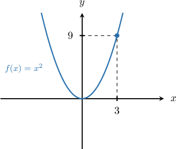
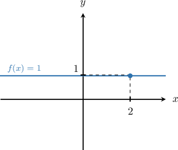
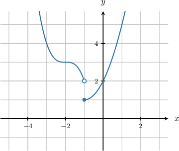
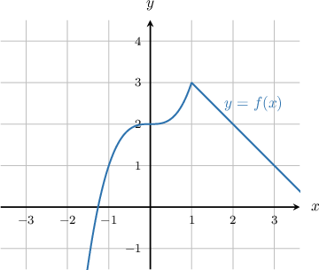

# Limits of Power Functions, and the Constant Rule for Limits

Source: https://www.mathacademy.com/topics/1716?courseId=111
Topic ID: 1716

## Prerequisites

- [Finding the Existence of a Limit Using One-Sided Limits](./625-finding-the-existence-of-a-limit-using-one-sided-limits.md)

## Lesson

### Introduction

For any power function $f(x) = x^n,$ we can compute the limit $\lim\limits_{x \to a} x^n$ by substituting $x=a$ directly into the limit:

$$

\lim\limits_{x \to a} x^n = a^n \, .

$$

For example, to compute $\lim\limits_{x \to 3} x^2,$ we can substitute $x=3$ directly into the limit:

$$

\lim\limits_{x \to 3} x^2 = 3^2 = 9 \, .

$$

We can verify this result by graphing the function $f(x)=x^2$ and checking the left and right-sided limits.

Looking at the graph, we compute the left and right-sided limits:

- Left-sided limit: $\hspace{.25cm} \lim\limits_{x \to 3^-} x^2 = 9$

- Right-sided limit: $\hspace{.25cm} \lim\limits_{x \to 3^+} x^2 = 9$

Since the left and right-sided limits both evaluate to $9,$ we conclude that $\lim\limits_{x \to 3} x^2 = 9 \,.$

### Example: Computing a Limit Using Direct Substitution

#### Question

Find $\lim_\limits{x\rightarrow (-1/2)} x^3.$

#### Explanation

Substituting $x=-\dfrac{1}{2}$ directly into the limit, we find

$$

\begin{aligned}\underset{𝑥→(−1/2)}{lim}𝑥^{3} & =(−\,\frac{1}{2})^{3} \\ & =−\,\frac{1}{2^{3}} \\ & =−\,\frac{1}{8}.\end{aligned}

$$

### The Limit of a Constant Function

For any constant function $f(x)=c,$ the limit $\lim_\limits{x\rightarrow a} c$ will match the value of the constant:

$$

\lim_\limits{x\rightarrow a} c=c \,.

$$

For example, the limit $\lim_\limits{x\rightarrow 2} 1$ is just the value of the constant, $1\mathbin{:}$

$$

\lim_\limits{x\rightarrow 2} 1 = 1

$$

We can verify this result by graphing the function $f(x) = 1.$

Looking at the graph, we compute the left and right-sided limits:

- Left-sided limit: $\hspace{.25cm} \lim\limits_{x \to 2^-} 1 = 1$

- Right-sided limit: $\hspace{.25cm} \lim\limits_{x \to 2^+} 1 = 1$

Since the left and right-sided limits both evaluate to $1,$ we conclude that $\lim\limits_{x \to 2} 1 = 1 \,.$

### Example: Computing the Limit of a Constant Function

#### Question

Evaluate $\lim_\limits{x\,\rightarrow \,-4} \sqrt{7}.$

#### Explanation

As $x$ approaches $-4,$ the function $f(x)=\sqrt 7$ remains equal to $\sqrt{7}.$ Therefore, we have

$$

\lim_\limits{x\,\rightarrow\, -4} \sqrt{7}=\sqrt{7}.

$$

### The Constant Rule for Limits

The **constant rule for limits** states that if $c$ is a constant, and $\lim_\limits{x\rightarrow a}f(x)=L,$ then

$$

\lim_\limits{x\rightarrow a}c\cdot f(x) = c\cdot \lim_\limits{x\rightarrow a}f(x)=c\cdot L .

$$

For example, to compute $\lim_\limits{x\rightarrow 2}5x^3,$ we just factor the constant $5$ out of the limit and then substitute:

$$

\begin{aligned} \lim_\limits{x\rightarrow 2}{\color{blue}5}x^3 &= {\color{blue}5} \lim_\limits{x\rightarrow 2}x^3 \\\[5pt] &= {\color{blue}5}\cdot 2^3 \\\[5pt] &= 40 \end{aligned}

$$

Similarly, consider the graph of the function $y=f(x)$ below. Suppose we know that $\displaystyle{\lim_{x \rightarrow \,1} cf(x) = 10},$ where $c$ is a real constant. Let's find the value of $c.$

From the figure above, we get that $\displaystyle{\lim_{x \rightarrow \, 1} f(x)} = 5.$ Therefore,

$$

\begin{aligned}\underset{𝑥→\,1}{lim}𝑐𝑓(𝑥) & =10 \\ 𝑐⋅\underset{𝑥→\,1}{lim}𝑓(𝑥) & =10 \\ 𝑐⋅5 & =10 \\ 𝑐 & =2.\end{aligned}

$$

### Example: Using the Constant Rule to Compute a Limit Algebraically

#### Question

Given that $\displaystyle \lim_{y\rightarrow \sqrt{7}/2} Cy^2=14,$ where $C$ is a real constant, what is the value of $C?$

#### Explanation

We factor the constant out of the limit and evaluate the remaining limit, as follows:

$$

\begin{aligned} \displaystyle \lim_{y\rightarrow \sqrt{7}/2} Cy^2&=14\\C\cdot\displaystyle \lim_{y\rightarrow \sqrt{7}/2} y^2&=14\\C\left(\dfrac{\sqrt{7}}{2}\right)^2&=14\\\dfrac{7C}{4}&=14\\C&=8 \end{aligned}

$$

### Example: Using the Constant Rule to Compute the Limit of a Function Given a Graph

#### Question

The figure below shows the graph of $y=f(x).$ Evaluate $\lim_\limits{x \rightarrow \,0} \Bigl(-2.5f(x)\Bigr).$

#### Explanation

From the graph we get that $\lim_\limits{x\to 0}f(x)=2.$ Therefore,

$$

\begin{aligned}\underset{𝑥→\,0}{lim}(−2.5𝑓(𝑥)) & =(−2.5)⋅\underset{𝑥→0}{lim}𝑓(𝑥) \\ & =(−2.5)⋅2 \\ & =−5.\end{aligned}

$$
