# Dilations of Geometric Figures

Source: https://www.mathacademy.com/topics/2216?courseId=111
Topic ID: 2216

## Prerequisites

- [Measures of Segments](../grade-7/1379-measures-of-segments.md)
- [Translations of Geometric Figures](./1516-translations-of-geometric-figures.md)

## Lesson

### Introduction

Consider the polygon $\mathcal{P}$ below. How can we construct a polygon with the same shape as $\mathcal{P}$ but whose side lengths are twice those of $\mathcal{P}?$

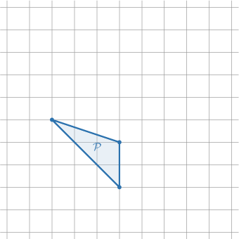

First, we pick a random point $O$ in the plane. Then, we draw three line segments that connect the point $O$ with the vertices of our polygon.

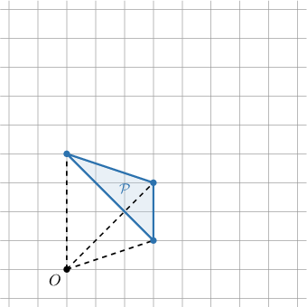

Next, we increase the length of each segment by a factor of $2.$ Notice that each segment should have $O$ as one of its endpoints.

Finally, we connect the endpoints of the enlarged segments using edges, and we obtain a new polygon $\mathcal P'.$

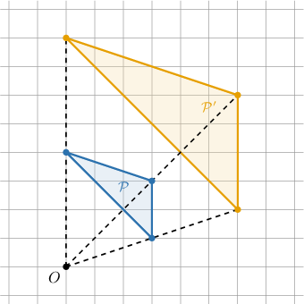

The new polygon $\mathcal{P}'$ has the same shape as $\mathcal{P},$ but each side has a length that is twice as long as the corresponding side length of $\mathcal P.$

The transformation we just applied is called an **enlargement** with center $O$ and scale factor $k=2.$

For an enlargement, we must have $|k| > 1.$ We can split this into two cases:

- If $k$ is positive, then the original polygon $\mathcal P$ and its image $\mathcal P'$ lie in the same direction from $O.$

- If $k$ is negative, then the original polygon $\mathcal P$ and its image $\mathcal P'$ lie in the opposite directions from $O.$

We will first explore the case where $k$ is positive. The cases when $k$ is negative will be dealt with toward the end of the lesson.

### Example: Finding the Scale Factor of an Enlargement

#### Question

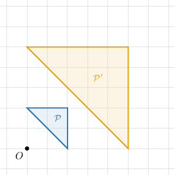

The polygon $\mathcal{P}'$ is the image of the polygon $\mathcal{P}$ under an enlargement with center $O.$ What is the scale factor of the enlargement?

#### Explanation

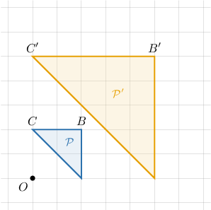

Notice that, in the diagram above, we have that

$$

\dfrac{B'C'}{BC} = \dfrac52 ,

$$

and the same proportion holds for the other corresponding sides too. As a result, the absolute value of the scale factor $k$ is

$$

|k|=\dfrac52.

$$

Since the points $B$ and $B'$ lie in the same direction from $O$, the scale factor $k$ is positive. Therefore, $k=\dfrac52.$

### Contractions

Consider the polygon $\mathcal{P}$ below. How can we construct a polygon with the same shape as $\mathcal{P}$ but whose side lengths are half those of $\mathcal{P}?$

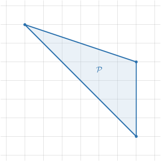

First, we pick a random point $O$ in the plane. Then, we draw three line segments that connect the point $O$ to the vertices of our polygon.

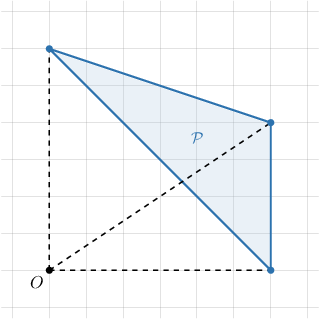

Notice that point $O$ is a common endpoint to all three segments.

Next, we scale the length of each line segment by a factor of $\dfrac 12,$ ensuring that $O$ is an endpoint of each of our new segments.

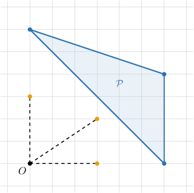

Finally, we connect the endpoints of the new segments to obtain a new polygon.

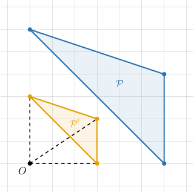

The new polygon $\mathcal{P}'$ has the same shape as $\mathcal{P},$ but its lengths are $\dfrac{1}{2}$ times those of $\mathcal P.$

The transformation we just applied is called a **contraction** with center $O$ and scale factor $k=\dfrac 12.$

For a contraction, we must have $|k| < 1.$ Again, we can split this into two cases:

- If $k$ is positive, then the original polygon $\mathcal P$ and its image $\mathcal P'$ lie in the same direction from $O.$

- If $k$ is negative, then the original polygon $\mathcal P$ and its image $\mathcal P'$ lie in the opposite directions from $O.$

Again, we'll first concern ourselves with positive $k$ only.

Finally, we use the term **dilation** to refer to both enlargements and contractions.

### Example: Finding the Scale Factor of a Contraction

#### Question

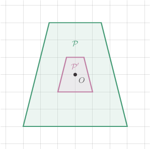

The polygon $\mathcal{P}'$ is the image of the polygon $\mathcal{P}$ under a dilation with center $O.$ What is the scale factor of the dilation?

#### Explanation

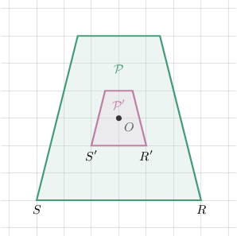

Notice that, in the diagram above, we have that

$$

\dfrac{R'S'}{RS} = \dfrac{2}{6} = \dfrac 13,

$$

and the same proportion holds for the other corresponding sides too. As a result, the absolute value of the scale factor $k$ is

$$

|k|=\dfrac{1}{3}.

$$

Since the points $S$ and $S'$ lie in the same direction from $O$, the scale factor $k$ is positive. Therefore, $k=\dfrac{1}{3}.$

### Negative Scale Factors

So far, we have only considered dilations where the scale factor $k > 0.$ But what happens if the scale factor is negative?

For example, let's dilate the polygon $\mathcal P$ below using a scale factor $k=-2.$

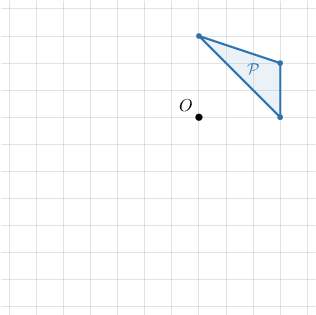

As usual, we draw three line segments that connect the point $O$ with the vertices of our polygon.

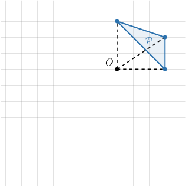

As always, our segments have one common endpoint, the point $O.$

Next, we flip the three line segments over the point $O$ and increase the length of each segment by a factor of $|{-2}|=2,$ keeping the point $O$ fixed.

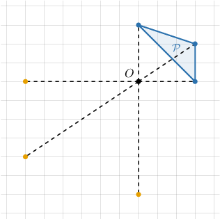

Finally, we connect the endpoints of the dilated segments by edges and obtain a new polygon, as shown below.

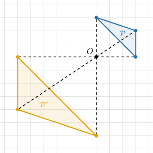

The new polygon $\mathcal{P}'$ has the same shape as $\mathcal{P}$ but its lengths are twice the size of $\mathcal P$ *and* it lies in the opposite direction from $O.$

Also, the new polygon has been "flipped over." Notice that

- the rightmost edge of $\mathcal{P}$ maps to the leftmost edge of $\mathcal{P'},$

- the top edge of $\mathcal{P}$ maps to the bottom edge of $\mathcal{P'},$

and so on.

### Example: Finding a Negative Scale Factor for a Dilation

#### Question

The polygon $\mathcal{P}'$ is the image of the polygon $\mathcal{P}$ under a dilation with center $O.$ What is the scale factor of the dilation?

#### Explanation

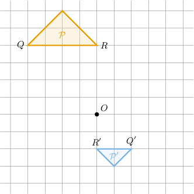

Notice that, in the diagram above, we have that

$$

\dfrac{Q'R'}{QR} = \dfrac{2}{4}= \dfrac{1}{2},

$$

and the same proportion holds for the other corresponding sides too. As a result, the absolute value of the scale factor $k$ is

$$

|k|=\dfrac{1}{2}.

$$

Since points $R$ and $R'$ lie in opposite directions from $O$, the scale factor $k$ is negative. Therefore, $k=-\dfrac{1}{2}.$

### Example: Finding the Center of a Dilation

#### Question

One of the polygons below is the image of the other polygon under a dilation. Which of the points shown is the center of the dilation?

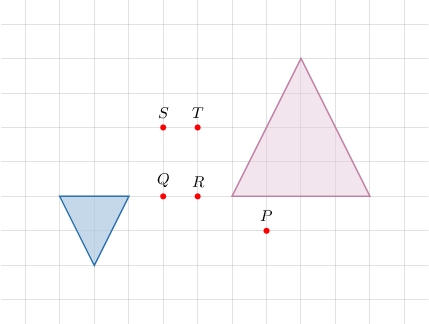

#### Explanation

First of all, notice that our figures have opposite orientations, which means that the scale factor of the dilation is negative.

The center of a dilation lies on any line which passes through a point and its image.

Therefore, the center of our dilation can be found as, for example, the point of intersection of the lines $\overset{\longleftrightarrow}{BB'}$ and $\overset{\longleftrightarrow}{CC'},$ as shown below.

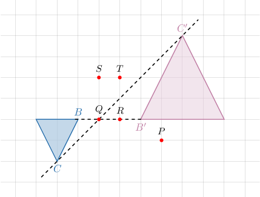

Therefore, the center of the dilation is the point $Q.$
