# Reflections of Figures Across Arbitrary Lines

Source: https://www.mathacademy.com/topics/3535?courseId=111
Topic ID: 3535

## Prerequisites

- [Horizontal and Vertical Lines](../grade-8/97-horizontal-and-vertical-lines.md)
- [Reflections of Geometric Figures in the Cartesian Plane](./1518-reflections-of-geometric-figures-in-the-cartesian-plane.md)

## Lesson

### Introduction

We can reflect an object in any line. Consider the diagram below. The two polygons are the mirror images of each other in the line $l.$

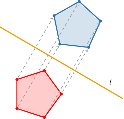

If we want to reflect the quadrilateral $ABCD$ below in the line $l,$ we can reflect each vertex separately and then draw the segments between the resulting corresponding vertices.

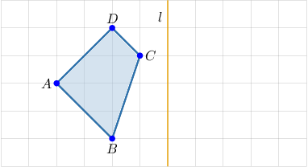

Let's start by reflecting the point $A.$ To do this, we need to plot a new point $A'$ on the opposite side of $l$ at an equal distance away from $l$ as the original point $A.$

The original point $A$ is $4$ units to the left of $l,$ so we need to plot the new point $A'$ at a distance of $4$ units to the right of $l.$

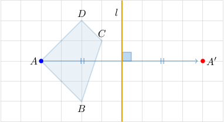

Now let's reflect other vertices of the quadrilateral in the same way:

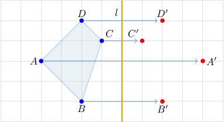

Finally, we draw segments between the reflected vertices.

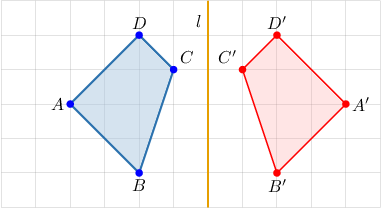

### Example: Reflecting a Geometric Figure

#### Question

Reflect the figure shown below across the line $l.$

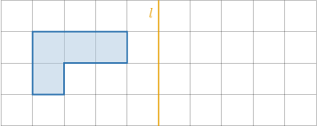

#### Explanation

To reflect a polygon across a line, we

- reflect the vertices of the polygon, and then

- draw the edges connecting the reflected vertices.

Therefore, reflecting our polygon across the line $l$, we obtain the following result:

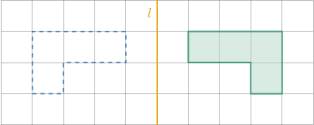

### Identifying the Line of Reflection

If we're given two points, we can find the line of reflection that maps one point onto another by finding the perpendicular bisector of the segment joining the two points.

For example, suppose that the line $l$ reflects the point $A$ onto $A'$ below. How can we find the equation of $l?$

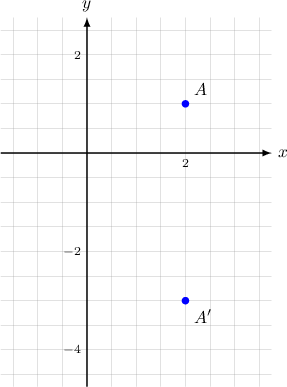

The line $l$ is the perpendicular bisector of the line segment $\overline{AA'}.$ So, the line of reflection is $y=-1.$

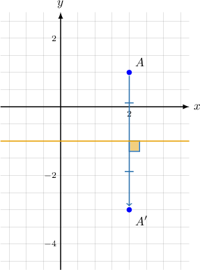

### Example: Identifying the Line of Reflection

#### Question

The triangle $\mathcal{T}$ is mapped to the triangle $\mathcal{T'}$ under the action of a reflection. What is the equation of the line of reflection?

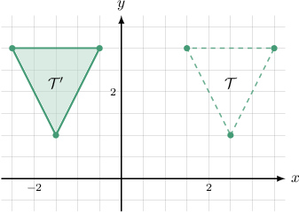

#### Explanation

The line of reflection is the perpendicular bisector of the segments joining each point to its image.

Therefore, the line of reflection is $x = \dfrac{1}{2},$ as shown below.

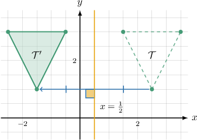
