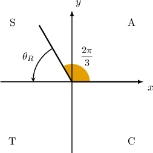
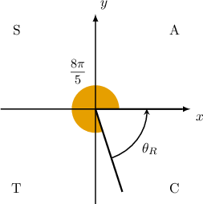
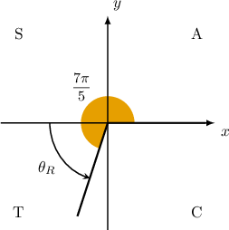
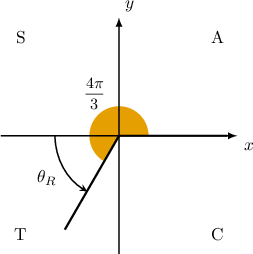
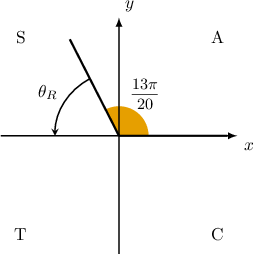

# Extending the Trigonometric Ratios Using Angles in Radians

Source: https://www.mathacademy.com/topics/4037?courseId=111
Topic ID: 4037

## Prerequisites

- [Extending the Trigonometric Ratios Using the Unit Circle](./204-extending-the-trigonometric-ratios-using-the-unit-circle.md)

## Lesson

### Introduction

When drawing angles expressed in radians, it can be helpful to convert the angle to degrees first. This is especially helpful when writing trigonometric ratios in terms of reference angles, as we usually need to determine which quadrant the angle lies in.

Let's express the following trigonometric ratio in terms of a reference angle:

$$

\sin\left(\dfrac{2\pi}{3}\right)

$$

You might find it tricky to visualize this angle straight off the bat. So, let's start by converting the angle measure into degrees.

To convert the measure of an angle in radians to an equivalent measure in degrees, we multiply the measure in radians by $\dfrac{180^\circ}{\pi}.$ This gives

$$

\left(\dfrac{2\pi}{3}\right) \cdot \left(\dfrac {180^\circ} {\pi}\right) = 120^\circ.

$$

Therefore $\dfrac{2\pi}{3}$ is equivalent to $120^\circ,$ which lies in the $2$nd quadrant.

Now, to express $\sin\left(\dfrac{2\pi}{3}\right)$ in terms of $\sin\theta_R,$ we follow three steps:

1. Find its reference angle $\theta_R.$

2. Calculate the value of the function for $\theta_R.$

3. Determine whether the resulting value is positive or negative.

**Step 1**: Since $\theta = \dfrac{2\pi}{3}$ is in the $2$nd quadrant, the reference angle $\theta_R$ is

$$

\begin{aligned}𝜃_{𝑅} & =𝜋−𝜃 \\ & =𝜋−\frac{2𝜋}{3} \\ & =\frac{3𝜋}{3}−\frac{2𝜋}{3} \\ & =\frac{𝜋}{3}.\end{aligned}

$$

**Step 2**: The given ratio is $\sin\left(\dfrac{2\pi}{3}\right)$, and therefore we're interested in $\sin\theta_R = \sin\left(\dfrac{\pi}{3}\right).$

**Step 3:** The ratio $\sin\left(\dfrac{2\pi}{3}\right)$ must be *positive* because the sine ratio is *always* positive in the $2$nd quadrant. Therefore,

$$

\sin\left(\dfrac{2\pi}{3}\right) = \sin\left(\dfrac{\pi}{3}\right).

$$

And we're done!

Let's see another example.

### Example: Expressing the Sine of an Angle in Terms of a Reference Angle in Radians

#### Question

Express $\sin\left(\dfrac{8\pi}{5}\right)$ in terms of a reference angle.

#### Explanation

To help us to visualize the angle, we first convert the measure of the angle into degrees.

To convert the measure of an angle in radians to an equivalent measure in degrees, we multiply the measure in radians by $\dfrac{180^\circ}{\pi}.$ This gives

$$

\left(\dfrac{8\pi}{5}\right) \cdot \left(\dfrac {180^\circ} {\pi}\right) = 288^\circ.

$$

Therefore $\dfrac{8\pi}{5}$ is equivalent to $288^\circ,$ which lies in the $4$th quadrant.

To express $\sin\left(\dfrac{8\pi}{5}\right)$ in terms of $\sin\theta_R,$ we follow three steps:

1. Find its reference angle $\theta_R.$

2. Calculate the value of the function for $\theta_R.$

3. Determine whether the resulting value is positive or negative.

****: Since $\theta = \dfrac{8\pi}{5}$ is in the $4$th quadrant, the reference angle $\theta_R$ is

$$

\begin{aligned}𝜃_{𝑅} & =2𝜋−𝜃 \\ & =2𝜋−\frac{8𝜋}{5} \\ & =\frac{10𝜋}{5}−\frac{8𝜋}{5} \\ & =\frac{2𝜋}{5}.\end{aligned}

$$

****: The given ratio is $\sin\left(\dfrac{8\pi}{5}\right)$, and therefore we're interested in $\sin\theta_R = \sin\left(\dfrac{2\pi}{5}\right).$

**** The ratio $\sin\left(\dfrac{8\pi}{5}\right)$ must be ** because the sine ratio is ** negative in the $4$th quadrant. Therefore,

$$

\sin\left(\dfrac{8\pi}{5}\right) = -\sin\left(\dfrac{2\pi}{5}\right).

$$

### Example: Expressing the Cosine of an Angle in Terms of a Reference Angle

#### Question

Express $\cos\left(\dfrac{7\pi}{5}\right)$ in terms of a reference angle.

#### Explanation

To help us to visualize the angle, we first convert the measure of the angle into degrees.

To convert the measure of an angle in radians to an equivalent measure in degrees, we multiply the measure in radians by $\dfrac{180^\circ}{\pi}.$ This gives

$$

\left(\dfrac{7\pi}{5}\right) \cdot \left(\dfrac {180^\circ} {\pi}\right) = 252^\circ.

$$

Therefore $\dfrac{7\pi}{5}$ is equivalent to $252^\circ,$ which lies in the $3\textrm{rd}$ quadrant.

To express $\cos\left(\dfrac{7\pi}{5}\right)$ in terms of $\cos\theta_R,$ we follow three steps:

1. Find its reference angle $\theta_R.$

2. Calculate the value of the function for $\theta_R.$

3. Determine whether the resulting value is positive or negative.

****: Since $\theta = \dfrac{7\pi}{5}$ is in the $3$rd quadrant, the reference angle $\theta_R$ is

$$

\begin{aligned}𝜃_{𝑅} & =𝜃−𝜋 \\ & =\frac{7𝜋}{5}−𝜋 \\ & =\frac{2𝜋}{5}.\end{aligned}

$$

****: The given ratio is $\cos\left(\dfrac{7\pi}{5}\right)$, and therefore we're interested in $\cos\theta_R = \cos\left(\dfrac{2\pi}{5}\right).$

**** The ratio $\cos\left(\dfrac{7\pi}{5}\right)$ must be ** because the cosine ratio is ** negative in the $3$rd quadrant. Therefore,

$$

\cos\left(\dfrac{7\pi}{5}\right) = -\cos\left(\dfrac{2\pi}{5}\right).

$$

### Example: Expressing the Tangent of an Angle in Terms of a Reference Angle

#### Question

Express $\tan\left(\dfrac{4\pi}{3}\right)$ in terms of $\theta_R.$

#### Explanation

To help us to visualize the angle, we first convert the measure of the angle into degrees.

To convert the measure of an angle in radians to an equivalent measure in degrees, we multiply the measure in radians by $\dfrac{180^\circ}{\pi}.$ This gives

$$

\left(\dfrac{4\pi} {3}\right) \cdot \left(\dfrac {180^\circ} {\pi}\right) = 240^\circ.

$$

Therefore $\dfrac{4\pi} {3}$ is equivalent to $240^\circ,$ which lies in the $3\textrm{rd}$ quadrant.

To express $\tan\left(\dfrac{4\pi}{3}\right)$ in terms of $\tan\theta_R,$ we follow three steps:

1. Find its reference angle $\theta_R.$

2. Calculate the value of the function for $\theta_R.$

3. Determine whether the resulting value is positive or negative.

****: Since $\theta = \dfrac{4\pi}{3}$ is in the $3$rd quadrant, the reference angle $\theta_R$ is

$$

\begin{aligned}𝜃_{𝑅} & =𝜃−𝜋 \\ & =\frac{4𝜋}{3}−𝜋 \\ & =\frac{𝜋}{3}.\end{aligned}

$$

****: The given ratio is $\tan\left(\dfrac{4\pi}{3}\right),$ and therefore we're interested in $\tan\theta_R = \tan\left(\dfrac{\pi}{3}\right).$

**** The ratio $\tan\left(\dfrac{4\pi}{3}\right)$ must be ** because the tangent ratio is ** positive in the $3$rd quadrant. Therefore,

$$

\tan\left(\dfrac{4\pi}{3}\right) = \tan\left(\dfrac{\pi}{3}\right).

$$

### Example: Expressing a Reciprocal Trigonometric Ratio in Terms of a Reference Angle

#### Question

Express $\cot\left(\dfrac{13\pi}{20}\right)$ in terms of a reference angle.

#### Explanation

To help us to visualize the angle, we first convert the measure of the angle into degrees.

To convert the measure of an angle in radians to an equivalent measure in degrees, we multiply the measure in radians by $\dfrac{180^\circ}{\pi}.$ This gives

$$

\left(\dfrac{13\pi}{20}\right) \cdot \left(\dfrac{180^\circ}{\pi}\right) = 117^\circ.

$$

Therefore $\dfrac{13\pi}{20}$ is equivalent to $117^\circ,$ which lies in the $2\textrm{nd}$ quadrant.

To express $\cot\left(\dfrac{13\pi}{20}\right)$ in terms of $\cot\theta_R,$ we follow three steps:

1. Find its reference angle $\theta_R.$

2. Calculate the value of the function for $\theta_R.$

3. Determine whether the resulting value is positive or negative.

****: Since $\theta = \dfrac{13\pi}{20}$ is in the $2$nd quadrant, the reference angle $\theta_R$ is

$$

\begin{aligned}𝜃_{𝑅} & =𝜋−𝜃 \\ & =𝜋−\frac{13𝜋}{20} \\ & =\frac{7𝜋}{20}.\end{aligned}

$$

****: The given ratio is $\cot\left(\dfrac{13\pi}{20}\right)$, and therefore we're interested in $\cot\theta_R = \cot\left(\dfrac{7\pi}{20}\right).$

**** The ratio $\cot\left(\dfrac{13\pi}{20}\right)$ must be negative because tangent (and therefore cotangent) is always negative in the 2nd quadrant. Therefore,

$$

\cot\left( \dfrac{13\pi}{20}\right) = -\cot\left(\dfrac{7\pi}{20}\right).

$$
