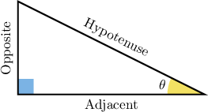
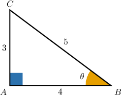
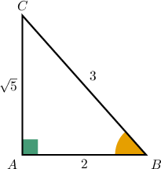
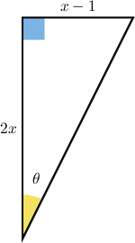

# The Trigonometric Ratios

Source: https://www.mathacademy.com/topics/609?courseId=111
Topic ID: 609

## Prerequisites

- [Rationalizing Denominators](../grade-8/1318-rationalizing-denominators.md)
- [Angles and Sides in Right Triangles](./1597-angles-and-sides-in-right-triangles.md)
- [Degrees of Accuracy](../algebra-i/2234-degrees-of-accuracy.md)
- [Solving Rational Equations Containing Binomials Using Cross-Multiplication](../algebra-i/3555-solving-rational-equations-containing-binomials-using-cross-multiplication.md)

## Lesson

### Introduction

Let's remind ourselves of the names of the sides of a right triangle relative to an angle $\theta.$

The three fundamental trigonometric ratios, **sine**, **cosine**, and **tangent**, represent the ratios of the sides of a right triangle. The ratios are often shortened to $\sin$, $\cos,$ and $\tan,$ and they are defined as

$$

\begin{aligned} \sin(\theta) &= \dfrac {\text{opposite}} {\text{hypotenuse}}, \\\[5pt] \cos(\theta) &= \dfrac {\text{adjacent}} {\text{hypotenuse}}, \\\[5pt] \tan(\theta) &= \dfrac {\text{opposite}} {\text{adjacent}}. \\\end{aligned}

$$

For a given angle $\theta$, these ratios remain the same no matter what the size of the triangle is. For example, if we were to double the length of each side of a given triangle, the values of these ratios would remain unchanged.

An easy way of remembering how to compute the different trigonometric ratios is by using the three-syllable acronym **SOH-CAH-TOA**. It stands for:

- SOH $\rightarrow$ **S**ine = **O**pposite / **H**ypotenuse,

- CAH $\rightarrow$ **C**osine = **A**djacent / **H**ypotenuse,

- TOA $\rightarrow$ **T**angent = **O**pposite / **A**djacent.

### Example: Evaluating Trigonometric Ratios Given a Triangle with Integer Side Lengths

#### Question

Find $\sin{\theta},$ $\cos{\theta},$ and $\tan{\theta}$ for the triangle below.

#### Explanation

Remember the acronym "SOH-CAH-TOA."

- The sine of an angle is equal to the opposite divided by the hypotenuse (S-O-H). Relative to the angle $\theta,$ the opposite side is $\overline{AC},$ and the hypotenuse is $\overline{BC}.$ Therefore,

- The cosine of an angle is equal to the adjacent divided by the hypotenuse (C-A-H). Relative to the angle $\theta,$ the adjacent side is $\overline{AB},$ and the hypotenuse is $\overline{BC}.$ Therefore,

- The tangent of an angle is equal to the opposite divided by the adjacent (T-O-A). Relative to the angle $\theta,$ the opposite side is $\overline{AC},$ and the adjacent side is $\overline{AB}.$ Therefore,

### Example: Evaluating a Trigonometric Ratio Given a Triangle with Non-Integer Side Lengths

#### Question

In the right triangle $\triangle ABC,$ the angle $\angle A$ is a right angle, and the side lengths are $AB=2,$ $AC=\sqrt{5},$ and $BC=3.$ Find $\tan B.$

#### Explanation

Let's illustrate the given triangle.

The tangent of an angle is equal to the opposite divided by the adjacent (T-O-A). Relative to $\angle B,$ the opposite side is $\overline{AC},$ and the adjacent side is $\overline{AB}.$ Therefore,

$$

\begin{aligned} \tan{B} &= \dfrac{AC}{AB} = \dfrac{\sqrt{5}}{2}. \end{aligned}

$$

### Example: Solving for a Variable Given a Trigonometric Ratio

#### Question

Given that $\tan\theta = \dfrac{1}{4},$ find the value of $x.$

#### Explanation

The tangent of an angle is equal to the opposite divided by the adjacent (T-O-A).

Relative to the angle $\theta,$ the length of the opposite side is $x-1,$ and the length of the adjacent side is $2x.$ Therefore,

$$

\begin{aligned}tan⁡𝜃 & =\frac{opposite}{adjacent} \\ \frac{1}{4} & =\frac{𝑥−1}{2𝑥} \\ 2𝑥 & =4(𝑥−1) \\ 2𝑥 & =4𝑥−4 \\ 2𝑥 & =4 \\ 𝑥 & =2.\end{aligned}

$$

### Calculating Sine, Cosine, and Tangent Using a Calculator

Calculators usually have a special key that allows us to compute $\sin\theta,$ $\cos\theta,$ and $\tan\theta$ for some specific value of $\theta.$

For example, using a calculator, we can compute the trigonometric ratios for $\theta = 30^\circ$ and get the following results:

$$

\begin{aligned}sin⁡(30^{∘}) & =0.5 \\ cos⁡(30^{∘}) & =0.866... \\ tan⁡(30^{∘}) & =0.577...\end{aligned}

$$

**Watch out!** Make sure that the calculator is in degrees mode (instead of radians mode) before you start the computation.

### Example: Evaluating a Trigonometric Function Using a Calculator

#### Question

Evaluate $\cos\left(50^\circ\right).$ Round the answer to two decimal places.

#### Explanation

Using a calculator, we find

$$

\begin{aligned}cos⁡(50^{∘}) & =0.64278...≈0.64,\end{aligned}

$$

rounded to two decimal places.
