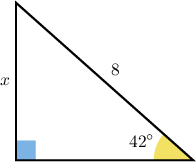
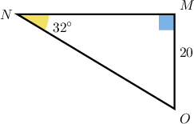
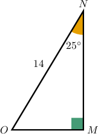
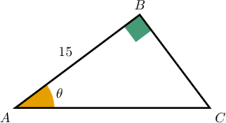

# Calculating Side Lengths of Right Triangles Using Trigonometry

Source: https://www.mathacademy.com/topics/629?courseId=111
Topic ID: 629

## Prerequisites

- [The Trigonometric Ratios](./609-the-trigonometric-ratios.md)

## Lesson

### Introduction

Trigonometric ratios can be used to solve for a missing side of a right triangle if one side is known along with the measure of an acute angle. However, the question of which ratio to use depends on what side is given and what side is unknown.

In the triangle above, we are given an angle $\theta = 42^\circ,$ and the length of the hypotenuse is given but the length of the side opposite is unknown.

So, we need to choose the trigonometric ratio that relates the opposite side to the hypotenuse. This is sine, and now we can just set up the ratio, as follows:

$$

\begin{aligned}sin⁡42^{∘} & =\frac{opposite}{hypotenuse} \\ & =\frac{𝑥}{8}\end{aligned}

$$

Now, we simply solve for the unknown value $x,$ as follows:

$$

\begin{aligned}sin⁡42^{∘} & =\frac{𝑥}{8} \\ 𝑥 & =8sin⁡42^{∘} \\ & =8(0.669\,13...) \\ & =5.353\,04... \\ & ≈5.4,\end{aligned}

$$

rounded to the nearest tenth.

Note that we used a calculator to evaluate $\sin(42^\circ).$

### Example: Calculating an Unknown Side Length Using Sine

#### Question

Given the triangle below, find the length of $\overline{NO}$ rounded to one decimal place.

#### Explanation

For an angle $\theta$ in a right triangle, the trigonometric ratios are as follows:

- $\sin\theta = \dfrac{\textrm{opposite leg}}{\textrm{hypotenuse}}$

- $\cos\theta = \dfrac{\textrm{adjacent leg}}{\textrm{hypotenuse}}$

- $\tan\theta = \dfrac{\textrm{opposite leg}}{\textrm{adjacent leg}}$

First, notice that we are given the length of the leg $\overline{MO}$ opposite the given angle $\angle{N}$ and wish to find the length of the hypotenuse $\overline{NO}.$

The trigonometric ratio that relates the opposite leg to the hypotenuse is **. Hence,

$$

\begin{aligned}sin⁡(𝑚∠𝑁) & =\frac{opposite leg}{hypotenuse} \\ sin⁡(32^{∘}) & =\frac{20}{𝑁𝑂} \\ 𝑁𝑂⋅sin⁡(32^{∘}) & =20 \\ 𝑁𝑂 & =\frac{20}{sin⁡(32^{∘})}.\end{aligned}

$$

Using a calculator to evaluate the trigonometric ratio, we conclude that

$$

\begin{aligned}𝑁𝑂 & =\frac{20}{sin⁡(32^{∘})} \\ & =\frac{20}{(0.529\,91…)} \\ & =37.741\,59… \\ & ≈37.7,\end{aligned}

$$

rounded to one decimal place.

### Example: Calculating an Unknown Side Length Using Cosine

#### Question

Given the triangle below, find the length of $\overline{MN}$ rounded to one decimal place.

#### Explanation

For an angle $\theta$ in a right triangle, the trigonometric ratios are as follows:

- $\sin\theta = \dfrac{\textrm{opposite leg}}{\textrm{hypotenuse}}$

- $\cos\theta = \dfrac{\textrm{adjacent leg}}{\textrm{hypotenuse}}$

- $\tan\theta = \dfrac{\textrm{opposite leg}}{\textrm{adjacent leg}}$

First, note that we are given the length of the hypotenuse $\overline{NO}$ and wish to find the length of the leg $\overline{MN}$ adjacent to the given angle $\angle{N}.$

The trigonometric ratio that relates the adjacent leg to the hypotenuse is **. Hence,

$$

\begin{aligned}cos⁡(𝑚∠𝑁) & =\frac{adjacent leg}{hypotenuse} \\ cos⁡(25^{∘}) & =\frac{𝑀𝑁}{14} \\ 𝑀𝑁 & =14cos⁡(25^{∘}).\end{aligned}

$$

Using a calculator to evaluate the trigonometric ratio, we conclude that

$$

\begin{aligned}𝑀𝑁 & =14cos⁡(25^{∘}) \\ & =14(0.906\,30…) \\ & =12.688\,30… \\ & ≈12.7,\end{aligned}

$$

rounded to one decimal place.

### Example: Calculating an Unknown Side Length Using Tangent

#### Question

Given the triangle below, find the length of $\overline{BC}$ in terms of $\theta.$

#### Explanation

For an angle $\theta$ in a right triangle, the trigonometric ratios are as follows:

- $\sin\theta = \dfrac{\textrm{opposite leg}}{\textrm{hypotenuse}}$

- $\cos\theta = \dfrac{\textrm{adjacent leg}}{\textrm{hypotenuse}}$

- $\tan\theta = \dfrac{\textrm{opposite leg}}{\textrm{adjacent leg}}$

Notice that we are given the length of the leg $\overline{AB}$ adjacent to the given angle $\angle A$ and wish to find the length of the leg $\overline{BC}$ opposite $\angle A.$

The trigonometric ratio that relates the opposite leg to the adjacent leg is **. Hence,

$$

\begin{aligned}tan⁡(𝑚∠𝐴) & =\frac{opposite leg}{adjacent leg} \\ tan⁡𝜃 & =\frac{𝐵𝐶}{15} \\ 𝐵𝐶 & =15tan⁡𝜃.\end{aligned}

$$
