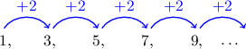
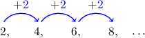
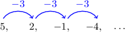
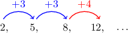
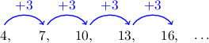
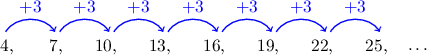

# Arithmetic Sequences

Source: https://www.mathacademy.com/topics/667?courseId=111
Topic ID: 667

## Prerequisites

- [Introduction to Sequences](./2271-introduction-to-sequences.md)

## Lesson

### Introduction

Consider the following sequence:

$$

1,\quad 3,\quad 5,\quad 7,\quad 9,\quad \ldots

$$

Notice that the difference (or "jump") between two consecutive numbers is always the same.

A sequence where the jump never changes is called an **arithmetic sequence.**

We call this jump the **common difference**, and represent it using the letter $d.$ In this particular case, the common difference is $d=2.$

### Example: Finding a Common Difference

#### Question

What is the common difference of the following arithmetic sequence?

$$

7,\: 2,\: -3,\: -8,\: \ldots

$$

#### Explanation

The common difference $d$ of an arithmetic sequence is the difference between any two consecutive terms.

Therefore, the common difference for our sequence is

$$

\begin{aligned}𝑑 & =𝑎_{2}−𝑎_{1} \\ & =2−7 \\ & =−5.\end{aligned}

$$

### Example: Identifying an Arithmetic Sequence

#### Question

Which of the three sequences below are arithmetic sequences?

1. $2, \: 4, \: 6, \: 8, \: \ldots$

2. $5, \: 2, \: -1, \: -4, \: \ldots$

3. $2, \: 5, \: 8, \: 12, \: \ldots$

#### Explanation

To determine whether each sequence is an arithmetic sequence, we need to look at the jumps between terms in the sequence. If the jumps are the same, then they indeed represent a common difference of an arithmetic sequence.

- In sequence I, the jumps are all the same. Therefore, sequence I is an arithmetic sequence with common difference $d=2.$

- In sequence II, the jumps are all the same. Therefore, sequence II is an arithmetic sequence with common difference $d=-3.$

- In sequence III, the jumps are not all the same. Therefore, sequence III is not an arithmetic sequence.

In conclusion, only sequences I and II are arithmetic sequences.

### Example: Computing the Terms of an Arithmetic Sequence

#### Question

What is the $8$th term of the following arithmetic sequence?

$$

4, \: 7, \: 10, \: 13, \: 16, \: \ldots

$$

#### Explanation

We notice that the sequence is an arithmetic sequence with a common difference of

$$

d=7-4=3.

$$

So, we can calculate each term in the sequence by adding $3$ to the previous term.

We will continue listing terms of the sequence until we get to the $8$th term. Listing the terms up to the $8$th term, we have:

Therefore, the $8$th term is $25.$
