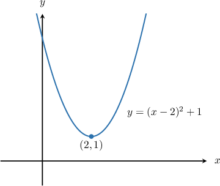
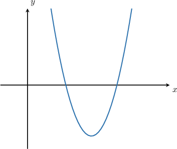

# The Vertex Form of a Parabola

Source: https://www.mathacademy.com/topics/814?courseId=111
Topic ID: 814

## Prerequisites

- [Graphs of General Quadratic Functions](./84-graphs-of-general-quadratic-functions.md)

## Lesson

### Introduction

Up to now, all the parabolas we've seen have been written in **standard form**.

We can also write the equation of a parabola in the so-called **vertex form,** given by

When a parabola is written in vertex form, the pair gives the coordinates of its vertex.

For example, consider the following parabola:

This parabola is written in vertex form with and Therefore, the vertex of the parabola is at

In future lessons, we'll learn how to express any parabola in vertex form. For now, let's get some practice working with this form.

### Example: Finding the Vertex of a Parabola Given in Vertex Form

#### Question

What are the coordinates of the vertex of the parabola $y=-3(x+5)^2-4?$

#### Explanation

Remember that the vertex form of a parabola is

$$

y=a(x-h)^2 + k,

$$

where $(h,k)$ are the coordinates of the vertex of the parabola.

The given parabola

$$

y=-3(x+5)^2-4

$$

is written in vertex form with $h=-5$ and $k=-4.$ To see this clearly, note that we can write the parabola as follows:

$$

y=-3(x-(-5))^2-4

$$

Therefore, the vertex of the parabola is at $(-5,-4).$

### Example: Finding the Axis of Symmetry of a Parabola Given in Vertex Form

#### Question

What is the axis of symmetry of the parabola $y=4(x-3)^2+2?$

#### Explanation

The axis of symmetry of the parabola is the vertical line that passes through the vertex of the parabola. To find the axis of symmetry, we need to compute the $x$-coordinate of the vertex of the parabola.

Remember that the vertex form of a parabola is

$$

y=a(x-h)^2 + k,

$$

where $(h,k)$ are the coordinates of the vertex of the parabola.

The given parabola

$$

y=4(x-3)^2+2

$$

is written in vertex form with $h=3$ and $k=2.$ Therefore, the vertex of the parabola is at $(3,2),$ and the axis of symmetry is $x=3.$

### Example: Finding the Minimum or Maximum Value of a Parabola Given in Vertex Form

#### Question

Find the minimum value of the parabola sketched below.

#### Explanation

The minimum value of the parabola is the -coordinate of the vertex of the parabola.

Remember that the vertex form of a parabola is

where are the coordinates of the vertex of the parabola.

The given parabola

is written in vertex form with and Therefore, the vertex of the parabola is at and its minimum value is

### Why Does Vertex Form Give the Coordinates of the Vertex?

Let's consider our first example once more.

You might be wondering how we can tell that the vertex coordinates are just from looking at the equation.

To see this, let's label the two terms in our parabola formula:

Now, note the following:

- The quadratic part is a *squared* quantity. Therefore, it can only be *positive* or *zero*.

- Moreover, the quadratic part *equals* zero when

- Since the constant part does not vary with the entire expression is *minimized* when Therefore, the -coordinate of the minimum point (i.e., the vertex) is

- When the quadratic part is zero, giving Therefore, the -coordinate of the vertex is

Following this logic, we conclude that the coordinates of the vertex are

Finally, it's possible to generalize this argument to any parabola. For the coordinates give the maximum of the parabola.
