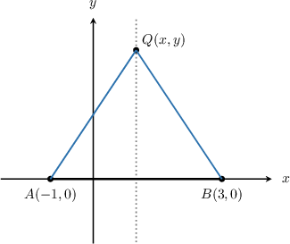
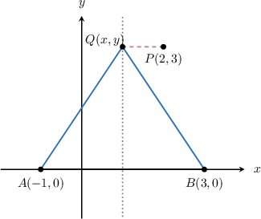
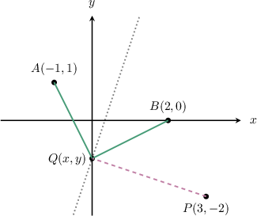

# Optimizing Distances

Source: https://www.mathacademy.com/topics/1216?courseId=136
Topic ID: 1216

## Prerequisites

- [The Candidates Test](./364-the-candidates-test.md)
- [The Distance Formula](../geometry/459-the-distance-formula.md)
- [Solving Optimization Problems Using Derivatives](./1211-solving-optimization-problems-using-derivatives.md)

## Lesson

### Introduction

We can use differentiation to solve optimization problems involving distances.

For example, consider the following two points in the Cartesian plane:

$$

(1, 2), \qquad (x,2x)

$$

The point $(1,2)$ is a *fixed* point, while $(x,2x)$ is a *variable* point since its location on the plane changes depending on the value of $x.$

We wish to find the value(s) of $x$ at which the distance between the two points is minimized.

To do this, we follow three steps:

**Step 1.** Create a function $S(x)$ representing the **squared distance** between the two points.

By the distance formula, the *squared* distance between two points $(x_1, y_1)$ and $(x_2, y_2)$ is given by

$$

S = (x_2-x_1)^2 + (y_2-y_1)^2.

$$

Therefore, the expression for the squared distance between our two points is as follows:

$$

\begin{aligned}𝑆(𝑥) & =(𝑥−1)^{2}+(2𝑥−2)^{2} \\ & =(𝑥^{2}−2𝑥+1)+(4𝑥^{2}−8𝑥+4) \\ & =5𝑥^{2}−10𝑥+5\end{aligned}

$$

**Step 2.** Calculate the first derivative $S'(x)$ and solve $S'(x) = 0$ to find the stationary point(s).

Computing the derivative $S'(x),$ we get

$$

\begin{aligned}𝑆^{′}(𝑥) & =10𝑥−10.\end{aligned}

$$

The stationary points of $S(x)$ are the points where $S'(x) = 0.$ Solving this equation, we get

$$

\begin{aligned}𝑆^{′}(𝑥) & =0 \\ 10𝑥−10 & =0 \\ 𝑥 & =1.\end{aligned}

$$

**Step 3.** Use the first or second derivative tests to confirm that the stationary point minimizes the squared distance.

Computing the second derivative, we have

$$

S''(1) =10.

$$

Since $S''(1) > 0,$ the point $x=1$ is a minimum of $S(x)$ by the second derivative test.

Therefore, we conclude that the squared distance (and therefore the actual distance) reaches a minimum when $x = 1.$

Before we look at another example, note the following:

- In these calculations, it's convenient to work with the *squared* distance $S(x)$ instead of the *actual* distance $d(x),$ which in this case is given by Using the squared distance, we avoid dealing with a square root when taking the derivative.

- It can be shown that if the squared distance is minimized, then so is the distance.

### Example: Finding a Variable Point Closest to a Fixed Point

#### Question

If the distance between the points $(b+3,b)$ and $(-1, 2)$ is minimized, find the value of $b.$

#### Explanation

First, let's compute the ** distance $S(b)$ between the two points. We have

$$

\begin{aligned}𝑆(𝑏) & =(𝑏+3−(−1))^{2}+(𝑏−2)^{2} \\ & =(𝑏+4)^{2}+(𝑏−2)^{2} \\ & =𝑏^{2}+8𝑏+16+𝑏^{2}−4𝑏+4 \\ & =2𝑏^{2}+4𝑏+20.\end{aligned}

$$

Since we want to minimize $S,$ we compute the derivative $S'(b).$ This gives

$$

\begin{aligned}𝑆^{′}(𝑏) & =4𝑏+4.\end{aligned}

$$

The stationary points of $S(b)$ are the points where the derivative $S'(b) = 0.$ Solving this equation, we get

$$

\begin{aligned}𝑆^{′}(𝑏) & =0 \\ 4𝑏+4 & =0 \\ 𝑏 & =−1.\end{aligned}

$$

We can see that $S''\left(-1\right) =4> 0.$ Therefore, the squared distance (and therefore the actual distance) reaches a minimum when $b = -1.$

### Example: Finding the Minimum Distance Between a Fixed Point and Variable Point

#### Question

What is the smallest possible distance between the points $(a+1, a+2)$ and $(-1, 3),$ where $a$ is a real number?

#### Explanation

First, let's compute the ** distance $S(a)$ between the two points. We have

$$

\begin{aligned}𝑆(𝑎) & =(𝑎+1−(−1))^{2}+(𝑎+2−3)^{2} \\ & =(𝑎+2)^{2}+(𝑎−1)^{2} \\ & =𝑎^{2}+4𝑎+4+𝑎^{2}−2𝑎+1 \\ & =2𝑎^{2}+2𝑎+5.\end{aligned}

$$

Since we want to minimize $S,$ we compute the derivative $S'(a).$ This gives

$$

\begin{aligned}𝑆^{′}(𝑎) & =4𝑎+2.\end{aligned}

$$

The stationary points of $S(a)$ are the points where the derivative $S'(a) = 0.$ Solving this equation, we get

$$

\begin{aligned}𝑆^{′}(𝑎) & =0 \\ 4𝑎+2 & =0 \\ 𝑎 & =−\frac{1}{2}.\end{aligned}

$$

We can see that $S''\left(- \dfrac 12\right) =4 > 0.$ So, the squared distance (and therefore the actual distance) reaches a minimum when $a = -\dfrac12.$

Since $S(a)$ gives the squared distance between the two points, the actual distance $d$ between the two points when $a=-\dfrac 12$ is given by

$$

d = \sqrt{S\left(-\dfrac 12\right)}.

$$

Computing this quantity, we get

$$

\begin{aligned}𝑑 & =\sqrt{√𝑆(−\frac{1}{2})} \\ & =\sqrt{√2(−\frac{1}{2})^{2}+2(−\frac{1}{2})+5} \\ & =\sqrt{√\frac{9}{2}} \\ & =\frac{3\sqrt{√2}}{2}.\end{aligned}

$$

### The Perpendicular Bisector Theorem

Suppose we have the points $A(-1,0)$ and $B(3,0)$ in the plane.

Recall that the *perpendicular bisector* of the segment $\overline{AB}$ is the line perpendicular to $\overline{AB}$ that bisects it.

The points $A, B,$ and the perpendicular bisector of $\overline{AB}$ are shown below.

The *perpendicular bisector theorem* tells us that every point on this line is *equidistant* to $A$ and $B.$ In other words, if we pick a point $Q(x,y)$ on the line, then $AQ = BQ$ for every point $Q.$

Now, suppose we pick the point $P(2,3)$ that does not lie on the perpendicular bisector. What point on our line is closest to $P?$

To answer this, we first create a function $S$ representing the squared distance between the point $P(2,3)$ and a general point $Q(x,y){:}$

$$

\begin{aligned}𝑆(𝑥,𝑦) & =(𝑥−2)^{2}+(𝑦−3)^{2} \\ & =𝑥^{2}−4𝑥+4+𝑦^{2}−6𝑦+9 \\ & =𝑥^{2}+𝑦^{2}−4𝑥−6𝑦+13\end{aligned}

$$

We cannot differentiate this function because it contains two variables. However, we can eliminate one by noting that $Q$ lies on the perpendicular bisector.

The required point $Q(x,y)$ is equidistant to the points $A(-1,0)$ and $B(3,0).$ So, by writing down $(QA)^2 = (QB)^2,$ we have the following constraint equation:

$$

\begin{aligned}\underset{(𝑄𝐴)^{2}}{\underset{}{(𝑥−(−1))^{2}+(𝑦−0)^{2}}} & =\underset{(𝑄𝐵)^{2}}{\underset{}{(𝑥−3)^{2}+(𝑦−0)^{2}}}\end{aligned}

$$

which simplifies as

$$

\begin{aligned}(𝑥+1)^{2}+𝑦^{2} & =(𝑥−3)^{2}+𝑦^{2}\end{aligned}

$$

We make $x$ the subject in the constraint equation as follows:

$$

\begin{aligned}(𝑥+1)^{2}+𝑦^{2} & =(𝑥−3)^{2}+𝑦^{2} \\ 𝑥^{2}+𝑦^{2}+2𝑥+1 & =𝑥^{2}+𝑦^{2}−6𝑥+9 \\ 𝑥^{2}+2𝑥+1+𝑦^{2} & =𝑥^{2}−6𝑥+9+𝑦^{2} \\ 2𝑥+6𝑥 & =9−1 \\ 8𝑥 & =8 \\ 𝑥 & =1\end{aligned}

$$

Substituting the above into our expression for $S(x,y),$ we get

$$

\begin{aligned}𝑆(𝑦) & =1^{2}+𝑦^{2}−4(1)−6𝑦+13 \\ & =1+𝑦^{2}−4−6𝑦+13 \\ & =𝑦^{2}−6𝑦+10.\end{aligned}

$$

Now, we calculate the first derivative,

$$

\begin{aligned}𝑆^{′}(𝑦) & =2𝑦−6,\end{aligned}

$$

and solve $S'(y)=0$ to find the stationary point:

$$

\begin{aligned}𝑆^{′}(𝑦) & =0 \\ 2𝑦−6 & =0 \\ 𝑦 & =3\end{aligned}

$$

Let's verify that this stationary point is a minimum. Taking the second derivative, we find

$$

S''(3) =2>0.

$$

We conclude that the stationary point $y=3$ indeed minimizes the squared distance.

Therefore, the required point is $\left(1,3\right).$

### Example: The Shortest Distance Between a Point and a Perpendicular Bisector

#### Question

Use calculus to find the closest point to $P(3,-2)$ that is equidistant to the points $A(-1,1)$ and $B(2,0).$

#### Explanation

Let's sketch the situation.

Note the following:

- The dotted line is the ** of the segment $\overline{AB}.$

- All the points on this perpendicular bisector are equidistant to $A$ and $B.$

- Our task is to find the point $Q$ on this line that's closest to $P.$

First, we create a function $S$ which represents the ** distance between the point $P(3,-2)$ and a general point $Q(x,y),$ as follows:

$$

\begin{aligned}𝑆(𝑥,𝑦) & =(𝑥−3)^{2}+(𝑦−(−2))^{2} \\ & =(𝑥−3)^{2}+(𝑦+2)^{2} \\ & =𝑥^{2}−6𝑥+9+𝑦^{2}+4𝑦+4 \\ & =𝑥^{2}+𝑦^{2}−6𝑥+4𝑦+13\end{aligned}

$$

The required point $Q(x,y)$ is equidistant to the points $A(-1,1)$ and $B(2,0).$ So, by writing down $(QA)^2 = (QB)^2,$ we have the following constraint equation:

$$

\begin{aligned}\underset{(𝑄𝐴)^{2}}{\underset{}{(𝑥−(−1))^{2}+(𝑦−1)^{2}}} & =\underset{(𝑄𝐵)^{2}}{\underset{}{(𝑥−2)^{2}+(𝑦−0)^{2}}}\end{aligned}

$$

We make $y$ the subject in the constraint equation as follows:

$$

\begin{aligned}(𝑥+1)^{2}+(𝑦−1)^{2} & =(𝑥−2)^{2}+𝑦^{2} \\ 𝑥^{2}+2𝑥+1+𝑦^{2}−2𝑦+1 & =𝑥^{2}−4𝑥+4+𝑦^{2} \\ 𝑥^{2}+2𝑥+1+𝑦^{2}−2𝑦+1 & =𝑥^{2}−4𝑥+4+𝑦^{2} \\ 2𝑥−2𝑦+2 & =−4𝑥+4 \\ 6𝑥−2 & =2𝑦 \\ 𝑦 & =3𝑥−1\end{aligned}

$$

Substituting the above into our expression for $S(x,y),$ we get

$$

\begin{aligned}𝑆(𝑥) & =𝑥^{2}+(3𝑥−1)^{2}−6𝑥+4(3𝑥−1)+13 \\ & =𝑥^{2}+9𝑥^{2}−6𝑥+1−6𝑥+12𝑥−4+13 \\ & =10𝑥^{2}+10.\end{aligned}

$$

Now, we calculate the first derivative,

$$

\begin{aligned}𝑆^{′}(𝑥) & =20𝑥,\end{aligned}

$$

and solve $S'(x)=0$ to find the stationary point:

$$

\begin{aligned}𝑆^{′}(𝑥) & =0 \\ 20𝑥 & =0 \\ 𝑥 & =0\end{aligned}

$$

Let's verify that this stationary point is a minimum. Taking the second derivative, we find

$$

S''(0) =20>0.

$$

We conclude that the stationary point $x=0$ indeed minimizes the squared distance.

Finally, the $y$-coordinate is

$$

y = 3(0)-1 = -1.

$$

Therefore, the required point is $\left(0,-1\right).$
