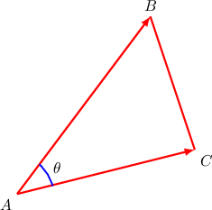

# The Angle Between Two Vectors

Source: https://www.mathacademy.com/topics/1278?courseId=136
Topic ID: 1278

## Prerequisites

- [Calculating the Dot Product Using Components](./177-calculating-the-dot-product-using-components.md)
- [Evaluating Expressions Containing Inverse Trigonometric Functions](./209-evaluating-expressions-containing-inverse-trigonometric-functions.md)
- [Calculating the Magnitude of Cartesian Vectors in 3D](./1277-calculating-the-magnitude-of-cartesian-vectors-in-3d.md)

## Lesson

### Introduction

Consider the two vectors $\mathbf{a}=\langle 1,-2, 2 \rangle$ and $\mathbf{b}=\langle 3,0,-1 \rangle$ shown in the picture below.

To find the angle $\theta$ between the vectors, we can rearrange the dot product formula:

$$

\begin{aligned}𝐚⋅𝐛 & =|\,𝐚\,|⋅|\,𝐛\,|⋅cos⁡𝜃 \\ cos⁡𝜃 & =\frac{𝐚⋅𝐛}{|\,𝐚\,||\,𝐛\,|} \\ 𝜃 & =arccos⁡(\frac{𝐚⋅𝐛}{|\,𝐚\,||\,𝐛\,|})\end{aligned}

$$

The dot product is given by

$$

\begin{aligned}𝐚⋅𝐛 & =𝑎_{𝑥}𝑏_{𝑥}+𝑎_{𝑦}𝑏_{𝑦}+𝑎_{𝑧}𝑏_{𝑧} \\ & =1⋅3+(−2)⋅0+2⋅(−1) \\ & =1,\end{aligned}

$$

and the magnitudes of $\mathbf{a}$ and $\mathbf{b}$ are

$$

\begin{aligned}|\,𝐚\,| & =\sqrt{√𝑎_{2𝑥}^{}+𝑎_{2𝑦}^{}+𝑎_{2𝑧}^{}} \\ & =\sqrt{√1^{2}+(−2)^{2}+2^{2}} \\ & =3, \\ |\,𝐛\,| & =\sqrt{√𝑏_{2𝑥}^{}+𝑏_{2𝑦}^{}+𝑏_{2𝑧}^{}} \\ & =\sqrt{√3^{2}+0^{2}+(−1)^{2}} \\ & =\sqrt{√10}.\end{aligned}

$$

Therefore,

$$

\theta = \arccos \Bigg( \dfrac{1}{3\sqrt{10}} \Bigg) \approx 83.9^\circ.

$$

### Example: Finding the Angle Between Two Vectors Given Their Components

#### Question

Find the angle between $\mathbf{a}=\langle 2,-1,1 \rangle$ and $\mathbf{b}=\langle 1,5,-2 \rangle$. Round your answer to $1$ decimal place.

#### Explanation

Rearranging the dot product formula, we have:

$$

\begin{aligned}cos⁡𝜃 & =\frac{𝐚⋅𝐛}{|\,𝐚\,||\,𝐛\,|} \\ & =\frac{𝑎_{𝑥}𝑏_{𝑥}+𝑎_{𝑦}𝑏_{𝑦}+𝑎_{𝑧}𝑏_{𝑧}}{\sqrt{√𝑎_{2𝑥}^{}+𝑎_{2𝑦}^{}+𝑎_{2𝑧}^{}}\sqrt{√𝑏_{2𝑥}^{}+𝑏_{2𝑦}^{}+𝑏_{2𝑧}^{}}} \\ & =\frac{2⋅1+(−1)⋅5+1⋅(−2)}{\sqrt{√2^{2}+(−1)^{2}+1^{2}}\sqrt{√1^{2}+5^{2}+(−2)^{2}}} \\ & =\frac{−5}{\sqrt{√6}⋅\sqrt{√30}} \\ & =\frac{−5}{\sqrt{√6}⋅\sqrt{√6}⋅\sqrt{√5}} \\ & =−\frac{\sqrt{√5}}{6}\end{aligned}

$$

Therefore,

$$

\theta = \arccos \left( -\dfrac{\sqrt{5}}{6} \right) \approx 111.9^\circ.

$$

### Example: Finding the Angle Between Two Vectors Given Three Points

#### Question

Find $\angle BAC$ given the points $A(2,-1,-5)$, $B(-1,0,-4)$, and $C(5,1,1).$ Round your answer to $1$ decimal place.

#### Explanation

Note that the position vectors of the points $A$, $B$, $C$ are

$$

\begin{aligned}𝐚=⟨2,−1,−5⟩,\,𝐛=⟨−1,0,−4⟩,\,𝐜=⟨5,1,1⟩.\end{aligned}

$$

The triangle $\triangle ABC$ is shown (schematically) in the diagram below, where we denote $\angle BAC = \theta.$

First, we find the components of $\overrightarrow{AB}$ and $\overrightarrow{AC}\mathbin{:}$

$$

\begin{aligned}\overset{𝐴𝐵}{} & =𝐛−𝐚 \\ & =⟨−1,0,−4⟩−⟨2,−1,−5⟩ \\ & =⟨−3,1,1⟩ \\ \overset{𝐴𝐶}{} & =𝐜−𝐚 \\ & =⟨5,1,1⟩−⟨2,−1,−5⟩ \\ & =⟨3,2,6⟩\end{aligned}

$$

Now, the cosine of the angle between $\overrightarrow{AB}$ and $\overrightarrow{AC}$ is

$$

\begin{aligned}cos⁡𝜃 & =\frac{\overset{𝐴𝐵}{}⋅\overset{𝐴𝐶}{}}{|\overset{𝐴𝐵}{}||\overset{𝐴𝐶}{}|} \\ & =\frac{−3⋅3+1⋅2+1⋅6}{\sqrt{√(−3)^{2}+1^{2}+1^{2}}\sqrt{√3^{2}+2^{2}+6^{2}}} \\ & =\frac{−1}{\sqrt{√11}\sqrt{√49}} \\ & =−\frac{1}{7\sqrt{√11}}.\end{aligned}

$$

Therefore,

$$

\theta = \arccos \left( -\dfrac{1}{7\sqrt{11}} \right) \approx 92.5^\circ.

$$

### Example: Finding the Angle Between Two Vectors Given the Value of Their Dot Product

#### Question

Given that $\mathbf{a}\cdot \mathbf{b}=-4$, find the angle between $\mathbf{a}=\langle t, \, -2 \rangle$ and $\mathbf{b}=\langle 6, \, t \rangle$. Round your answer to $1$ decimal place.

#### Explanation

First, since $\mathbf{a}\cdot \mathbf{b}=-4$, we can solve for $t$, as follows:

$$

\begin{aligned}𝐚⋅𝐛 & =−4 \\ 𝑡⋅6+(−2)⋅𝑡 & =−4 \\ 6𝑡−2𝑡 & =−4 \\ 4𝑡 & =−4 \\ 𝑡 & =−1\end{aligned}

$$

So,

$$

\begin{aligned}𝐚=⟨−1,−2⟩,\,𝐛=⟨6,−1⟩.\end{aligned}

$$

Now, the cosine of the angle between $\mathbf{a}$ and $\mathbf{b}$ is

$$

\begin{aligned}cos⁡𝜃 & =\frac{𝐚⋅𝐛}{|\,𝐚\,||\,𝐛\,|} \\ & =\frac{𝑎_{𝑥}𝑏_{𝑥}+𝑎_{𝑦}𝑏_{𝑦}}{\sqrt{√𝑎_{2𝑥}^{}+𝑎_{2𝑦}^{}}\sqrt{√𝑏_{2𝑥}^{}+𝑏_{2𝑦}^{}}} \\ & =\frac{−4}{\sqrt{√(−1)^{2}+(−2)^{2}}⋅\sqrt{√6^{2}+(−1)^{2}}} \\ & =−\frac{4}{\sqrt{√5}⋅\sqrt{√37}} \\ & =−\frac{4}{\sqrt{√185}}.\end{aligned}

$$

Therefore,

$$

\theta = \arccos \left( -\dfrac{4}{\sqrt{185}} \right) \approx 107.1^\circ.

$$
