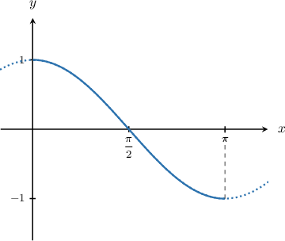
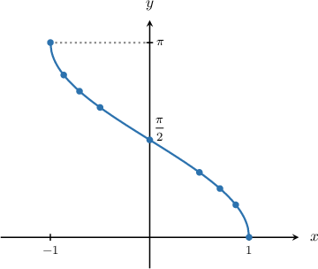
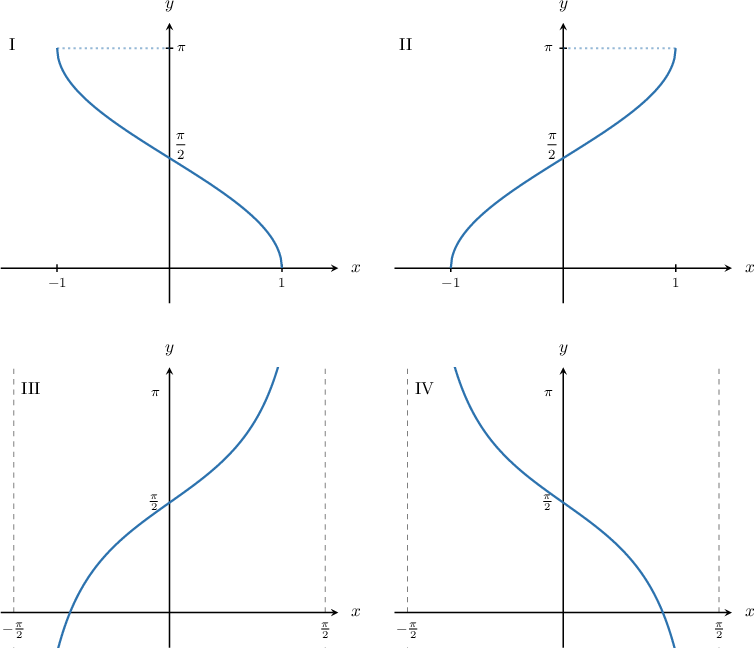

# Graphing the Inverse Cosine Function

Source: https://www.mathacademy.com/topics/1486?courseId=136
Topic ID: 1486

## Prerequisites

- [Graphing Sine and Cosine](../algebra-ii/1491-graphing-sine-and-cosine.md)
- [Invertible Functions](../algebra-ii/1889-invertible-functions.md)
- [Domain and Range of Inverse Functions](../algebra-ii/3734-domain-and-range-of-inverse-functions.md)

## Lesson

### Introduction

How do we plot the graph of $y = \arccos x?$ As usual, we can use a table of known values.

In order to determine these known values, let's first look at the graph of the cosine function.

The cosine function is a one-to-one function on the interval $x\in\left[0, \pi \right].$ So if we restrict the domain to this interval, we can define the inverse function $y=\arccos x.$

Remember that the inverse swaps the domain and range of the original function. So the domain of $y=\arccos x$ is $x\in[-1,1],$ while the range is $y \in\left[0, \pi \right].$ In the domain, we create a table of values:

Now we can use this table to plot the graph of $y=\arccos x\mathbin{:}$

Some key characteristics of the graph are:

- The domain of the function is $x\in [-1, 1].$

- The range of the function is $y\in \left[0, \pi\right].$

- The minimum value $y=0$ occurs at $x=1.$

- The maximum value $y=\pi$ occurs at $x=-1.$

- The $y$-intercept is $y=\dfrac \pi 2.$

- The function is strictly decreasing on its entire domain.

### Example: Graphing the Inverse Cosine Function

#### Question

Which of the following plots is the graph of $y=\arccos x?$

#### Explanation

Let's recall some of the basic properties of $y=\arccos x\mathbin{:}$

- The domain of the function is $x\in [-1, 1].$

- The range of the function is $y\in \left[0, \pi\right].$

- The minimum value occurs at $x=1.$

- The maximum value occurs at $x=-1.$

- The $y$-intercept is $y=\dfrac \pi 2.$

- The function is strictly decreasing on its entire domain.

Of the given functions, the only one that has all of these properties is I.

### Example: Identifying Values in the Domain of the Inverse Cosine Function

#### Question

Which of the following values is in the domain of $y=\arccos x?$

1. $-2$

2. $0$

3. $1$

#### Explanation

Let's recall the graph of $y=\arccos x.$

Note that the domain of the function is $x=\left[-1, 1\right].$

Therefore, the values $x=0$ and $x=1$ lie in the domain of the function, while the value $x=-2$ does not.

### Example: Identifying Values in the Range of the Inverse Cosine Function

#### Question

Which of the following values is in the range of $y=\arccos x?$

1. $-\dfrac \pi 2$

2. $0$

3. $\pi$

#### Explanation

Let's recall the graph of $y=\arccos x.$

Note that the range of the function is $y=\left[0, \pi\right].$

Therefore, the values $y=0$ and $y=\pi$ lie in the range of the function, while the value $y=-\dfrac{\pi}{2}$ does not.

### Example: Determining Points that Lie on the Curve of the Inverse Cosine Function

#### Question

Which of the following points lies on the graph of the function $y=\arccos x?$

1. $\left(-\dfrac 1 2,\dfrac {\pi}{3}\right)$

2. $\left(0,-\dfrac \pi 2\right)$

3. $\left(\dfrac{\sqrt 2}{2},\dfrac{\pi}{4}\right)$

#### Explanation

In order for a point $(a,b)$ to lie on the graph of the function $y=\arccos x,$ the following conditions must hold:

- The reflected point $(b,a)$ must lie on the graph of $y=\cos x.$

- The $y$-value of the point must lie in the range of $y=\arccos x,$ which is $y\in \left[0, \pi \right].$

With this in mind, let's check each of the points.

- First, we consider the point $\left(-\dfrac{1}{2},\dfrac{\pi}{3}\right).$ We note the following: The point $\left(\dfrac{\pi}{3},-\dfrac{1}{2}\right)$ does **** lie on the graph of $y=\cos x.$ $\quad{\color{red}{\times}}$ Therefore, the point $\left(-\dfrac{1}{2},\dfrac{\pi}{3}\right)$ does **** lie on the graph of $y=\arccos x.$

- Next, we consider the point $\left(0,-\dfrac\pi 2 \right).$ We note the following: The point $\left(-\dfrac\pi 2,0\right)$ lies on the graph of $y=\cos x.\quad{\color{green}{\checkmark}}$ The range of $y=\arccos x$ is $y\in \left[0, \pi\right],$ and $y=-\dfrac\pi 2$ does **** lie within this range. $\quad{\color{red}{\times}}$ Therefore, the point $\left(0,-\dfrac\pi 2\right)$ does **** lie on the graph of $y=\arccos x.$

- Finally, we consider the point $\left(\dfrac{\sqrt 2}{2},\dfrac{\pi}{4}\right).$ We note the following: The point $\left(\dfrac{\pi}{4},\dfrac{\sqrt 2}{2}\right)$ lies on the graph of $y=\cos x.\quad{\color{green}{\checkmark}}$ The range of $y=\arccos x$ is $y\in \left[0, \pi\right],$ and $y=\dfrac{\pi}{4}$ lies within this range. $\quad{\color{green}{\checkmark}}$ Therefore, the point $\left(\dfrac{\sqrt 2}{2},\dfrac{\pi}{4}\right)$ does lie on the graph of $y=\arccos x.$
