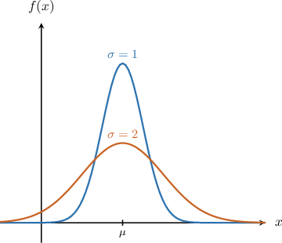
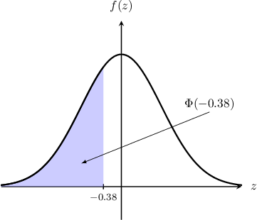
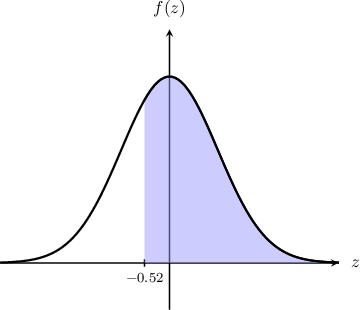
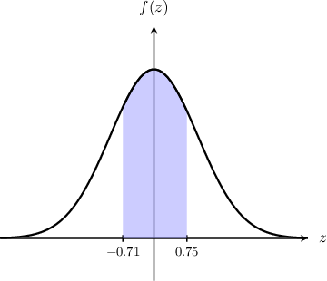

# The Normal Distribution

Source: https://www.mathacademy.com/topics/1843?courseId=136
Topic ID: 1843

## Prerequisites

- [The Z-Score](../mathematical-foundations-ii/711-the-z-score.md)
- [Symmetry Properties of the Standard Normal Distribution](./4420-symmetry-properties-of-the-standard-normal-distribution.md)

## Lesson

### Introduction

The **normal distribution** has the probability density function

$$

f(x) = \dfrac{1}{\sigma \sqrt{2\pi}} e^{-\frac{1}{2} \left( \frac{x-\mu}{\sigma} \right)^2},

$$

where the $\mu$ represents the mean and $\sigma$ represents the standard deviation. To state that $X$ follows a normal distribution, we write $X \sim N(\mu,\sigma^2).$

The graph of this probability density function forms a bell curve centered at $x=\mu.$

In general, the greater the standard deviation $\sigma,$ the flatter the bell curve. Intuitively, this makes sense because the standard deviation represents how "spread out" the distribution is.

### Transforming a Normal Random Variable into a Standard Normal Random Variable

To compute a probability involving a normally distributed variable $X \sim N(\mu, \sigma^2),$ it is convenient to transform $X$ into a standard normal random variable $Z$ by $z$-scoring:

$$

Z = \dfrac{X - \mu}{\sigma}

$$

So, we have

$$

P(X < x) = P \left( Z < \dfrac{x-\mu}{\sigma} \right)

$$

where $Z \sim N(0,1)$ is a standard normal random variable.

For example, suppose we have a random variable $X \sim N(1,2^2)$ and we want to compute $P(X \leq 1.4)$ using the following $z$-table:

The $z$-table above shows the cumulative probabilities for a normal random variable $Z \sim N(0,1).$ In order to use the table to compute $P(X \leq 1.4),$ we must first transform $X$ into a standard normal random variable $Z$ by $z$-scoring:

$$

\begin{aligned}𝑃(𝑋≤1.4) & =𝑃(𝑍≤\frac{1.4−1}{2}) \\ & =𝑃(𝑍≤0.2)\end{aligned}

$$

According to the table, we have

$$

P(Z \leq 0.2) = 0.5793 .

$$

Therefore,

$$

P(X \leq 1.4) = 0.5793.

$$

### Example: Computing the Probability of a Normal Random Variable on an Unbounded Interval

#### Question

The data below is taken from the table of values of the cumulative distribution function $\Phi(z)$ for the standard normal distribution. Given that $X \sim N(2,2^2),$ compute $P(X < 1.24).$

#### Explanation

Given a normal random variable $X \sim N(\mu, \sigma^2),$ we have

$$

P(X < x) = P \left( Z < \dfrac{x-\mu}{\sigma} \right)

$$

where $Z \sim N(0,1)$ is a standard normal random variable. In our case, we have $\mu = 2$ and $\sigma = 2.$

First, we transform $X$ into a standard normal random variable $Z$ by $z$-scoring:

$$

\begin{aligned}𝑃(𝑋<1.24) & =𝑃(𝑍<\frac{1.24−2}{2}) \\ & =𝑃(𝑍<−0.38) \\ & =𝑃(𝑍≤−0.38) \\ & =Φ(−0.38)\end{aligned}

$$

The required probability is represented by the area shown below.

According to the table, we have

$$

\Phi(-0.38) = 0.3520.

$$

Therefore, we conclude that

$$

P(X < 1.24) = 0.3520.

$$

### Example: Computing the Probability of a Normal Random Variable on an Unbounded Interval Using the Complement

#### Question

The data below is taken from the table of values of the cumulative distribution function $\Phi(z)$ for the standard normal distribution. Given that $Y \sim N(5,4^2),$ compute $P(Y \geq 2.92).$

#### Explanation

Given a normal random variable $Y \sim N(\mu, \sigma^2),$ we have

$$

P(Y \geq y) = P \left( Z \geq \dfrac{y-\mu}{\sigma} \right)

$$

where $Z \sim N(0,1)$ is a standard normal random variable. In our case, we have $\mu = 5$ and $\sigma = 4.$

First, we transform $Y$ into a standard normal random variable $Z$ by $z$-scoring:

$$

\begin{aligned}𝑃(𝑌≥2.92) & =𝑃(𝑍≥\frac{2.92−5}{4}) \\ & =𝑃(𝑍≥−0.52)\end{aligned}

$$

The required probability is represented by the area shown below.

Now, we express the required probability in terms of $\Phi(z)\mathbin{:}$

$$

\begin{aligned}𝑃(𝑍≥−0.52) & =1−𝑃(𝑍<−0.52) \\ & =1−𝑃(𝑍≤−0.52) \\ & =1−Φ(−0.52)\end{aligned}

$$

From the table, we know that

$$

\Phi(-0.52) =0.3015.

$$

Therefore, we have

$$

\begin{aligned}𝑃(𝑍≥−0.52) & =1−Φ(−0.52) \\ & =1−0.3015 \\ & =0.6985.\end{aligned}

$$

Finally, we conclude that

$$

P(Y \geq 2.92) = 0.6985.

$$

### Example: Computing the Probability of a Normal Random Variable on a Bounded Interval

#### Question

The data below is taken from the table of values of the cumulative distribution function $\Phi(z)$ for the standard normal distribution. Given that $X \sim N(1,9),$ compute $P(-1.13 < X < 3.25).$

#### Explanation

Given a normal random variable $X \sim N(\mu, \sigma^2),$ we have

$$

P(a < X < b) = P \left( \dfrac{a-\mu}{\sigma} < Z < \dfrac{b-\mu}{\sigma} \right)

$$

where $Z \sim N(0,1)$ is a standard normal random variable. In our case, we have $\mu = 1$ and $\sigma = \sqrt 9 = 3.$

First, we transform $X$ into a standard normal random variable $Z$ by $z$-scoring:

$$

\begin{aligned}𝑃(−1.13<𝑋<3.25) & =𝑃(\frac{−1.13−1}{3}<𝑍<\frac{3.25−1}{3}) \\ & =𝑃(−0.71<𝑍<0.75)\end{aligned}

$$

The required probability is represented by the area shown below.

Now, we express the required probability in terms of $\Phi(z)\mathbin{:}$

$$

\begin{aligned}𝑃(−0.71<𝑍<0.75) & =𝑃(𝑍<0.75)−𝑃(𝑍≤−0.71) \\ & =𝑃(𝑍≤0.75)−𝑃(𝑍≤−0.71) \\ & =Φ(0.75)−Φ(−0.71)\end{aligned}

$$

From the table, we have the following:

$$

\begin{aligned}Φ(−0.71) & =0.2389 \\ Φ(0.75) & =0.7734\end{aligned}

$$

Therefore, we have

$$

\begin{aligned}𝑃(−0.71<𝑍<0.75) & =Φ(0.75)−Φ(−0.71) \\ & =0.7734−0.2389 \\ & =0.5345.\end{aligned}

$$

Finally, we conclude that

$$

P(-1.13< X < 3.25) = 0.5345.

$$
