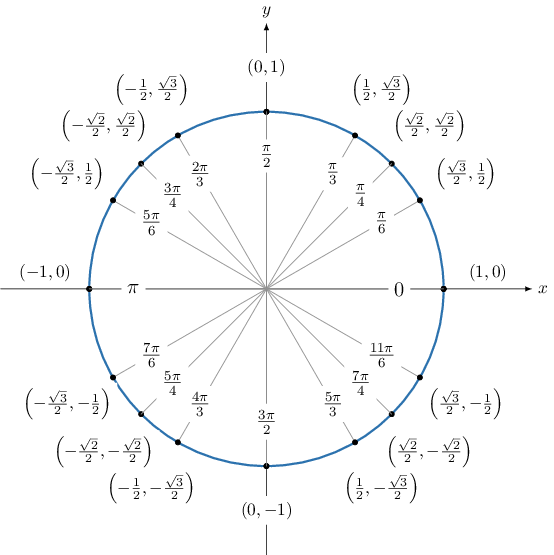

# Evaluating Expressions Containing Inverse Trigonometric Functions

Source: https://www.mathacademy.com/topics/209?courseId=136
Topic ID: 209

## Prerequisites

- [Graphing the Inverse Sine Function](./1483-graphing-the-inverse-sine-function.md)
- [Graphing the Inverse Cosine Function](./1486-graphing-the-inverse-cosine-function.md)
- [Graphing the Inverse Tangent Function](./1487-graphing-the-inverse-tangent-function.md)

## Lesson

### Introduction

Let's recall the ranges of the inverse trigonometric functions:

- The range of $\theta = \arcsin x$ is given by

- The range of $\theta = \arccos x$ is given by

- The range of $\theta = \arctan x$ is given by

When working with inverse trigonometric functions, it's essential to check that any answers we get lie within the permitted range.

### Computing the Value of an Inverse Trigonometric Function

Let's use our knowledge of inverse trigonometric functions to go through the steps of how to compute $\arcsin \left(\dfrac {\sqrt 3} 2\right).$

First, note that if $\theta = \arcsin \left(\dfrac{\sqrt3}{2}\right),$ then we must have that $\sin \theta = \dfrac{\sqrt3}{2}.$

Since the range of $\arcsin x$ is $\left[-\dfrac{\pi}{2}, \dfrac{\pi}{2}\right],$ we need to find an angle $\theta \in \left[-\dfrac{\pi}{2}, \dfrac{\pi}{2}\right]$ (i.e., in either the first or fourth quadrants) such that $\sin \theta = \dfrac{\sqrt3}{2}.$

Since $\dfrac{\sqrt3}{2}$ is positive, our answer is an angle that lies in the first quadrant, where sine is positive.

Now, let's take a look at the unit circle to find our angle.

From the values in the first quadrant, we see that

$$

\sin\left(\dfrac{\pi}{3}\right) = \dfrac{\sqrt3}{2}.

$$

Therefore,

$$

\arcsin\left(\dfrac{\sqrt3}{2}\right) = \dfrac{\pi}{3}.

$$

### Example: Evaluating Arcsine or Arccosine

#### Question

Find the value of $\arccos\left(-\dfrac{1}{2}\right).$

#### Explanation

The range of $\theta = \arccos x$ is given by

$$

0 \le \theta \le \pi.

$$

Note that the angle $\theta$ spans the first and second quadrants.

Since $-\dfrac{1}{2}$ is negative, our answer is an angle that lies in the second quadrant, where cosine is negative.

From the values in the second quadrant, we see that

$$

\cos\left( \dfrac{2\pi}{3}\right) = -\dfrac{1}{2}.

$$

Therefore,

$$

\arccos\left( -\dfrac{1}{2} \right) =\dfrac{2\pi}{3}.

$$

### Example: Evaluating Arcsine When a Coterminal Angle is Required

#### Question

Find the value of $\arcsin \left(-\dfrac{\sqrt{3}} 2 \right).$

#### Explanation

First, note that the range of $\theta = \arcsin x$ is given by

$$

-\dfrac\pi 2 \le \theta \le \dfrac\pi 2.

$$

Now, let's take a look at the unit circle.

From the values in the unit circle, we see that

$$

\sin\left( \dfrac{5\pi}{3}\right) = -\dfrac {\sqrt{3}} 2.

$$

However, $\dfrac{5\pi}{3}$ does not lie within the range of $\theta.$ To get an angle that's coterminal with $\dfrac{5\pi}{3}$ and lies within the range of $\theta,$ we subtract $2\pi{:}$

$$

\dfrac{5\pi}{3} - 2\pi = -\dfrac{\pi}{3}

$$

Therefore,

$$

\arcsin \left(-\dfrac {\sqrt{3}} 2\right) = -\dfrac{\pi}{3}.

$$

### Example: Evaluating Arctangent

#### Question

Find, in radians, the value of $\arctan(-\sqrt 3).$

#### Explanation

First, note that the range of $\theta = \arctan x$ is given by

$$

-\dfrac\pi 2 \lt \theta \lt \dfrac\pi 2.

$$

Note that the angle $\theta$ spans the first and fourth quadrants.

Since $-\sqrt 3$ is negative, our answer is an angle that lies in the fourth quadrant, where the tangent is negative.

From the special values of the trigonometric functions and the oddness of the tangent function, we know that

$$

\tan \left(-\dfrac{\pi}{3}\right) = -\tan\left(\dfrac{\pi}{3}\right) = -\sqrt 3.

$$

Since $-\dfrac{\pi}{3}$ is an angle in the fourth quadrant that lies within the range of $\arctan,$ we conclude that

$$

\arctan \left(-\sqrt 3\right) = -\dfrac{\pi}{3}.

$$
