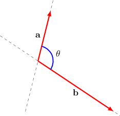
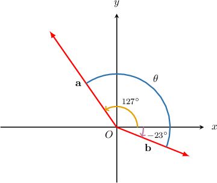

# Calculating the Dot Product Using Angle and Magnitude

Source: https://www.mathacademy.com/topics/243?courseId=136
Topic ID: 243

## Prerequisites

- [Calculating the Magnitude of Cartesian Vectors in 2D](../mathematical-foundations-ii/176-calculating-the-magnitude-of-cartesian-vectors-in-2d.md)
- [Evaluating Trigonometric Expressions](../algebra-ii/3766-evaluating-trigonometric-expressions.md)

## Lesson

### Introduction

The **dot product** (or **scalar product**) of two vectors $\mathbf{a}$ and $\mathbf{b}$ is defined as

$$

\mathbf{a} \cdot \mathbf{b} = |\,\mathbf{a}\,| \cdot |\,\mathbf{b}\,| \cdot \cos\theta,

$$

where $\theta$ is the angle formed between the vectors when their tails are placed at the same point.

For example, suppose we know that $|\mathbf{a}|=2,$ $|\mathbf{b}|=4,$ and $\theta = \dfrac{2\pi}{3}.$ We can now define the **dot product** (or **scalar product**) of $\mathbf{a}$ and $\mathbf{b}$ as follows:

$$

\begin{aligned}𝐚⋅𝐛 & =|\,𝐚\,|⋅|\,𝐛\,|⋅cos⁡𝜃 \\ & =2⋅4⋅cos⁡(\frac{2𝜋}{3}) \\ & =2⋅4⋅(−\frac{1}{2}) \\ & =−4\end{aligned}

$$

### Example: Calculating the Dot Product of Two Vectors Given Their Magnitudes and Angle

#### Question

For two vectors $\mathbf a$ and $\mathbf b,$ we have $|\mathbf{a}|=45,$ $|\mathbf{b}|=12,$ and the angle between the vectors is $\theta=77^\circ.$ Find $\mathbf{a}\cdot\mathbf{b}$ rounded to $3$ decimal places.

#### Explanation

Using the formula for the dot product, we obtain:

$$

\begin{aligned}𝐚⋅𝐛 & =|\,𝐚\,|⋅|\,𝐛\,|⋅cos⁡𝜃 \\ & =45⋅12⋅cos⁡77^{∘} \\ & ≈45⋅12⋅0.224\,951 \\ & ≈121.474\end{aligned}

$$

### Example: Calculating the Dot Product of Two Vectors Given Their Magnitudes and Directions

#### Question

Suppose that the vectors $\mathbf a$ and $\mathbf b$ are two vectors defined in the $x$-$y$ plane. The vector $\mathbf{a}$ makes a counterclockwise angle of $127^\circ$ with the positive $x$-axis and has $|\mathbf{a}|=4,$ while the vector $\mathbf{b}$ makes a clockwise angle of $23^\circ$ with the positive $x$-axis and has $|\mathbf{b}|=3.$ Find $\mathbf{a} \cdot \mathbf{b}.$

#### Explanation

If $\mathbf{a}$ makes an angle of $127^\circ$ with the positive $x$-axis and $\mathbf{b}$ makes an angle of $-23^\circ$ with the positive $x$-axis, then the angle between the vectors is

$$

\begin{aligned}𝜃 & =|127^{∘}−(−23^{∘})|=150^{∘}.\end{aligned}

$$

Now, using the formula for the dot product, we obtain:

$$

\begin{aligned}𝐚⋅𝐛 & =|\,𝐚\,|⋅|\,𝐛\,|⋅cos⁡𝜃 \\ & =4⋅3⋅cos⁡150^{∘} \\ & =4⋅3⋅(−\frac{\sqrt{√3}}{2}) \\ & =−6\sqrt{√3}\end{aligned}

$$

### Important Properties

The dot product satisfies many properties that we would normally expect multiplication to satisfy. Given the vectors $\mathbf{a},\mathbf{b},\mathbf{c}$ and any scalar $\lambda,$ the following properties hold.

- The dot product distributes over addition:

- The dot product is associative with respect to scalar multiplication:

- The dot product is commutative:

### Example: Calculating Dot Product Expressions Using the Properties of the Dot Product

#### Question

Find $(2\mathbf{a}-\mathbf{b}) \cdot \mathbf{c},$ if $\mathbf{a} \cdot \mathbf{c} = 2$ and $\mathbf{b} \cdot \mathbf{c} = -5.$

#### Explanation

Using the properties of the dot product, we have:

$$

\begin{aligned}(2𝐚−𝐛)⋅𝐜 & =(2𝐚)⋅𝐜−𝐛⋅𝐜 \\ & =2(𝐚⋅𝐜)−𝐛⋅𝐜 \\ & =2⋅2−(−5) \\ & =9\end{aligned}

$$

### The Dot Product of Perpendicular Vectors

Two nonzero vectors $\mathbf{a}$ and $\mathbf{b}$ are **perpendicular** if the angle between them is $\theta=90^\circ.$ We can denote that two vectors are perpendicular using the symbol $\perp,$ as follows:

$$

\mathbf{a} \perp \mathbf{b}

$$

In general, the dot product of two perpendicular vectors is $0.$ If $\mathbf{a} \perp \mathbf{b},$ and $\theta = 90^\circ,$ then

$$

\begin{aligned}𝐚⋅𝐛 & =|\,𝐚\,|⋅|\,𝐛\,|⋅cos⁡90^{∘} \\ & =|\,𝐚\,|⋅|\,𝐛\,|⋅0 \\ & =0.\end{aligned}

$$

The converse is also true. If $\mathbf a$ and $\mathbf b$ are nonzero vectors, then

$$

\mathbf{a} \perp \mathbf{b} \quad\Leftrightarrow\quad \mathbf{a} \cdot \mathbf{b} = 0.

$$

### Example: Calculating the Dot Product of Perpendicular Vectors

#### Question

Let $\mathbf{a}$ and $\mathbf{b}$ be two vectors with magnitudes $|\mathbf{a}|=13\sqrt{17}$ and $|\mathbf{b}|=146,$ and let the angle between the vectors be $\theta=\dfrac{\pi}{2}.$ Find $\mathbf{a}\cdot\mathbf{b}.$

#### Explanation

Since the angle between the vectors is $\theta = \dfrac\pi 2,$ the vectors are perpendicular and thus $\mathbf{a} \cdot \mathbf{b} = 0.$

We can confirm this. Using the formula for the dot product, we obtain:

$$

\begin{aligned}𝐚⋅𝐛 & =|\,𝐚\,|⋅|\,𝐛\,|⋅cos⁡𝜃 \\ & =13\sqrt{√17}⋅146⋅cos⁡(\frac{𝜋}{2}) \\ & =13\sqrt{√17}⋅146⋅0 \\ & =0\end{aligned}

$$
