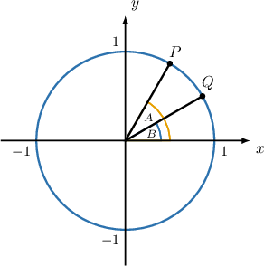

# The Sum and Difference Formulas for Cosine

Source: https://www.mathacademy.com/topics/274?courseId=136
Topic ID: 274

## Prerequisites

- [Evaluating Trigonometric Expressions](../algebra-ii/3766-evaluating-trigonometric-expressions.md)

## Lesson

### Introduction

The following two identities are known as the **sum and difference formulas for cosine**:

$$

\begin{aligned}cos⁡(𝑥\,+\,𝑦) & =cos⁡𝑥cos⁡𝑦\,\,−\,sin⁡𝑥sin⁡𝑦 \\ cos⁡(𝑥\,−\,𝑦) & =cos⁡𝑥cos⁡𝑦\,\,+\,sin⁡𝑥sin⁡𝑦\end{aligned}

$$

We'll prove these results at the end of the lesson.

Notice that the signs are somewhat counterintuitive. The sum formula for cosine contains a minus sign $({\color{red}{-}}),$ while the difference formula contains a plus sign $({\color{blue}{+}}).$

These identities can help calculate the cosine of an angle that can be expressed as the sum or difference of two special angles.

For example, we can use the sum formula to find the exact value of $\cos(105^\circ).$ First, we write

$$

105^\circ = {\color{blue}45^\circ} + {\color{red}60^\circ}.

$$

We can now apply the sum formula for cosine, as follows:

$$

\begin{aligned}cos⁡105^{∘} & =cos⁡(45^{∘}+60^{∘}) \\ & =cos⁡45^{∘}⋅cos⁡60−sin⁡45^{∘}⋅sin⁡60 \\ & =\frac{\sqrt{√2}}{2}⋅\frac{1}{2}−\frac{\sqrt{√2}}{2}⋅\frac{\sqrt{√3}}{2} \\ & =\frac{\sqrt{√2}}{4}−\frac{\sqrt{√6}}{4} \\ & =\frac{\sqrt{√2}−\sqrt{√6}}{4}\end{aligned}

$$

### Example: Finding Exact Values Using the Sum and Difference Formulas

#### Question

Find the exact value of $\cos \left(-\dfrac{\pi}{12} \right).$

**

#### Explanation

Recall the difference formula for cosine:

$$

\cos(x - y) = \cos{x}\cos{y} + \sin{x}\sin{y}

$$

Applying the difference formula for cosine with $x = \dfrac{\pi}{6}$ and $y = \dfrac{\pi}{4},$ we get

$$

\begin{aligned}cos⁡(−\frac{𝜋}{12}) & =cos⁡(\frac{𝜋}{6}−\frac{𝜋}{4}) \\ & =cos⁡(\frac{𝜋}{6})cos⁡(\frac{𝜋}{4})+sin⁡(\frac{𝜋}{6})sin⁡(\frac{𝜋}{4}) \\ & =\frac{\sqrt{√3}}{2}⋅\frac{\sqrt{√2}}{2}+\frac{1}{2}⋅\frac{\sqrt{√2}}{2} \\ & =\frac{\sqrt{√6}}{4}+\frac{\sqrt{√2}}{4} \\ & =\frac{\sqrt{√6}+\sqrt{√2}}{4}.\end{aligned}

$$

### Example: Simplifying Expressions in Degrees Using the Sum and Difference Formulas

#### Question

Express $\cos(x - 60^\circ)$ in terms of $\sin x$ and $\cos x.$

#### Explanation

First, we recall the difference formula for cosine:

$$

\cos(u - v) = \cos{u}\cos{v} + \sin{u}\sin{v}

$$

Applying the difference formula for cosine with $u = x$ and $v = 60^\circ,$ we get

$$

\begin{aligned}cos⁡(𝑥−60^{∘}) & =cos⁡𝑥cos⁡60^{∘}+sin⁡𝑥sin⁡60^{∘} \\ & =cos⁡𝑥⋅\frac{1}{2}+sin⁡𝑥⋅\frac{\sqrt{√3}}{2} \\ & =\frac{cos⁡𝑥}{2}+\frac{\sqrt{√3}sin⁡𝑥}{2} \\ & =\frac{cos⁡𝑥+\sqrt{√3}sin⁡𝑥}{2}.\end{aligned}

$$

### Example: Simplifying Expressions in Radians Using the Sum and Difference Formulas

#### Question

Express $\cos\left(x - \dfrac{\pi}{2} \right)$ in terms of $\sin x$ and $\cos x.$

#### Explanation

First, we recall the difference formula for cosine:

$$

\cos(u - v) = \cos u \cos v + \sin u \sin v

$$

Applying the difference formula for cosine with $u = x$ and $v = \dfrac{\pi}{2},$ we get

$$

\begin{aligned}cos⁡(𝑥−\frac{𝜋}{2}) & =cos⁡𝑥cos⁡(\frac{𝜋}{2})+sin⁡𝑥sin⁡(\frac{𝜋}{2}) \\ & =cos⁡𝑥⋅0+sin⁡𝑥⋅1 \\ & =sin⁡𝑥.\end{aligned}

$$

### Deriving the Difference Formula

Let's now prove the difference formula for cosine:

$$

\cos(A-B) = \cos A\cos B + \sin A\sin B

$$

Consider two points $P$ and $Q$ on the unit circle whose central angles have measures $A$ and $B,$ respectively, as shown below.

Since $P$ and $Q$ lie on the unit circle, their coordinates are

$$

P(\cos A, \sin A), \qquad Q(\cos B, \sin B).

$$

Therefore, the squared distance $PQ^2$ between $P$ and $Q$ can be found using the distance formula:

$$

\begin{aligned}𝑃𝑄^{2} & =(cos⁡𝐴−cos⁡𝐵)^{2}+(sin⁡𝐴−sin⁡𝐵)^{2} \\ & =cos^{2}⁡𝐴−2cos⁡𝐴cos⁡𝐵+cos^{2}⁡𝐵+sin^{2}⁡𝐴−2sin⁡𝐴sin⁡𝐵+sin^{2}⁡𝐵 \\ & =(cos^{2}⁡𝐴+sin^{2}⁡𝐴)+(cos^{2}⁡𝐵+sin^{2}⁡𝐵)−2(cos⁡𝐴cos⁡𝐵+sin⁡𝐴sin⁡𝐵)\end{aligned}

$$

Now, since

$$

\cos^2 B + \sin^2 B = \cos^2 A + \sin^2 A = 1

$$

for all $A$ and $B$ by the Pythagorean identity, our expression for $PQ^2$ simplifies as

$$

PQ^2 = 1+1 - 2(\cos A\cos B + \sin A\sin B)

$$

i.e.,

$$

PQ^2 = 2 - 2(\cos A\cos B + \sin A\sin B).

$$

We can also calculate $PQ^2$ by applying the law of cosines to $\triangle POQ{:}$

$$

\begin{aligned}𝑃𝑄^{2}=1^{2}+1^{2}−2⋅1⋅1⋅cos⁡(𝐴−𝐵)\end{aligned}

$$

which simplifies as

$$

PQ^2 = 2 - 2\cos(A-B).

$$

Equating the two expressions for $PQ^2,$ we get

$$

2 - 2(\cos A\cos B + \sin A\sin B) = 2 - 2\cos(A-B)

$$

which simplifies to

$$

\cos(A-B) = \cos A\cos B + \sin A\sin B

$$

as required.

### Deriving the Sum Formula

We have shown how to derive the difference formula

$$

\cos(A-B) = \cos A\cos B + \sin A\sin B.

$$

We can derive the sum formula for cosine by simply replacing $B$ with $-B,$ and using the evenness/oddness identities for cosine and sine, respectively:

$$

\cos(-B) = \cos B, \qquad \sin(-B) = -\sin B

$$

Substituting these into our difference formula, we get

$$

\begin{aligned}cos⁡(𝐴−(−𝐵))=cos⁡𝐴cos⁡(−𝐵)+sin⁡𝐴sin⁡(−𝐵)\end{aligned}

$$

which simplifies as

$$

\cos(A+B) = \cos A\cos B - \sin A\sin B.

$$
