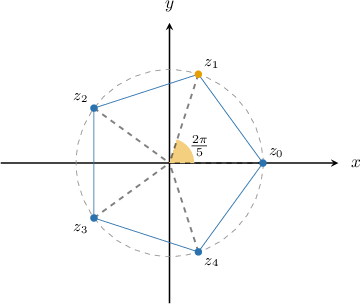
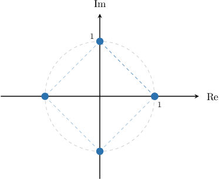
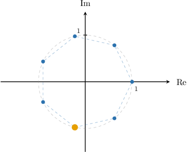
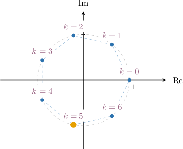

# The Roots of Unity

Source: https://www.mathacademy.com/topics/3400?courseId=136
Topic ID: 3400

## Prerequisites

- [Euler's Formula](./898-euler-s-formula.md)

## Lesson

### Introduction

A complex number $z$ is called an **$n$th root of unity** if it satisfies the equation

$$

z^n=1.

$$

(The word "unity" is simply another name for the number one.)

For example, to find all the 5th roots of unity, we must solve the equation

$$

z^5=1.

$$

We start by expressing the right-hand side in the form $re^{\textrm i\theta}.$

Computing the magnitude and argument of unity, we have

- $r = |1| = {\color{blue}1},$ and

- $\theta = \arg(1) = {\color{red}{0}}.$

Now, here's the trick. When expressing unity in exponential form, we add an arbitrary integer multiple of $2\pi,$ as follows:

$$

\begin{aligned}1 & =𝑟𝑒^{i𝜃} \\ & =𝑟𝑒^{i(𝜃+2𝑘𝜋)} \\ & =1⋅𝑒^{i(0+2𝑘𝜋)} \\ & =𝑒^{2𝑘𝜋i}\end{aligned}

$$

where $k$ is an integer.

Now, rewriting the right-hand side of the equation $z^5 = 1,$ we get

$$

z^5 = e^{2k\pi \textrm{i}}.

$$

Taking the 5th root of both sides gives

$$

\begin{aligned}𝑧_{𝑘}=(𝑒^{2𝑘𝜋i})^{1/5}=𝑒^{2𝑘𝜋i/5}.\end{aligned}

$$

There are exactly $5$ distinct 5th roots of unity. To find these, we substitute $k=0$ up to $k=4$ into the above, as follows:

$$

\begin{aligned}𝑘=0 & :\,𝑧_{0}=𝑒^{2(0)𝜋i/5}=𝑒^{0}=1 \\ 𝑘=1 & :\,𝑧_{1}=𝑒^{2(1)𝜋i/5}=𝑒^{2𝜋i/5} \\ 𝑘=2 & :\,𝑧_{2}=𝑒^{2(2)𝜋i/5}=𝑒^{4𝜋i/5} \\ 𝑘=3 & :\,𝑧_{3}=𝑒^{2(3)𝜋i/5}=𝑒^{6𝜋i/5} \\ 𝑘=4 & :\,𝑧_{4}=𝑒^{2(4)𝜋i/5}=𝑒^{8𝜋i/5}\end{aligned}

$$

Therefore, our 5th roots of unity are as follows:

$$

1, \quad e^{2\pi\textrm{i}/5}, \quad e^{4\pi\textrm{i}/5}, \quad e^{6\pi\textrm{i}/5}, \quad e^{8\pi\textrm{i}/5}

$$

In general, the case corresponding to $k=1$ is the **principal $n$th root of unity**. So, the principal $5$th root of unity is

$$

z_1 = e^{2\pi \textrm{i}/5}.

$$

### Example: Finding Primary Roots of Unity

#### Question

Find the principal $6$th root of unity.

#### Explanation

Let $z$ be a $6$th root of unity. This means that

$$

z^{6} = 1.

$$

First, we express the complex number $1$ in the form $re^{\textrm{i}\theta}.$ Notice that $|1| = 1$ and $\arg(1) = 0.$ Hence,

$$

1 = e^{\textrm{i}(0 + 2k\pi)} = e^{2k\pi \textrm{i}},

$$

where $k$ is an integer. So, we have

$$

\begin{aligned}𝑧^{6}=𝑒^{2𝑘𝜋i}\,⟹\,𝑧=(𝑒^{2𝑘𝜋i})^{1/6}=𝑒^{𝑘𝜋i/3}.\end{aligned}

$$

The principal root corresponds to $k=1,$ and is therefore equal to $e^{\pi \textrm{i}/3}.$

### The Geometry of the Nth Roots of Unity

Earlier, we found that the $5$th roots of unity are as follows:

$$

z_0 = 1, \qquad z_1 = e^{2\pi\textrm{i}/5}, \qquad z_2 = e^{4\pi\textrm{i}/5}, \qquad z_3 = e^{6\pi\textrm{i}/5}, \qquad z_4 = e^{8\pi\textrm{i}/5}

$$

All five roots lie on the unit circle in the complex plane and form a regular pentagon, as shown below.

In general, the $n$th roots of unity will always lie on the unit circle in the complex plane, and its vertices are those of a regular $n$-gon. Moreover,

- $z_0 = 1$ is *always* a vertex of this polygon, and

- if $n$ is even, then $z_{n/2} = -1$ is also a vertex of this polygon.

### Example: Geometric Interpretation of the Roots of Unity

#### Question

Sketch a diagram showing all the $4$th roots of unity.

#### Explanation

Geometrically, the $4$th roots of unity have the following properties:

- all of them lie on the unit circle centered in the origin,

- one of the roots is $1,$ corresponding to the point $(1,0)$ on the complex plane,

- the roots form a square (regular $4$-sided polygon).

Therefore, the correct answer is the following:

### Example: Finding Roots of Unity With Certain Properties

#### Question

Find the root of unity highlighted in the diagram below.

#### Explanation

The $n$th roots of unity lie at the vertices of a regular $n$-gon inscribed inside the unit circle in the complex plane. One of the vertices of this regular $n$-gon must lie at the point $(1,0).$

Since there are $7$ points in our diagram, we need to find a $7$th root of unity.

First, we express the complex number $1$ in the form $re^{\textrm{i}\theta}.$ Notice that $|1| = 1$ and $\arg(1) = 0.$ Hence,

$$

1 = e^{\textrm{i}(0 + 2k\pi)} = e^{2k\pi \textrm{i}},

$$

where $k$ is an integer. So, we have

$$

\begin{aligned}𝑧^{7}=𝑒^{2𝑘𝜋i}\,⟹\,𝑧=(𝑒^{2𝑘𝜋i})^{1/7}=𝑒^{2𝑘𝜋i/7}.\end{aligned}

$$

To find the index $k$ of our root of unity, we enumerate the roots in the diagram counter-clockwise, starting with the root at $(1,0)$ corresponding to $k=0,$ as shown below.

So, the required root corresponds to $k=5.$ Substituting this into the expression for roots, we obtain the following:

$$

\begin{aligned}𝑧_{5}=𝑒^{2(5)𝜋i/7}=𝑒^{10𝜋i/7}\end{aligned}

$$

### Closing Remark

Earlier, when finding the 5th roots of unity, we substituted the integers from $k=0$ to $k=4$ inclusive into the following formula:

$$

\begin{aligned}𝑧_{𝑘}=𝑒^{2𝑘𝜋i/5}\end{aligned}

$$

This process gave us the following results:

$$

z_0 = 1, \qquad z_1 = e^{2\pi\textrm{i}/5}, \qquad z_2 = e^{4\pi\textrm{i}/5}, \qquad z_3 = e^{6\pi\textrm{i}/5}, \qquad z_4 = e^{8\pi\textrm{i}/5}

$$

You may be wondering why we stopped at $k=4.$ What about $k=5,6,7,\ldots?$

It turns out that if we continue substituting values for $k,$ we'll get the same results repeated. In other words, we will not get any other roots.

For example, substituting $k=8$ into our formula gives

$$

\begin{aligned}𝑧_{8} & =𝑒^{2(8)𝜋i/5} \\ & =𝑒^{16𝜋i/5} \\ & =𝑒^{6𝜋i/5+10𝜋i/5} \\ & =𝑒^{6𝜋i/5+2𝜋i} \\ & =𝑒^{6𝜋i/5}⋅𝑒^{2𝜋i} \\ & =𝑒^{6𝜋i/5}⋅1 \\ & =𝑒^{6𝜋i/5} \\ & =𝑧_{3}.\end{aligned}

$$
