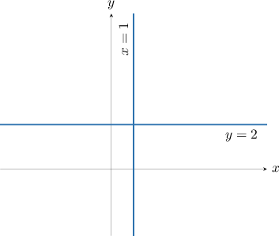
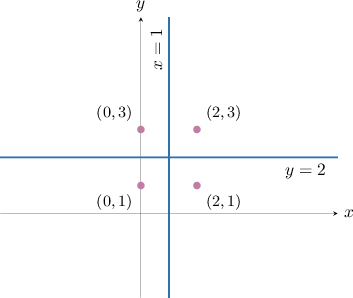
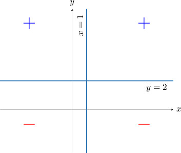
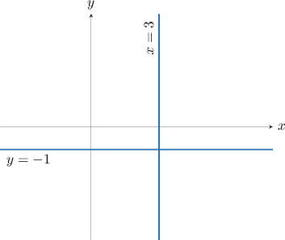
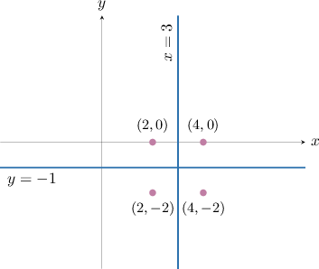
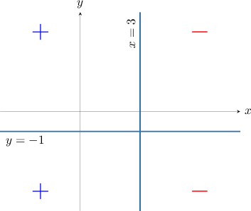
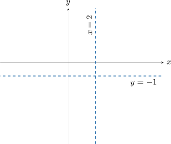
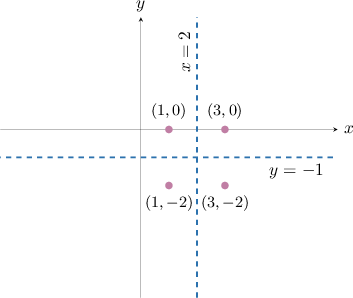
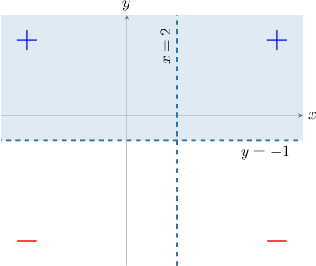

# Further Solving of Two-Variable Nonlinear Inequalities

Source: https://www.mathacademy.com/topics/3684?courseId=136
Topic ID: 3684

## Prerequisites

- [Solving Two-Variable Nonlinear Inequalities](./2076-solving-two-variable-nonlinear-inequalities.md)

## Lesson

### Introduction

Consider the function $f(x,y),$ defined as

$$

f(x,y) = 2(x-1)^2(y-2).

$$

Let's determine the values of $x$ and $y$ for which the function is positive and negative.

As always, we first solve $f(x,y) = 0.$ This gives

$$

\begin{aligned}2(𝑥−1)^{2}⋅(𝑦−2)=0\, & ⟹\,2(𝑥−1)^{2}=0\,or\,(𝑦−2)=0.\end{aligned}

$$

Solving these equations gives the solutions $x=1$ and $y=2.$ These solutions divide the $xy$-plane into four regions, as shown below.

We now determine the sign of $f(x,y)$ in each region. To do this, we pick four test points, one for each region.

We compute the sign of $f(x,y)$ in each region by calculating the sign at each test point. We record our results in a sign table.

Using the *last* column of the table above, we get the following picture:

We can also record our findings using a simplified sign table, like the one below.

### Example: Identifying Regions Where a Function Is Positive or Negative Using a Sign Table

#### Question

Consider the expression $f(x,y) = (3-x)(y+1)^2.$ What are the missing entries in the sign table of $f(x,y)$ shown below?

#### Explanation

Notice that $f(x,y)$ equals zero when $x = 3$ and $y = -1.$ These lines divide the $xy$-plane into four regions, as shown below.

To determine the sign of $f(x,y)$ in each region, we pick four test points, one for each region.

Next, we calculate the sign of $f(x,y)$ in each region using a sign table:

Using the ** column of the table above, we get the following picture:

Finally, we fill in the required sign table.

### Example: Identifying Regions in the Plane Where a Function Is Positive or Negative

#### Question

Suppose that $f(x,y) = (x-2)^2(y+1).$ Which of the following shaded areas gives the solution to the inequality $f(x,y) > 0?$

#### Explanation

Notice that $f(x,y)$ equals zero when $x=2$ and $y=-1.$ These lines divide the $xy$-plane into four regions, as shown below. Since we have a strict inequality, we use dashed lines to divide the plane.

To determine the sign of $f(x,y)$ in each region, we pick four test points, one for each region.

Next, we calculate the sign of $f(x,y)$ in each region using a sign table:

Finally, on our diagram, we shade in the solutions to $f(x,y) > 0$ using the ** column of the table above.

