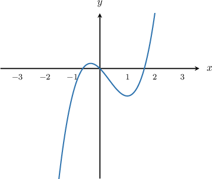

# Analyzing Second-Degree Taylor Polynomials

Source: https://www.mathacademy.com/topics/3825?courseId=136
Topic ID: 3825

## Prerequisites

- [Second-Degree Taylor Polynomials](./1177-second-degree-taylor-polynomials.md)
- [Relating Concavity to the Second Derivative](./3846-relating-concavity-to-the-second-derivative.md)

## Lesson

### Introduction

The second-degree Taylor polynomial of a function $f(x)$ about the point $x=a$ is given by

$$

P_2(x) = {\color{blue}f(a)} + {\color{red}f'(a)}(x-a) + {\color{purple}\dfrac{1}{2}f''(a)}(x-a)^2.

$$

We can use the Taylor polynomial of a function to determine the value of some derivatives of $f(x)$ at $x=a.$

For example, let's consider the following polynomial:

$$

P_2(x)= {\color{blue}-1} + {\color{red}2}(x-1) {\color{purple}\,-\,5}(x-1)^2

$$

In this case, we have $a=1.$

Now, comparing this polynomial with the general second-degree Taylor polynomial, we see that

$$

f(a)={\color{blue}-1}, \qquad f'(a)={\color{red}2}, \qquad \dfrac{1}{2}f''(a)={\color{purple}-5}.

$$

In other words,

- the value of the function $f(x)$ at $x=1$ must be

- the value of the first derivative $f'(x)$ at $x=1$ must be

- the value of the second derivative $f''(x)$ at $x=1$ can be found as follows:

### Example: Finding the First or Second Derivative of a Function at a Point Given Its Second-Degree Taylor Polynomial

#### Question

The second-degree Taylor polynomial of a function $f(x)$ about $x=2$ is given by

$$

f(x)=1 + 4(x-2) - 12(x-2)^2.

$$

What is the value of $f''(2)?$

#### Explanation

This is an expansion about the point $x=2,$ so the coefficient of the second-degree term is $\dfrac 1 2 f''(2).$ In the given equation, we see that the coefficient of the second-degree term is $-12,$ so we have

$$

\dfrac 1 2 f''(2) = -12\qquad\Longrightarrow\qquad f''(2) = -24.

$$

### Example: Deducing the Second-Degree Taylor Polynomial Given the Graph of a Function

#### Question

The figure above shows the graph of a function $y = f(x).$ Which of the following could be the second-degree Taylor polynomial for $f(x)$ about $x=-1?$

1. $-1+2(x+1)-3(x+1)^2$

2. $-1+4(x+1)+(x+1)^2$

3. $-1-5(x+1)-2(x+1)^2$

#### Explanation

The second-degree Taylor polynomial for $f(x)$ about $x=-1$ is

$$

P_2(x)=f(-1)+f'(-1)(x+1)+\dfrac{f''(-1)}{2}(x+1)^2.

$$

From the graph, we observe:

- $f(-1) <0.$ Therefore, the first term of the Taylor polynomial must be negative.

- $f'(-1) >0,$ because the slope of the tangent at $x=-1$ is positive. Therefore, the coefficient of the second term in the Taylor polynomial must be positive.

- $f''(-1) <0,$ because the graph is concave down at $x=-1.$ Therefore, the coefficient of the third term in the Taylor polynomial must be negative.

Only option I meets all of the above criteria.
