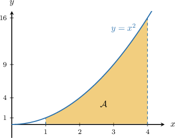
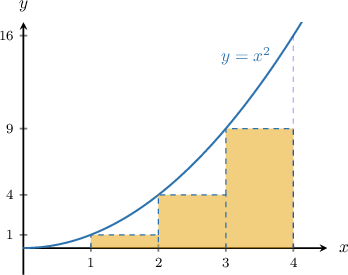
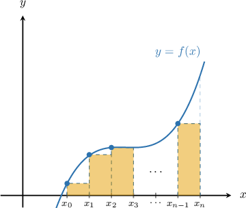
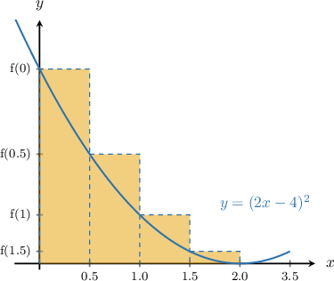
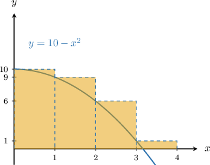
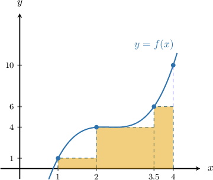

# Approximating Areas With the Left Riemann Sum

Source: https://www.mathacademy.com/topics/477?courseId=136
Topic ID: 477

## Prerequisites

- [Graphs of General Quadratic Functions](../algebra-i/84-graphs-of-general-quadratic-functions.md)
- [Areas of Rectangles and Squares](../grade-7/1352-areas-of-rectangles-and-squares.md)
- [Increasing and Decreasing Functions](../algebra-i/1628-increasing-and-decreasing-functions.md)

## Lesson

### Introduction

Suppose that we wish to find the area $\mathcal{A}$ under the graph of $y=x^2$ between the $x$-values $x=1$ and $x=4,$ as shown below.

We can *approximate* the area using, for instance, the area of three rectangles, each with a width equal to $1.$

So, we find the area of each rectangle and then add them all together.

$$

\begin{aligned}A & ≈\overset{\overset{\,\overset{\overset{𝑓(1)}{}}{height}\,⋅\,\underset{width}{\underset{}{1}}\,}{}}{1st rectangle}+\overset{\overset{\,\overset{\overset{𝑓(2)}{}}{height}\,⋅\,\underset{width}{\underset{}{1}}\,}{}}{2nd rectangle}+\overset{\overset{\,\overset{\overset{𝑓(3)}{}}{height}\,⋅\,\underset{width}{\underset{}{1}}\,}{}}{3rd rectangle} \\ & =[1^{2}⋅1]+[2^{2}⋅1]+[3^{2}⋅1] \\ & =1+4+9 \\ & =14\end{aligned}

$$

Here, we approximated the area using a **left Riemann sum**, which means that the top-*left* corner of each rectangle touches the curve.

Because the function is *strictly increasing* over the interval $[1,4],$ the rectangles are entirely *below* the function, which means our approximation is an *underestimate* of the actual area.

### A General Formula for the Left Riemann Sum

In general, the area under the curve over the interval can be approximated using a left Riemann sum by calculating the area of each rectangle and adding them together.

We can write this mathematically as

where and are the endpoints of the interval, is the number of rectangles, and the step size is given by

We can simplify by factoring out the which gives the following general formula:

### Example: Calculating a Left Riemann Sum With Regular Step Size

#### Question

Estimate the area under the curve $y=f(x)=(2x-4)^2$ over the interval $[0,2]$ using a left Riemann sum with $4$ rectangles of equal width.

#### Explanation

First, let's compute the step size $\Delta x,$ which is just the width of each rectangle. In this case, the endpoints of our interval are $a=0$ and $b=2,$ and there are $n=4$ rectangles, so the step size is

$$

\Delta x=\dfrac{b-a}{n}=\dfrac{2-0}{4}=0.5.

$$

Now, let's sketch our situation. We are using a left Riemann sum, which means we draw the rectangles so that the left corner of each rectangle coincides with the curve.

The area $\mathcal{A}$ can be approximated using the formula

$$

\mathcal A\approx(\overbrace{{\color{red}{f(0)}}+{\color{red}{f(0.5)}}+{\color{red}{f(1)}}+{\color{red}{f(1.5)}}}^{\color{red}{\large\text{heights}}})\cdot \underbrace{\color{blue}\Delta x}_{\color{blue}{\large\text{width}}}.

$$

So, we now set up a table with the values of $f(x)$ at each point:

Finally, we obtain the following approximation for our area:

$$

\begin{aligned}A≈(16+9+4+1)⋅0.5=15\end{aligned}

$$

### Example: Solving for an Unknown Given the Value of a Left Riemann Sum With Regular Step Size

#### Question

The table below gives some values of a continuous function $f(x)$ over the interval $[-4,2].$ If the left Riemann sum approximation of the area under the curve $y=f(x)$ with $3$ equal subintervals has a value of $28,$ then what must be the value of $k?$

#### Explanation

The area $\mathcal{A}$ can be approximated using the formula for the left Riemann sum:

$$

\mathcal A\approx(\overbrace{{\color{red}{f(-4)}}+{\color{red}{f(-2)}}+{\color{red}{f(0)}}}^{\color{red}{\large\text{heights}}})\cdot \underbrace{\color{blue}\Delta x}_{\color{blue}{\large\text{width}}}

$$

So, we set up a table with the values of $f(x)$ at each point:

Now, we obtain the following approximation for the area:

$$

\begin{aligned}A & ≈(5+3+𝑘)⋅2 \\ & =(8+𝑘)⋅2 \\ & =16+2𝑘\end{aligned}

$$

Since we are given that $\mathcal A$ must be $28,$ we obtain

$$

\begin{aligned}16+2𝑘 & =28 \\ 2𝑘 & =12 \\ 𝑘 & =6.\end{aligned}

$$

### Overestimates and Underestimates

Whether the left Riemann sum underestimates or overestimates the actual area under a function depends on whether the function is increasing or decreasing.

- If the function $f(x)$ is increasing, then the rectangles fall *below* the function, which means the left Riemann sum gives an *underestimate* of the actual area under the curve $y=f(x).$

- If the function $f(x)$ is decreasing, then the rectangles reach *above* the function, which means the left Riemann sum gives an *overestimate* of the actual area under the curve $y=f(x).$

### Example: Determining Whether a Left Riemann Sum is an Overestimate or Underestimate

#### Question

Suppose a left Riemann sum is used to approximate the area under the curve $y=f(x)=(2x-4)^2$ over the interval $[0,2].$ Is the resulting estimation an overestimate or an underestimate?

#### Explanation

Let's sketch our situation. We are using a left Riemann sum, which means we draw the rectangles so that the left corner of each rectangle coincides with the curve.

Because the function is ** over the interval $[0,2],$ the rectangles reach ** the function, which means our approximation is an ** of the actual area.

### Left Riemann Sums with Irregular Step Size

In the last few examples, the step size $\Delta x$ was the same for each of the rectangles. In these cases, we say that the step size is **regular**.

There are situations where the step size can vary, which we call an **irregular step size**. But we can still use a left Riemann sum to approximate the area.

For example, let's use a left Riemann sum to approximate the area under the curve of the continuous function $y=f(x)$ whose data is given in the table below.

First, note that the domain of $f(x)$ has been *partitioned* as

$$

\begin{aligned} [1,4] &= [1, 2] \cup [2, 3.5] \cup [3.5, 4] . \end{aligned}

$$

Let's plot what this function might look like, using the values given in the table.

We've drawn some rectangles to help us calculate our left Riemann sum, and we have chosen the heights of each rectangle to be calculated using the left endpoint of each interval.

By calculating the area of each rectangle, we obtain the following approximation for our area:

$$

1

$$

Plugging our numbers into the above, we find

$$

\begin{aligned} \mathcal{A} &\approx {\color{red}1} \cdot ({\color{blue}2-1}) + {\color{red}4} \cdot ({\color{blue}3.5-2}) + {\color{red}6} \cdot ({\color{blue}4-3.5}) \\\[5pt] &= {\color{red}1} \cdot {\color{blue}1} +{\color{red}4} \cdot {\color{blue}1.5}+ {\color{red}6} \cdot {\color{blue}0.5} \\\[5pt] &=1+6+3\\\[5pt] &= 10. \end{aligned}

$$

### Example: Calculating a Left Riemann Sum With Irregular Step Size

#### Question

The following table shows some values of a continuous function $f(x)$ over the interval $[0,2].$

Use the left Riemann sum, with the three subintervals indicated by the data, to approximate the area under the curve $y=f(x)$ over the interval $[0,2].$

#### Explanation

In this case, we have $n=3$ rectangles. Using the left Riemann sum, the area is computed as

$$

\mathcal{A} \approx f(0.0)\Delta x_1+f(0.8)\Delta x_2+f(1.6)\Delta x_3,

$$

where each $\Delta x_i$ is calculated by considering the step between a particular $x$-value and the next one, i.e.,

$$

\Delta x_i = x_{i+1}-x_{i}.

$$

We set up a value table that includes the $\Delta x$'s.

Finally, we plug in the numbers to approximate the area under the curve and get

$$

\begin{aligned}A & ≈2⋅0.8+5⋅0.8+10⋅0.4 \\ & =1.6+4+4 \\ & =9.6.\end{aligned}

$$
