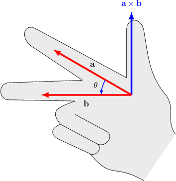
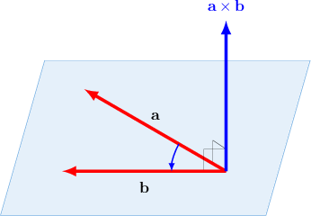
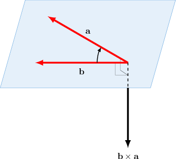

# Properties of the Cross Product

Source: https://www.mathacademy.com/topics/4858?courseId=136
Topic ID: 4858

## Prerequisites

- [The Cross Product of Two Vectors](./246-the-cross-product-of-two-vectors.md)

## Lesson

### Introduction

Recall that the cross product of two vectors $\mathbf{a}$ and $\mathbf{b}$ is defined as

$$

\mathbf{a}\times\mathbf{b} = | \, \mathbf{a} \, | \cdot | \, \mathbf{b} \, | \cdot \sin\theta \cdot \mathbf{n},

$$

where

- $\theta$ is the angle formed between the vectors when their tails are placed at the same point, and

- $\mathbf{n}$ is a unit vector that's perpendicular to *both* $\mathbf{a}$ and $\mathbf{b}.$

The cross product satisfies a few properties that we would normally expect multiplication to satisfy.

Specifically, given the vectors $\mathbf{a},$ $\mathbf{b},$ $\mathbf{c},$ and any scalar $\lambda,$ the following properties hold.

- The cross product distributes over addition and subtraction:

- The cross product is associative with respect to scalar multiplication:

Let's see some examples of how we can use these properties.

### Example: Calculating Cross Product Expressions Using the Distributive Laws

#### Question

Find $(-2\mathbf{a}+5\mathbf{b}) \times \mathbf{c},$ if $\mathbf{a} \times \mathbf{c} = \mathbf{i}$ and $\mathbf{b} \times \mathbf{c} = -3\mathbf{i}+\mathbf{j}.$

#### Explanation

First, we recall the following properties of the cross product:

- The cross product distributes over addition/subtraction:

- The cross product is associative with respect to scalar multiplication:

With that in mind, let's evaluate our expression:

- First, we use distributive property:

$$

\begin{aligned}(−2𝐚+5𝐛)×𝐜 & =(−2𝐚)×𝐜+(5𝐛)×𝐜\end{aligned}

$$

- Next, we factor out the scalars:

- Finally, we substitute the given values for $\mathbf{a} \times \mathbf{c}$ and $\mathbf{b} \times \mathbf{c},$ and simplify:

$$

\begin{aligned}−2(𝐚×𝐜)+5(𝐛×𝐜) & =−2⋅(𝐢)+5⋅(−3𝐢+𝐣) \\ & =−2𝐢−15𝐢+5𝐣 \\ & =−17𝐢+5𝐣\end{aligned}

$$

### The Anticommutativity Property

The cross product depends on the order of multiplication! In other words, the cross product is *not* commutative.

More specifically, it is **anticommutative**, meaning that if we swap the order of the multiplication, the result changes sign:

$$

\mathbf{a} \times \mathbf{b} = -\mathbf{b} \times \mathbf{a}

$$

To understand why this is so, we need to go back to the right-hand rule for calculating $\mathbf a \times \mathbf b{:}$

Recall that the right-hand rule says that we calculate the *direction* of the vector $\mathbf a \times \mathbf b$ as follows:

- First, we extend the index finger on our right hand along the direction of $\mathbf{a}.$

- Then, we extend our middle finger along the direction of $\mathbf{b}.$

- When we do this, our thumb points in the direction of $\mathbf{a}\times\mathbf{b}.$

We can also use the right-hand rule to calculate the direction of $\mathbf b \times \mathbf a{:}$

- First, we extend the index finger on our right hand along the direction of $\mathbf{b}.$

- Then, we extend our middle finger along the direction of $\mathbf{a}.$

- When we do this, our thumb points in the direction of $\mathbf{b}\times\mathbf{a}.$

So, $\mathbf a \times \mathbf b$ and $\mathbf b \times \mathbf a$ have the *same* magnitude yet *opposite* direction. Therefore,

$$

\mathbf a \times \mathbf b = -\mathbf b \times \mathbf a.

$$

### Example: Calculating Cross Product Expressions Using Anticommutativity

#### Question

Find $2\mathbf{a} \times (\mathbf{a}+3\mathbf{b})$, if $\mathbf{b} \times \mathbf{a} = \mathbf{i}-\mathbf{j}-2 \mathbf{k}.$

#### Explanation

First, we recall the following properties of the cross product:

- The cross product distributes over addition/subtraction:

- The cross product is associative with respect to scalar multiplication:

- The cross product of parallel vectors equals the zero vector. In particular,

- The cross product is anticommutative:

With that in mind, let's evaluate our expression:

- First, we use the distributive property:

- Next, we factor out the scalars:

- Then, we use anticommutativity, and the fact that $\mathbf{a} \times \mathbf{a} = \mathbf{0}{:}$

- Finally, we substitute the given value for $\mathbf{b} \times \mathbf{a}$ and simplify:
