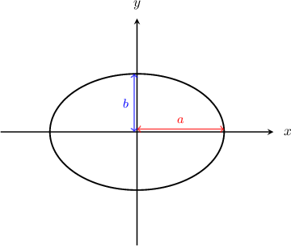
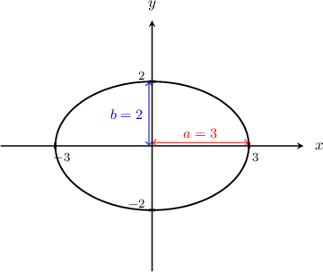
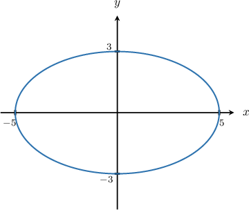
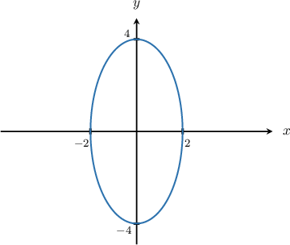
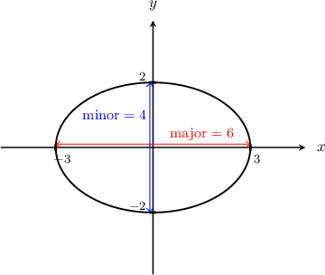
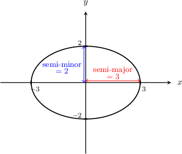

# Equations of Ellipses Centered at the Origin

Source: https://www.mathacademy.com/topics/848?courseId=136
Topic ID: 848

## Prerequisites

- [Equations of Circles Centered at the Origin](./842-equations-of-circles-centered-at-the-origin.md)
- [Introduction to Ellipses](./853-introduction-to-ellipses.md)

## Lesson

### Introduction

The equation of an ellipse centered at the origin with a horizontal radius of length $\color{red}a$ and a vertical radius of length $\color{blue}b$ is given by

$$

\dfrac{x^2}{{\color{red}a}^2}+\dfrac{y^2}{{\color{blue}b}^2}=1.

$$

To demonstrate, let's determine the equation of the following ellipse. The horizontal radius has length $\color{red}a=3$ and the vertical radius has length $\color{blue}b=2.$

Therefore, the equation of the ellipse is

$$

\begin{aligned}\frac{𝑥^{2}}{3^{2}}+\frac{𝑦^{2}}{2^{2}} & =1 \\ \frac{𝑥^{2}}{9}+\frac{𝑦^{2}}{4} & =1.\end{aligned}

$$

### Example: Determining the Equation of a Wide Ellipse

#### Question

What is the equation of the ellipse given below?

#### Explanation

Remember that the equation of an ellipse centered at the origin with a horizontal radius of length $a$ and a vertical radius of length $b$ is given by

$$

\dfrac{x^2}{a^2}+\dfrac{y^2}{b^2}=1.

$$

Here, the horizontal radius has length $a=5$ and the vertical radius has length $b=3.$ Therefore, the equation of the ellipse is

$$

\begin{aligned}\frac{𝑥^{2}}{𝑎^{2}}+\frac{𝑦^{2}}{𝑏^{2}} & =1 \\ \frac{𝑥^{2}}{5^{2}}+\frac{𝑦^{2}}{3^{2}} & =1 \\ \frac{𝑥^{2}}{25}+\frac{𝑦^{2}}{9} & =1.\end{aligned}

$$

### Example: Determining the Equation of a Tall Ellipse

#### Question

What is the equation of the ellipse given below?

#### Explanation

Remember that the equation of an ellipse centered at the origin with a horizontal radius of length $a$ and a vertical radius of length $b$ is given by

$$

\dfrac{x^2}{a^2}+\dfrac{y^2}{b^2}=1.

$$

Here, the horizontal radius has length $a=2$ and the vertical radius has length $b=4.$ Therefore, the equation of the ellipse is

$$

\begin{aligned}\frac{𝑥^{2}}{𝑎^{2}}+\frac{𝑦^{2}}{𝑏^{2}} & =1 \\ \frac{𝑥^{2}}{2^{2}}+\frac{𝑦^{2}}{4^{2}} & =1 \\ \frac{𝑥^{2}}{4}+\frac{𝑦^{2}}{16} & =1.\end{aligned}

$$

### Major and Minor Axes

The **axes** of an ellipse are the horizontal and vertical diameters of the ellipse.

- The **major axis** of an ellipse is the *larger* of the horizontal and vertical diameters.

- The **minor axis** of an ellipse is the *shorter* of the horizontal and vertical diameters.

For example, the ellipse below has a major axis of $6$ and a minor axis of $4.$

The **semi-axes** of an ellipse are the horizontal and vertical radii of the ellipse.

- The **semi-major axis** of an ellipse is the *larger* of the horizontal and vertical radii. In other words, it is half the length of the major axis.

- The **semi-minor axis** of an ellipse is the *shorter* of the horizontal and vertical radii. In other words, it is half the length of the minor axis.

For example, the ellipse below has a semi-major axis of length $3$ and a semi-minor axis of length $2.$

### Example: Determining the Lengths of the Major and Minor Axes Given the Equation of an Ellipse

#### Question

What are the lengths of the major and minor axes of an ellipse with equation $\dfrac{x^2}{36} + \dfrac{y^2}{25} = 1?$

#### Explanation

Remember that the equation of an ellipse centered at the origin with a horizontal radius of length $a$ and a vertical radius of length $b$ is given by

$$

\dfrac{x^2}{a^2}+\dfrac{y^2}{b^2}=1.

$$

In the given equation, we have $a^2=36$ and $b^2=25.$

- Since $a^2=36,$ the length of the horizontal radius must be $a=\sqrt{36} = 6.$

- Since $b^2=25,$ the length of the vertical radius must be $b=\sqrt{25} = 5.$

So the semi-major axis has length $a=6,$ and the semi-minor axis has length $b=5.$

Therefore, the major axis has length $2a = 2 \cdot 6 = 12,$ and the minor axis has length $2b = 2 \cdot 5 =10.$
