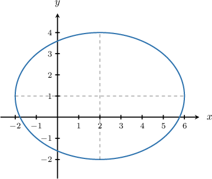
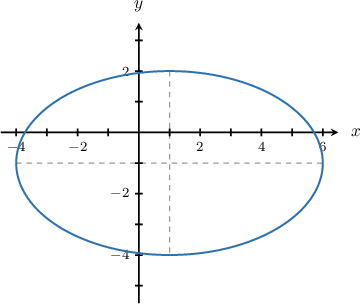
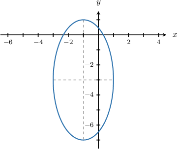

# Equations of Ellipses Centered at a General Point

Source: https://www.mathacademy.com/topics/849?courseId=136
Topic ID: 849

## Prerequisites

- [Equations of Circles](./843-equations-of-circles.md)
- [Equations of Ellipses Centered at the Origin](./848-equations-of-ellipses-centered-at-the-origin.md)

## Lesson

### Introduction

The equation of an ellipse centered at the point $({\color{red}h}, {\color{blue}k})$ with a horizontal radius of length $\color{red}a$ and a vertical radius of length $\color{blue}b$ is given by

$$

\dfrac{(x-{\color{red}h})^2}{{\color{red}a}^2}+\dfrac{(y-{\color{blue}k})^2}{{\color{blue}b}^2}=1.

$$

To demonstrate, let's determine the equation that describes the ellipse below, centered at $({\color{red}2},{\color{blue}1}).$

Notice that the horizontal radius has length ${\color{red}a} = {\color{red}4},$ while the vertical radius has length ${\color{blue}b} = {\color{blue}3}.$

Substituting ${\color{red}a} = {\color{red}4},$ ${\color{blue}b} = {\color{blue}3},$ and $({\color{red}h}, {\color{blue}k}) = ({\color{red}2}, {\color{blue}1}),$ we find that the equation of the ellipse is

$$

\begin{aligned}\frac{(𝑥−2)^{2}}{4^{2}}+\frac{(𝑦−1)^{2}}{3^{2}} & =1 \\ \frac{(𝑥−2)^{2}}{16}+\frac{(𝑦−1)^{2}}{9} & =1.\end{aligned}

$$

### Example: Determining the Equation of a Wide Ellipse

#### Question

What is the equation of the ellipse given below?

#### Explanation

Remember that the general equation of an ellipse centered at $(h,k)$ with a horizontal radius of length $a$ and a vertical radius of length $b$ is given by

$$

\dfrac{(x-h)^2}{{a}^2}+\dfrac{(y-k)^2}{{b}^2}=1.

$$

Here, the ellipse is centered at $(1,-1),$ the horizontal radius has length $a=5,$ and the vertical radius has length $b=3.$ Therefore, the equation of the ellipse is

$$

\begin{aligned}\frac{(𝑥−ℎ)^{2}}{𝑎^{2}}+\frac{(𝑦−𝑘)^{2}}{𝑏^{2}} & =1 \\ \frac{(𝑥−1)^{2}}{5^{2}}+\frac{(𝑦−(−1))^{2}}{3^{2}} & =1 \\ \frac{(𝑥−1)^{2}}{25}+\frac{(𝑦+1)^{2}}{9} & =1.\end{aligned}

$$

### Example: Determining the Equation of a Tall Ellipse

#### Question

What is the equation of the ellipse given below?

#### Explanation

Remember that the general equation of an ellipse centered at $(h,k)$ with a horizontal radius of length $a$ and a vertical radius of length $b$ is given by

$$

\dfrac{(x-h)^2}{{a}^2}+\dfrac{(y-k)^2}{{b}^2}=1.

$$

Here, the ellipse is centered at $(-1,-3),$ the horizontal radius has length $a=2,$ and the vertical radius has length $b=4.$ Therefore, the equation of the ellipse is

$$

\begin{aligned}\frac{(𝑥−ℎ)^{2}}{𝑎^{2}}+\frac{(𝑦−𝑘)^{2}}{𝑏^{2}} & =1 \\ \frac{(𝑥−(−1))^{2}}{2^{2}}+\frac{(𝑦−(−3))^{2}}{4^{2}} & =1 \\ \frac{(𝑥+1)^{2}}{4}+\frac{(𝑦+3)^{2}}{16} & =1.\end{aligned}

$$

### Example: Determining the Center and Lengths of the Major and Minor Axes Given the Equation of an Ellipse

#### Question

For the ellipse $\dfrac{(x-2)^2}{25} + \dfrac{(y+2)^2}{16} = 1,$ find its center, and the lengths of its major and minor axes.

#### Explanation

Remember that the general equation of an ellipse centered at $(h,k)$ with a horizontal radius of length $a$ and a vertical radius of length $b$ is given by

$$

\dfrac{(x-h)^2}{{a}^2}+\dfrac{(y-k)^2}{{b}^2}=1.

$$

In the given equation, we have $h=2$ and $k=-2,$ so the center is located at $(2,-2).$

In the given equation, we also have $a^2=25$ and $b^2=16.$

- Since $a^2=25,$ the length of the horizontal radius must be $a=\sqrt{25} = 5.$

- Since $b^2=16,$ the length of the vertical radius must be $b=\sqrt{16} = 4.$

So the semi-major axis has length $a=5,$ and the semi-minor axis has length $b=4.$

Therefore, the major axis has length $2a = 2\cdot5 = 10,$ and the minor axis has length $2b = 2\cdot4 = 8.$
