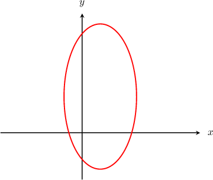

# Finding the Center and Axes of Ellipses by Completing the Square

Source: https://www.mathacademy.com/topics/852?courseId=136
Topic ID: 852

## Prerequisites

- [Determining Circle Properties by Completing the Square](./666-determining-circle-properties-by-completing-the-square.md)
- [Equations of Ellipses Centered at a General Point](./849-equations-of-ellipses-centered-at-a-general-point.md)
- [Completing the Square With Leading Coefficients](../algebra-i/3824-completing-the-square-with-leading-coefficients.md)

## Lesson

### Introduction

Let's consider the equation $4x^2+y^2 - 8x - 4y = 8.$ Its graph is given below.

Clearly, this is an ellipse. To determine the center and the lengths of the major and minor axes, we need to rewrite the given equation in the standard form

$$

\dfrac{(x-h)^2}{{a}^2}+\dfrac{(y-k)^2}{{b}^2}=1,

$$

where $(h,k)$ is the center of the ellipse, and $a$ and $b$ are the horizontal and vertical radii of the ellipse, respectively.

We do this by completing the square. First, we must group the $x$ terms and the $y$ terms:

$$

\begin{aligned}4𝑥^{2}+𝑦^{2}−8𝑥−4𝑦 & =8 \\ (4𝑥^{2}−8𝑥)+(𝑦^{2}−4𝑦) & =8\end{aligned}

$$

Now, we complete the square for the both the $x$ and $y$ terms, as follows:

$$

\begin{aligned}(4𝑥^{2}−8𝑥)+(𝑦^{2}−4𝑦) & =8 \\ 4[𝑥^{2}−2𝑥]+𝑦^{2}−4𝑦 & =8 \\ 4[(𝑥−1)^{2}−1]+(𝑦−2)^{2}−4 & =8 \\ 4(𝑥−1)^{2}−4+(𝑦−2)^{2}−4 & =8.\end{aligned}

$$

Finally, we rearrange the equation into the desired form:

$$

\begin{aligned}4(𝑥−1)^{2}−4+(𝑦−2)^{2}−4 & =8 \\ 4(𝑥−1)^{2}+(𝑦−2)^{2} & =8+4+4 \\ 4(𝑥−1)^{2}+(𝑦−2)^{2} & =16 \\ \frac{(𝑥−1)^{2}}{4}+\frac{(𝑦−2)^{2}}{16} & =1 \\ \frac{(𝑥−1)^{2}}{2^{2}}+\frac{(𝑦−2)^{2}}{4^{2}} & =1.\end{aligned}

$$

Now that the ellipse equation is in the standard form, we can tell that the ellipse is centered at $(1,2).$

Also, since $4 > 2,$ the length of the semi-major axis is $4$, and the length of the semi-minor axis is $2.$

Consequently, the length of the major axis is $2\cdot 4 =8$ and the length of the minor axis is $2\cdot 2 =4.$

### Example: Determining the Center and Axis Lengths Given an Inhomogeneous Polynomial Equation of an Ellipse

#### Question

Find the center and the lengths of the major and minor axes of the ellipse whose equation is $25x^2 + 9y^2 - 100x - 18y = 116.$

#### Explanation

First, we must group the $x$ terms and the $y$ terms:

$$

\begin{aligned}25𝑥^{2}+9𝑦^{2}−100𝑥−18𝑦 & =116 \\ (25𝑥^{2}−100𝑥)+(9𝑦^{2}−18𝑦) & =116\end{aligned}

$$

Now, we complete the square for the both the $x$ and $y$ terms, as follows:

$$

\begin{aligned}(25𝑥^{2}−100𝑥)+(9𝑦^{2}−18𝑦) & =116 \\ 25[𝑥^{2}−4𝑥]+9[𝑦^{2}−2𝑦] & =116 \\ 25[(𝑥−2)^{2}−4]+9[(𝑦−1)^{2}−1] & =116 \\ 25(𝑥−2)^{2}−100+9(𝑦−1)^{2}−9 & =116\end{aligned}

$$

Finally, we rearrange the equation into the desired form:

$$

\begin{aligned}25(𝑥−2)^{2}−100+9(𝑦−1)^{2}−9 & =116 \\ 25(𝑥−2)^{2}+9(𝑦−1)^{2} & =116+100+9 \\ 25(𝑥−2)^{2}+9(𝑦−1)^{2} & =225 \\ \frac{(𝑥−2)^{2}}{9}+\frac{(𝑦−1)^{2}}{25} & =1 \\ \frac{(𝑥−2)^{2}}{3^{2}}+\frac{(𝑦−1)^{2}}{5^{2}} & =1\end{aligned}

$$

Since $5 > 3,$ the length of the major axis is $2\cdot 5 =10,$ the length of the minor axis is $2\cdot 3 =6,$ and the ellipse is centered at $({2},{1}).$

### Example: Determining the Center and Axis Lengths Given a Homogeneous Polynomial Equation of an Ellipse

#### Question

Find the center and the lengths of the major and minor axes of the ellipse whose equation is $x^2 + 4y^2 - 6x + 24y + 41 = 0.$

#### Explanation

First, we must group the $x$ terms and the $y$ terms:

$$

\begin{aligned}𝑥^{2}+4𝑦^{2}−6𝑥+24𝑦+41 & =0 \\ (𝑥^{2}−6𝑥)+(4𝑦^{2}+24𝑦)+41 & =0\end{aligned}

$$

Now, we complete the square for the both the $x$ and $y$ terms, as follows:

$$

\begin{aligned}(𝑥^{2}−6𝑥)+(4𝑦^{2}+24𝑦)+41 & =0 \\ (𝑥^{2}−6𝑥)+4[𝑦^{2}+6𝑦]+41 & =0 \\ (𝑥−3)^{2}−9+4[(𝑦+3)^{2}−9]+41 & =0 \\ (𝑥−3)^{2}−9+4(𝑦+3)^{2}−36+41 & =0\end{aligned}

$$

Finally, we rearrange the equation into the desired form:

$$

\begin{aligned}(𝑥−3)^{2}−9+4(𝑦+3)^{2}−36+41 & =0 \\ (𝑥−3)^{2}+4(𝑦+3)^{2} & =9+36−41 \\ (𝑥−3)^{2}+4(𝑦+3)^{2} & =4 \\ \frac{(𝑥−3)^{2}}{4}+\frac{(𝑦+3)^{2}}{1} & =1 \\ \frac{(𝑥−3)^{2}}{2^{2}}+\frac{(𝑦+3)^{2}}{1^{2}} & =1\end{aligned}

$$

Since $2 > 1,$ the length of the major axis is $2\cdot 2 =4,$ the length of the minor axis is $2\cdot 1 =2,$ and the ellipse is centered at $({3},{-3}).$
