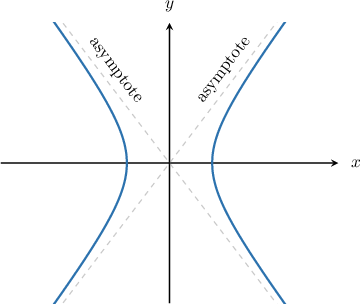

# Asymptotes of Hyperbolas Centered at the Origin

Source: https://www.mathacademy.com/topics/872?courseId=136
Topic ID: 872

## Prerequisites

- [Equations of Lines in Point-Slope Form](../algebra-i/418-equations-of-lines-in-point-slope-form.md)
- [Equations of Hyperbolas Centered at the Origin](./871-equations-of-hyperbolas-centered-at-the-origin.md)

## Lesson

### Introduction

Consider the horizontal hyperbola whose equation is

$$

\dfrac{x^2}{10} - \dfrac{y^2}{25} = 1,

$$

and whose graph is shown below:

The two dotted lines are the asymptotes of the hyperbola. As $x$ and $y$ get larger in absolute value, the hyperbola gets closer and closer to the asymptotes, but they never intersect. On the other hand, the asymptotes intersect each other at the center of the hyperbola.

Recall that the equation of general horizontal hyperbola centered at the origin is given by

$$

\dfrac{x^2}{a^2} - \dfrac{y^2}{b^2} = 1.

$$

The equations of the asymptotes of a general horizontal hyperbola are

$$

y = \pm \dfrac{b}{a}x.

$$

From the equation of the hyperbola shown in the diagram above, we have that $a = \sqrt {10}$ and $b = \sqrt{25} = 5.$ Therefore, the equations of asymptotes are

$$

\begin{aligned}𝑦=±\frac{5}{\sqrt{√10}}𝑥.\end{aligned}

$$

Finally, if we rationalize the denominator in the above equation, we get

$$

y = \pm\dfrac{\sqrt{10}}{2}x.

$$

### Example: Finding the Asymptotes of a Horizontal Hyperbola Given in Standard Form

#### Question

Find the asymptotes of the hyperbola $\dfrac{x^2}{36} - \dfrac{y^2}{9} = 1.$

#### Explanation

The standard equation of a horizontal hyperbola centered at the origin is

$$

\frac{x^2}{a^2} - \frac{y^2}{b^2}=1.

$$

For a horizontal hyperbola centered at the origin, the equations of the asymptotes are

$$

y=\pm \dfrac{b}{a}x.

$$

In our case, we have

$$

a=\sqrt{36} = 6, \qquad b=\sqrt9 =3.

$$

Therefore, the asymptotes of the hyperbola are

$$

\begin{aligned}𝑦 & =±\frac{3}{6}𝑥 \\ & =±\frac{1}{2}𝑥.\end{aligned}

$$

### The Asymptotes of a Vertical Hyperbola

For a general vertical hyperbola centered at the origin of the form

$$

\dfrac{y^2}{a^2} - \dfrac{x^2}{b^2} = 1,

$$

the equations of the asymptotes are

$$

y = \pm \dfrac{a}{b}x.

$$

**Note:** To remember which formula to use for the asymptotes of a hyperbola, notice that the numerator of the fraction is always the constant associated with $y$ in the equation:

$$

y - k = \pm \dfrac{\textrm{constant associated with }y}{\textrm{constant associated with }x} (x - h)

$$

### Example: Finding the Asymptotes of a Vertical Hyperbola Given in Standard Form

#### Question

Find the asymptotes of the hyperbola $\dfrac{y^2}{9} - \dfrac{x^2}{16} = 1$.

#### Explanation

The standard equation of a vertical hyperbola centered at the origin is

$$

\dfrac{y^2}{a^2} - \dfrac{x^2}{b^2} = 1.

$$

For a vertical hyperbola centered at the origin, the equations of the asymptotes are

$$

y=\pm \dfrac{a}{b} x.

$$

In our case, we have

$$

a=\sqrt{9} = 3, \qquad b=\sqrt{16} = 4.

$$

Therefore, the asymptotes of the hyperbola are $y = \pm \dfrac{3}{4}x.$

### Example: Finding the Asymptotes of a Hyperbola Given Its Equation in Non-Standard Form

#### Question

Calculate the asymptotes of the hyperbola $25 x ^ 2 - 9 y ^ 2 = 225$.

#### Explanation

The standard equation of a horizontal hyperbola centered at the origin is

$$

\frac{x^2}{a^2} - \frac{y^2}{b^2}=1.

$$

For a horizontal hyperbola centered at the origin, the equations of the asymptotes are

$$

y=\pm \dfrac{b}{a}x.

$$

To rewrite the given equation in standard form, we divide both sides of the equation by $225$ and then simplify, as follows:

$$

\begin{aligned}25𝑥^{2}−9𝑦^{2} & =225 \\ \frac{25𝑥^{2}}{225}−\frac{9𝑦^{2}}{225} & =\frac{225}{225} \\ \frac{𝑥^{2}}{9}−\frac{𝑦^{2}}{25} & =1\end{aligned}

$$

So, we have $a=\sqrt 9 = 3,$ and $b=\sqrt{25} = 5.$

Therefore, the asymptotes are $y=\pm \dfrac{5}{3}x.$
