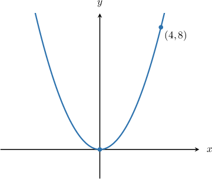

# Parametric Equations of Parabolas

Source: https://www.mathacademy.com/topics/875?courseId=136
Topic ID: 875

## Prerequisites

- [Left and Right Opening Parabolas](./1124-left-and-right-opening-parabolas.md)
- [Cartesian Equations of Parametric Curves](./1255-cartesian-equations-of-parametric-curves.md)

## Lesson

### Introduction

The standard parametric equations of a *vertical* parabola that has its vertex at $(0,0)$ are

$$

x = 2pt, \qquad y = pt^2, \qquad t \in (-\infty, \infty),

$$

where $p$ is constant.

As usual, the sign of $p$ determines whether the parabola is upward-opening or downward-opening.

- When $p > 0,$ the parabola is upward-opening.

- When $p < 0,$ the parabola is downward-opening.

### Example: Parametrizing a Vertical Parabola Whose Vertex Is at the Origin

#### Question

What set of parametric equations, defined for $t\in(-\infty, \infty),$ generate the parabola shown below?

#### Explanation

The diagram shows that the parabola is vertical, has its vertex at $(0,0),$ and passes through the point $(4,8).$

The parametric equations of a vertical parabola that has its vertex at $(0,0)$ are

$$

x = 2pt, \qquad y = pt^2,

$$

where $p$ is constant.

Since the parabola passes through $(4,8),$ we can substitute $x=4$ and $y=8$ into the standard parametric equations to obtain a system of equations. This gives

$$

\begin{aligned}4=2𝑝𝑡 \\ 8=𝑝𝑡^{2}.\end{aligned}

$$

Solving the first equation for $t,$ we have

$$

\begin{aligned}4 & =2𝑝𝑡 \\ 2 & =𝑝𝑡 \\ 𝑡 & =\frac{2}{𝑝}.\end{aligned}

$$

Substituting this into the second equation and solving for $p,$ we get

$$

\begin{aligned}8 & =𝑝(\frac{2}{𝑝})^{2} \\ 8 & =𝑝⋅\frac{4}{𝑝^{2}} \\ 8 & =\frac{4}{𝑝} \\ 𝑝 & =\frac{1}{2}.\end{aligned}

$$

Therefore, the parametric equations of the parabola are

$$

x = 2\left(\dfrac 12 \right)t, \qquad y = \left(\dfrac 12 \right)t^2 ,

$$

which simplify to

$$

x = t, \qquad y = \dfrac 12 t^2 .

$$

### The Parametric Equations of Horizontal Parabolas Whose Vertex Is at the Origin

The parametric equations of a *horizontal* parabola that has its vertex at $(0,0)$ are

$$

x = pt^2, \qquad y = 2pt, \qquad t \in (-\infty, \infty),

$$

where $p$ is constant.

This time, the sign of $p$ determines whether the parabola is left-opening or right-opening.

- When $p > 0,$ the parabola is right-opening.

- When $p < 0,$ the parabola is left-opening.

### Example: Parametrizing a Horizontal Parabola Whose Vertex Is at the Origin

#### Question

What set of parametric equations, defined for $t\in(-\infty, \infty),$ generates the horizontal parabola given by the Cartesian equation $y^2 = -64x?$

#### Explanation

The parametric equations of a horizontal parabola $y^2=4px$ that has its vertex at $(0,0)$ are

$$

x = pt^2, \qquad y = 2pt,

$$

where $p$ is constant.

Comparing the given Cartesian equation with the general case $y^2=4px$ and solving for $p,$ we get

$$

\begin{aligned}4𝑝𝑥 & =−64𝑥 \\ 4𝑝 & =−64 \\ 𝑝 & =−16.\end{aligned}

$$

Therefore, the parametric equations of the parabola are

$$

x = (-16)t^2, \qquad y = 2(-16)t,

$$

which simplify to

$$

x = -16t^2, \qquad y = -32t .

$$

### Example: Finding the Cartesian Equation of a Parabola Given Its Parametric Equations

#### Question

Find the Cartesian equation of the parabola defined by the parametric equations

$$

x = 2t^2, \qquad y = 4t, \qquad t\in(-\infty,\infty).

$$

#### Explanation

First, let's make $t$ the subject of the parametric equations. This gives

$$

\begin{aligned}𝑡^{2} & =\frac{𝑥}{2},\,𝑡=\frac{𝑦}{4}.\end{aligned}

$$

Squaring both sides of the second equation, we have

$$

\begin{aligned}𝑡^{2} & =\frac{𝑦^{2}}{16}.\end{aligned}

$$

We can now eliminate the parameter $t$ by substituting the above into the equation $t^2 = \dfrac{x}{2}$ and rearranging to find the Cartesian equation of the parabola, as follows:

$$

\begin{aligned}\frac{𝑦^{2}}{16} & =\frac{𝑥}{2} \\ 𝑦^{2} & =8𝑥\end{aligned}

$$

Therefore, the Cartesian equation of the parabola is $y^2 = 8x.$

### How Do We Know That the Parametric Equations Describe a Parabola?

We've been told that the parametric equations of a vertical parabola that has its vertex at $(0,0)$ are

$$

x = 2pt, \qquad y = pt^2, \qquad t\in(-\infty,\infty).

$$

But how do we know that these parametric equations describe a parabola?

First, let's make $t$ the subject of the parametric equations:

$$

\begin{aligned}𝑥 & =2𝑝𝑡 & ⟹ & & 𝑡 & =\frac{𝑥}{2𝑝} \\ 𝑦 & =𝑝𝑡^{2} & ⟹ & & 𝑡^{2} & =\frac{𝑦}{𝑝}\end{aligned}

$$

Squaring the first equation above, we have

$$

\begin{aligned}𝑡^{2} & =(\frac{𝑥}{2𝑝})^{2} \\ 𝑡^{2} & =\frac{𝑥^{2}}{4𝑝^{2}}.\end{aligned}

$$

Now, substituting the above into the second equation $t^2 = \dfrac{y}{p},$ we can eliminate the parameter $t$ and rearrange to find the Cartesian equation:

$$

\begin{aligned}𝑡^{2} & =\frac{𝑦}{𝑝} \\ \frac{𝑥^{2}}{4𝑝^{2}} & =\frac{𝑦}{𝑝} \\ 𝑥^{2} & =\frac{𝑦}{𝑝}⋅4𝑝^{2} \\ 𝑥^{2} & =4𝑝𝑦\end{aligned}

$$

This is the Cartesian equation of a vertical parabola, which confirms that the parametric equations describe a vertical parabola.

If we followed the same procedure for the parametric equations of a horizontal parabola that has its vertex at $(0,0),$ we would obtain that the Cartesian equation of the parabola is $y^2 = 4px.$
