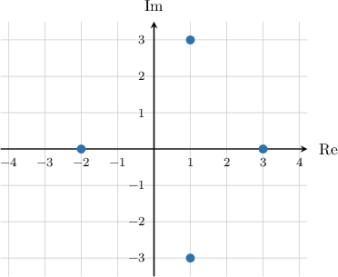

# The Fundamental Theorem of Algebra with Quartic Equations

Source: https://www.mathacademy.com/topics/897?courseId=136
Topic ID: 897

## Prerequisites

- [Factoring Quartic Polynomials Using the Factor Theorem](../algebra-ii/104-factoring-quartic-polynomials-using-the-factor-theorem.md)
- [The Fundamental Theorem of Algebra with Cubic Equations](./896-the-fundamental-theorem-of-algebra-with-cubic-equations.md)

## Lesson

### Introduction

The **fundamental theorem of algebra** tells us that any quartic polynomial with real coefficients has precisely four roots.

Furthermore, any such polynomial can be factored as

$$

ax^4+bx^3+cx^2 + dx + e = a(x-x_1)(x-x_2)(x-x_3)(x-x_4),

$$

where $x_1, x_2, x_3,$ and $x_4$ are the roots of the polynomial.

As always, when counting the roots of a quartic polynomial, we need to bear in mind the following points:

- If a root has multiplicity $2,$ we count it twice.

- Likewise, if a root has multiplicity $3$ or $4,$ we count it three or four times, respectively.

- We also include any imaginary or complex roots.

Remember that in the case of imaginary or complex roots, the roots always come in complex conjugate pairs.

### Example: Finding a Quartic Polynomial Given Four Real Roots

#### Question

The quartic polynomial $P(x)$ has roots $x_1=0, x_2=-1,x_3=2$ and $x_4=-3,$ and the coefficient of the quartic term is $4.$ Find $P(x).$

#### Explanation

Since our quartic polynomial has roots ${x_1=0, x_2=-1},$ ${x_3=2},$ and ${x_4=-3},$ and the coefficient of the quartic term is ${a=4},$ we can write the polynomial as follows:

$$

\begin{aligned}𝑎(𝑥−𝑥_{1})(𝑥−𝑥_{2})(𝑥−𝑥_{3})(𝑥−𝑥_{4}) & =4(𝑥−0)(𝑥−(−1))(𝑥−2)(𝑥−(−3)) \\ & =4(𝑥−0)(𝑥+1)(𝑥−2)(𝑥+3)\end{aligned}

$$

Expanding the parentheses, we obtain

$$

\begin{aligned}4(𝑥−0)(𝑥+1)(𝑥−2)(𝑥+3) & =4(𝑥^{2}+𝑥)(𝑥^{2}+𝑥−6) \\ & =4(𝑥^{4}+𝑥^{3}−6𝑥^{2}+𝑥^{3}+𝑥^{2}−6𝑥) \\ & =4(𝑥^{4}+2𝑥^{3}−5𝑥^{2}−6𝑥) \\ & =4𝑥^{4}+8𝑥^{3}−20𝑥^{2}−24𝑥.\end{aligned}

$$

Therefore, $P(x) = 4x^4+8x^3-20x^2-24x.$

### Example: Finding a Quartic Polynomial Given Two Real and Two Complex Roots

#### Question

The Argand diagram above shows the roots of a quartic polynomial $f(x).$ Find $f(x)$ given that the coefficient of the quartic term is $1.$

#### Explanation

From the diagram, we see that $f(x)$ has roots ${x_1=-2},$ ${x_2=3},$ and ${x_{3,4}=1 \pm 3\textrm{i}}.$ Additionally, we're given that the coefficient of the quartic term is ${a=1}.$ Therefore, we can write the polynomial as follows:

$$

\begin{aligned}𝑓(𝑥) & =𝑎(𝑥−𝑥_{1})(𝑥−𝑥_{2})(𝑥−𝑥_{3})(𝑥−𝑥_{4}) \\ & =1⋅(𝑥−(−2))(𝑥−(3))(𝑥−(1+3i))(𝑥−(1−3i)) \\ & =(𝑥+2)(𝑥−3)(𝑥−(1+3i))(𝑥−(1−3i))\end{aligned}

$$

Expanding the parentheses, we obtain

$$

\begin{aligned}(𝑥+2)(𝑥−3)(𝑥−(1+3i))(𝑥−(1−3i)) & = \\ (𝑥^{2}−3𝑥+2𝑥−6)(𝑥^{2}−𝑥(1−3i)−𝑥(1+3i)+(1+3i)(1−3i)) & = \\ (𝑥^{2}−𝑥−6)(𝑥^{2}−2𝑥+10) & = \\ 𝑥^{4}−2𝑥^{3}+10𝑥^{2}−𝑥^{3}+2𝑥^{2}−10𝑥−6𝑥^{2}+12𝑥−60 & = \\ 𝑥^{4}−3𝑥^{3}+6𝑥^{2}+2𝑥−60 & .\end{aligned}

$$

Therefore, $f(x) = x^4 - 3x^3 + 6x^2 + 2x - 60.$

### General Statement of the Fundamental Theorem of Algebra

In this lesson, we have considered the fundamental theorem of algebra applied to quartic polynomials. However, we remind ourselves that we can apply the fundamental theorem of algebra to *any* polynomial with real coefficients.

Suppose that $p(x)$ is a polynomial of degree $n$ with real coefficients, given by

$$

p(x) = a_nx^n+\ldots+a_1x+a_0, \qquad a_n\neq 0.

$$

The fundamental theorem of algebra tells us that $p(x)$ will always have precisely $n$ roots.

Furthermore, $p(x)$ can be factored as follows:

$$

p(x) = a_n(x-x_1)(x-x_2)(x-x_3)\cdots (x-x_{n})

$$

where $x_1, x_2, x_3,\ldots,x_n$ are the roots of the polynomial.

As with the quadratic, cubic, and quartic cases, we need to bear the following important points in mind when counting the roots of a polynomial:

- If a root has multiplicity $m,$ we count that root $m$ times.

- We also include any imaginary or complex roots.

And remember, complex roots *always* come in complex conjugate pairs.
