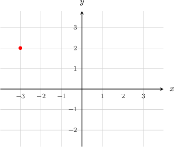

# Euler's Formula

Source: https://www.mathacademy.com/topics/898?courseId=136
Topic ID: 898

## Prerequisites

- [The Polar Form of a Complex Number](./894-the-polar-form-of-a-complex-number.md)

## Lesson

### Introduction

**Euler's formula** allows us to convert between complex exponential functions and complex numbers expressed in polar form. It states that

$$

e^{\textrm{i}\theta} = \cos\theta + \textrm{i}\sin\theta.

$$

With Euler's formula, we can write any complex number $z$ in three equivalent ways. Letting $r=|z|$ and $\theta =\textrm{arg}(z),$ we have the following:

For instance, if $z=1+\textrm{i},$ then we have

$$

\begin{aligned}𝑟 & =\sqrt{√1^{2}+1^{2}}=\sqrt{√2}, \\ 𝜃 & =arg(𝑧)=arctan⁡(\frac{1}{1})=\frac{𝜋}{4}.\end{aligned}

$$

So, the complex number $z=1+\textrm{i}$ can be written in exponential form as

$$

z=\sqrt{2}e^{\textrm{i}\pi/4}.

$$

When $\theta=\pi,$ we have a special case:

$$

e^{\textrm{i}\pi} = -1 \quad\Longrightarrow\quad e^{\textrm{i}\pi} +1=0

$$

The equation $e^{\textrm{i}\pi} +1=0$ is called **Euler's identity**. It is often described as the most beautiful equation in all of mathematics because it combines five important constants $e, \textrm{i}, \pi, 1,$ and $0$ into a single elegant form.

### Example: Writing a Complex Number in Exponential Form

#### Question

Write the complex number $z=4+4\textrm{i}$ in exponential form.

#### Explanation

To write our complex number in the form $z = r\textrm{e}^{\textrm{i}\theta},$ where $r=|z|$ and $\theta = \arg(z),$ we first calculate $r\mathbin{:}$

$$

\begin{aligned}𝑟=|𝑧| & =\sqrt{√𝑥^{2}+𝑦^{2}} \\ & =\sqrt{√4^{2}+4^{2}} \\ & =4\sqrt{√2}\end{aligned}

$$

Since $z$ lies in the first quadrant of the complex plane, we have

$$

\begin{aligned}𝜃=arg⁡(𝑧) & =arctan⁡(\frac{𝑦}{𝑥}) \\ & =arctan⁡(1) \\ & =\frac{𝜋}{4}\,.\end{aligned}

$$

Finally, substituting $r=4\sqrt{2}$ and $\theta=\dfrac{\pi}{4}$ into $z=re^{\textrm{i}\theta},$ we get

$$

z = 4\sqrt{2}\,\textrm{e}^{\pi\textrm{i}/4}.

$$

### Example: Writing a Complex Number Shown on an Argand Diagram in Exponential Form

#### Question

Write the complex number, shown in the following Argand diagram, in exponential form.

#### Explanation

The complex number shown in the Argand diagram can be written as

To write it in the form where and we first calculate

Now, since lies in the second quadrant, we can find the angle as

to three decimal places.

Finally, substituting and into we get

### Proving the Sum Formulas for Sine and Cosine

We can use Euler's formula to construct straightforward proofs of some trigonometric identities.

For example, let's prove the following:

$$

\cos(x+y) = \cos x\cos y - \sin x\sin y, \qquad \sin(x+y) = \sin x\cos y + \cos x\sin y

$$

By the rules of exponents, we have that

$$

e^{\textrm i (x+y)} = e^{\textrm i x} \cdot e^{\textrm iy}.

$$

Using Euler's formula, this can be written as

$$

\underbrace{\cos(x+y) + \textrm i\sin(x+y)}_{e^{\textrm i (x+y)} } = \underbrace{\left(\cos x + \textrm i\sin x\right)}_{e^{\textrm i x}}\cdot \underbrace{\left(\cos y + \textrm i\sin y\right)}_{e^{\textrm iy}}.

$$

If we expand the parentheses on the right-hand side and group real and imaginary parts, we get

$$

\begin{aligned}cos⁡(𝑥+𝑦)+isin⁡(𝑥+𝑦) & =(cos⁡𝑥+isin⁡𝑥)⋅(cos⁡𝑦+isin⁡𝑦) \\ & =cos⁡𝑥cos⁡𝑦+icos⁡𝑥sin⁡𝑦+isin⁡𝑥cos⁡𝑦+i^{2}sin⁡𝑥sin⁡𝑦 \\ & =cos⁡𝑥cos⁡𝑦+icos⁡𝑥sin⁡𝑦+isin⁡𝑥cos⁡𝑦−sin⁡𝑥sin⁡𝑦 \\ & =cos⁡𝑥cos⁡𝑦−sin⁡𝑥sin⁡𝑦+i(cos⁡𝑥sin⁡𝑦+sin⁡𝑥cos⁡𝑦).\end{aligned}

$$

So, we have

$$

\cos(x+y) + \textrm i\sin(x+y) = \cos x\cos y - \sin x\sin y + \textrm i\left(\cos x\sin y + \sin x\cos y\right).

$$

Equating the real parts of this equation gives

$$

\cos(x+y) = \cos x\cos y - \sin x\sin y

$$

and equating the imaginary parts gives

$$

\sin(x+y) = \sin x\cos y + \cos x\sin y

$$

as required.
