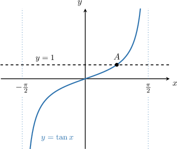

# Elementary Trigonometric Equations Containing Tangent

Source: https://www.mathacademy.com/topics/915?courseId=136
Topic ID: 915

## Prerequisites

- [Graphing Tangent and Cotangent](../algebra-ii/1493-graphing-tangent-and-cotangent.md)

## Lesson

### Introduction

Suppose we want to find all of the solutions to the equation

$$

0^{∘}≤𝑥<360^{∘}.

$$

We can immediately calculate a solution, called the **principal value**, as follows:

$$

x = \arctan\left(\sqrt{3}\right) = 60^\circ

$$

Since $60^\circ$ lies inside the required domain, our first solution is $x_1=60^\circ.$

The tangent function has a period of $180^\circ.$ So, to generate more solutions, we add (or subtract) integer multiples of $180^\circ$ to the principal value.

Therefore, our second solution $x_2$ inside the range $0^\circ \leq x < 360^\circ$ can be calculated as

$$

\begin{aligned}𝑥_{2} & =𝑥_{1}+180^{∘} \\ & =60^{∘}+180^{∘} \\ & =240^{∘}.\end{aligned}

$$

We can stop generating solutions here because adding or subtracting further integer multiples of $180^\circ$ to the principal value will give us solutions that lie outside the domain $0^\circ \leq x < 360^\circ.$

So, the solutions are $x=60^\circ, 240^\circ.$

### Example: Solving a Trigonometric Equation Involving Tangent with Special Angles

#### Question

Find the solutions to the equation $3\tan x + 3\sqrt{3}=0$ for $0^\circ \leq x < 360^\circ.$

#### Explanation

First, we rearrange the equation and isolate $\tan x \mathbin{:}$

$$

\begin{aligned}3tan⁡𝑥+3\sqrt{√3} & =0 \\ 3tan⁡𝑥 & =−3\sqrt{√3} \\ tan⁡𝑥 & =−\frac{3\sqrt{√3}}{3} \\ tan⁡𝑥 & =−\sqrt{√3}.\end{aligned}

$$

Next, we find the principal value:

$$

\begin{aligned}𝑥=arctan⁡(−\sqrt{√3})=−60^{∘}\end{aligned}

$$

Since $-60^\circ$ lies outside the given domain, it is not a solution. However, to generate more solutions, we add integer multiples of $180^\circ$ as follows:

$$

\begin{aligned}𝑥_{1} & =𝑥+180^{∘}=−60^{∘}+180^{∘}=120^{∘}\end{aligned}

$$

$$

\begin{aligned}𝑥_{2} & =𝑥+360^{∘}=−60^{∘}+360^{∘}=300^{∘}\end{aligned}

$$

So, the solutions are $x=120^\circ, 300^\circ.$

### Example: Solving a Trigonometric Equation Involving Tangent with Non-Special Angles

#### Question

Calculate, in degrees to the nearest integer, the solutions to the equation $\tan x=4$ for $0 \leq x < 360^\circ.$

#### Explanation

First, we find the principal value:

$$

\begin{aligned}𝑥=arctan⁡(4)=75.963\,75...^{∘}≈75.964^{∘}\end{aligned}

$$

Since $75.964^\circ$ lies inside the given domain, our first solution is $x_1 = 75.964^\circ.$

To generate more solutions, we add integer multiples of $180^\circ$ as follows:

$$

x_2 = 180^\circ + 75.964^\circ \approx 255.964^\circ

$$

So, the solutions (rounded to the nearest integer) are $x=76^\circ, 256^\circ.$

### Solving a Trigonometric Equation Involving Tangent Under a Modified Domain

Suppose we want to find all of the solutions to the equation

$$

−180^{∘}<𝑥≤180^{∘}.

$$

Notice that this time, we are looking for solutions in the domain $-180^\circ < x \leq 180^\circ.$

First, we find the principal value:

$$

\begin{aligned}𝑥=arctan⁡(1)=45^{∘}\end{aligned}

$$

Since $45^\circ$ lies inside the given domain, our first solution is $x_1 =45^\circ.$

To generate more solutions, we subtract integer multiples of $180^\circ,$ as follows:

$$

\begin{aligned}𝑥_{2} & =𝑥_{1}−180^{∘} \\ & =45^{∘}−180^{∘} \\ & =−135^{∘}\end{aligned}

$$

So, the solutions are $x=-135^\circ, 45^\circ.$

### Example: Solving a Trigonometric Equation Involving Tangent Under a Modified Domain

#### Question

Solve the equation $3 \tan x - \sqrt{3} = 0$ for $-180^\circ < x \leq 180^\circ.$

#### Explanation

First, we rearrange the equation, isolating $\tan x \mathbin{:}$

$$

\begin{aligned}3tan⁡𝑥−\sqrt{√3} & =0 \\ 3tan⁡𝑥 & =\sqrt{√3} \\ tan⁡𝑥 & =\frac{\sqrt{√3}}{3}\end{aligned}

$$

Now, we find the principal value:

$$

\begin{aligned}𝑥=arctan⁡(\frac{\sqrt{√3}}{3})=30^{∘}\end{aligned}

$$

Since $30^\circ$ lies inside the given domain, our first solution is $x_1 =30^\circ.$

To generate more solutions, we subtract integer multiples of $180^\circ$ as follows:

$$

\begin{aligned}𝑥_{2} & =𝑥_{1}−180^{∘} \\ & =30^{∘}−180^{∘} \\ & =−150^{∘}\end{aligned}

$$

So, the solutions are $x=-150^\circ, 30^\circ.$

### Example: Finding the Points of Intersection of a Horizontal Line and a Tangent Curve

#### Question

The graph below shows a section of the curve $y=\tan{x}$ on the interval $-\dfrac \pi 2 < x < \dfrac {\pi} 2$ and the line $y=1.$ The line and the curve intersect at the point $A,$ as shown. What is the $x$-coordinate of the point $A?$

#### Explanation

The $y$-values of both functions are the same at the intersection point. Equating the two functions gives

$$

\tan x=1, \qquad -\dfrac \pi 2 < x < \dfrac {\pi} 2 .

$$

First, we find the principal value:

$$

\begin{aligned}𝑥=arctan⁡(1)=\frac{𝜋}{4}\end{aligned}

$$

Since $\dfrac{\pi}{4}$ lies inside the required domain, and there is only one point of intersection, we conclude that the $x$-coordinate of the intersection point $A$ is $x= \dfrac{\pi}{4}.$
