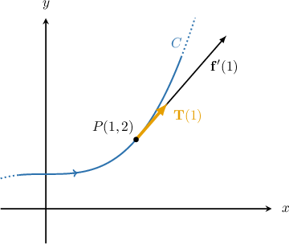

# Unit Tangent Vectors

Source: https://www.mathacademy.com/topics/1794?courseId=154
Topic ID: 1794

## Prerequisites

- [Differentiation Rules for Vector-Valued Functions](./1738-differentiation-rules-for-vector-valued-functions.md)
- [Tangent Vectors and Tangent Lines to Curves](./1792-tangent-vectors-and-tangent-lines-to-curves.md)

## Lesson

### Introduction

Consider the curve that's defined parametrically by

The point corresponding to on the curve has coordinates We know that a tangent vector to at is given by as shown below.

We compute as follows:

Substituting into the above gives a tangent vector to at

As we'll see, it's more helpful to work with unit vectors. Notice that is not a unit vector because

However, we can create a unit vector, which we'll call by dividing by its magnitude:

In general, for a vector valued function the **unit tangent vector** to the curve traced by can be computed using the following formula:

**Note:** When we take a vector and create a unit vector that's parallel to it, we say that we have **normalized** the vector

### Example: Finding the Unit Tangent Vector at an Arbitrary Point

#### Question

Find the unit tangent vector to the curve $\mathbf r(t)=\left\langle \sin^3{t}, \:\cos^3{t} \right\rangle$ at an arbitrary point where $0 < t < \dfrac{\pi}{2}.$

#### Explanation

For a curve $\mathbf r(t)= x(t) \,\mathbf i + y(t) \,\mathbf j,$ the unit tangent vector $\mathbf T(t)$ at the point $P(x(t),y(t))$ is given by

$$

\mathbf T(t)=\dfrac{\mathbf r'(t)}{\left\| \mathbf r'(t) \right\|}.

$$

First, we find the derivative of $\mathbf r(t)\mathbin{:}$

$$

\begin{aligned}𝐫^{′}(𝑡) & =⟨\frac{d}{d𝑡}(sin^{3}⁡𝑡),\,\frac{d}{d𝑡}(cos^{3}⁡𝑡)⟩ \\ & =⟨3sin^{2}⁡𝑡cos⁡𝑡,\,3cos^{2}⁡𝑡(−sin⁡𝑡)⟩ \\ & =3sin⁡𝑡cos⁡𝑡⟨sin⁡𝑡,−cos⁡𝑡⟩\end{aligned}

$$

Next, we calculate the magnitude of $\mathbf r'(t)\mathbin{:}$

$$

\begin{aligned}‖𝐫^{′}(𝑡)‖ & =|3sin⁡𝑡cos⁡𝑡|\sqrt{√sin^{2}⁡𝑡+(−cos⁡𝑡)^{2}} \\ & =|3sin⁡𝑡cos⁡𝑡|\sqrt{√sin^{2}⁡𝑡+cos^{2}⁡𝑡} \\ & =|3sin⁡𝑡cos⁡𝑡|\sqrt{√1} \\ & =3sin⁡𝑡cos⁡𝑡\end{aligned}

$$

In the last step, we were able to remove the absolute value bars because $\sin{t}>0$ and $\cos{t}>0$ for $0 < t < \dfrac{\pi}{2}.$

Finally, we normalize $\mathbf r'(t)$ and obtain the unit tangent vector to the curve:

$$

\begin{aligned}𝐓(𝑡) & =\frac{𝐫^{′}(𝑡)}{‖𝐫^{′}(𝑡)‖} \\ & =\frac{3sin⁡𝑡cos⁡𝑡⟨sin⁡𝑡,\,−cos⁡𝑡⟩}{3sin⁡𝑡cos⁡𝑡} \\ & =⟨sin⁡𝑡,\,−cos⁡𝑡⟩\end{aligned}

$$

### Example: Finding the Unit Tangent Vector at a Given Point

#### Question

What is the unit tangent vector to the curve at the point

#### Explanation

For a curve the unit tangent vector at the point is given by

First, we find the value of that corresponds to the point on the given curve. We know that

In the above equation, the first component in each of the two vectors is equal to Equating the other two components gives the system From the first equation, This value satisfies the second equation too. Therefore, the point is at the tip of

Now, we calculate and evaluate it at

Next, we calculate the magnitude of

Finally, we normalize and obtain the unit tangent vector to the given curve at

### Example: Finding Unit Tangent Vectors Using the Rules of Differentiation For Vector Functions

#### Question

Find the unit tangent vector to the curve $\mathbf r(t)=e^{2t}\mathbf p(t)$ at the point where $t=0,$ if $\mathbf p(0)=\mathbf i-\,\mathbf j-\mathbf k$ and $\mathbf p'(0)=\mathbf i - \mathbf j+ 2\mathbf k.$

#### Explanation

For a curve $\mathbf r(t)=x(t)\mathbf i+y(t)\mathbf j+z(t)\mathbf k,$ the unit tangent vector $\mathbf T(t)$ at the point $P(x(t),y(t),z(t))$ is given by

$$

\mathbf T(t)=\dfrac{\mathbf r'(t)}{\left\| \mathbf r'(t) \right\|}.

$$

First, we find $\mathbf r'(t)$ and evaluate it at $t=0\mathbin{:}$

$$

\begin{aligned}𝐫^{′}(𝑡) & =\frac{d}{d𝑡}(𝑒^{2𝑡}𝐩(𝑡)) \\ & =\frac{d}{d𝑡}(𝑒^{2𝑡})𝐩(𝑡)+𝑒^{2𝑡}\frac{d}{d𝑡}(𝐩(𝑡)) \\ & =2𝑒^{2𝑡}𝐩(𝑡)+𝑒^{2𝑡}𝐩^{′}(𝑡) \\ 𝐫^{′}(0) & =2𝑒^{2(0)}𝐩(0)+𝑒^{2(0)}𝐩^{′}(0) \\ & =2(𝐢−\,𝐣−𝐤)+1(𝐢−𝐣+2𝐤) \\ & =3\,𝐢−3\,𝐣\end{aligned}

$$

Now, we calculate the magnitude of $\mathbf r'(0)\mathbin{:}$

$$

\begin{aligned}𝐫^{′}(0) & =\sqrt{√(3)^{2}+(−3)^{2}+(0)^{2}} \\ & =\sqrt{√2⋅3^{2}} \\ & =3\sqrt{√2}\end{aligned}

$$

Finally, we normalize $\mathbf r'(0)\mathbin{:}$

$$

\begin{aligned}𝐓(0) & =\frac{𝐫^{′}(0)}{∥𝐫^{′}(0)∥} \\ & =\frac{1}{3\sqrt{√2}}(3\,𝐢−3\,𝐣) \\ & =\frac{1}{\sqrt{√2}}(𝐢−𝐣) \\ & =\frac{\sqrt{√2}}{2}(𝐢−𝐣)\end{aligned}

$$

Therefore, the unit tangent vector to the curve at the point that corresponds to $t=0$ is $\mathbf T(0) = \dfrac{\sqrt{2}}{2}(\mathbf i - \mathbf j).$
