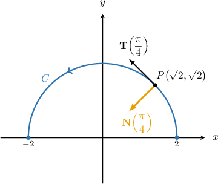

# Principal Normal Vectors

Source: https://www.mathacademy.com/topics/1795?courseId=154
Topic ID: 1795

## Prerequisites

- [Unit Tangent Vectors](./1794-unit-tangent-vectors.md)

## Lesson

### Introduction

The **principal normal vector** to a curve $C$ at a point $P$ is a unit vector that

- is perpendicular to the unit tangent vector, and

- points in the direction that the curve is bending.

In general, if the unit tangent vector is given by $\mathbf T(t),$ then the principal normal vector is given by

$$

\mathbf N(t)= \dfrac{\mathbf T'(t)}{\|\mathbf T'(t)\|},

$$

where it is assumed that $\|\mathbf T'(t)\|\neq 0.$

To demonstrate, suppose that the curve $C$ is parametrized by the vector function

$$

\mathbf f(t) = \left\langle 2\cos t, \: 2\sin t \right\rangle, \qquad t \in [0, \pi].

$$

We will compute the principal normal vector at $t=\dfrac{\pi}{4}.$

First, using the formula for the unit tangent, $\mathbf T(t) = \dfrac{\mathbf f'(t)}{||\mathbf f'(t)||},$ we find that the general unit tangent vector is

$$

\mathbf T(t)= \left\langle {-\sin t}, \cos t\right\rangle.

$$

Now, when $t=\dfrac{\pi}{4},$ we have the point $P(\sqrt{2},\sqrt{2}).$ The unit tangent vector $\mathbf{T}\left(\dfrac{\pi}{4}\right)$ and the principal normal vector $\mathbf{N}\left(\dfrac{\pi}{4}\right)$ at this point are shown below:

To calculate the principal normal vector, we start by calculating the derivative of the unit tangent function. This gives

$$

\begin{aligned}𝐓(𝑡) & =⟨−sin⁡𝑡,cos⁡𝑡⟩ \\ 𝐓^{′}(𝑡) & =⟨−cos⁡𝑡,\,−sin⁡𝑡⟩.\end{aligned}

$$

Therefore, the general principal normal vector is

$$

\begin{aligned}𝐍(𝑡) & =\frac{𝐓^{′}(𝑡)}{||𝐓^{′}(𝑡)||} \\ & =\frac{⟨−cos⁡𝑡,\,−sin⁡𝑡⟩}{\sqrt{√(−cos⁡𝑡)^{2}+(sin⁡𝑡)^{2}}} \\ & =\frac{⟨−cos⁡𝑡,\,−sin⁡𝑡⟩}{\sqrt{√cos^{2}⁡𝑡+sin^{2}⁡𝑡}} \\ & =\frac{⟨−cos⁡𝑡,\,−sin⁡𝑡⟩}{\sqrt{√1}} \\ & =⟨−cos⁡𝑡,\,−sin⁡𝑡⟩.\end{aligned}

$$

We can now find $\mathbf N\left(\dfrac\pi 4\right),$ as follows:

$$

\begin{aligned}𝐍(\frac{𝜋}{4}) & =⟨−cos⁡(\frac{𝜋}{4}),\,−sin⁡(\frac{𝜋}{4})⟩ \\ & =⟨−\frac{\sqrt{√2}}{2},−\frac{\sqrt{√2}}{2}⟩\end{aligned}

$$

Finally, it's easy to check that $\mathbf T'(t)$ and $\mathbf N'(t)$ are perpendicular for all $t$ by computing the dot product and showing that we get zero:

$$

\begin{aligned}𝐓(𝑡)⋅𝐍(𝑡) & =⟨−sin⁡𝑡,cos⁡𝑡⟩⋅⟨−cos⁡𝑡,\,−sin⁡𝑡⟩ \\ & =sin⁡𝑡cos⁡𝑡−sin⁡𝑡cos⁡𝑡 \\ & =0\,✓\end{aligned}

$$

### Example: Calculating the Principal Normal at a Given Point

#### Question

The unit tangent vector to a curve at an arbitrary point is given by

$$

\mathbf T(t) =\sin{t} \,\mathbf i -\cos{t}\,\mathbf j.

$$

Find the principal normal vector at the point where $t=\dfrac{\pi}{4}.$

#### Explanation

Remember that in general, the principal normal vector is given by

$$

\mathbf N(t)= \dfrac{\mathbf T'(t)}{\|\mathbf T'(t)\|}.

$$

First, we calculate $\mathbf T'(t)$ and evaluate it at $t=\dfrac{\pi}{4}\mathbin{:}$

$$

\begin{aligned}𝐓^{′}(𝑡) & =\frac{d}{d𝑡}(sin⁡𝑡\,𝐢−cos⁡𝑡\,𝐣) \\ & =\frac{d}{d𝑡}(sin⁡𝑡)\,𝐢−\frac{d}{d𝑡}(cos⁡𝑡)\,𝐣 \\ & =cos⁡𝑡\,𝐢−(−sin⁡𝑡)\,𝐣 \\ & =cos⁡𝑡\,𝐢+sin⁡𝑡\,𝐣 \\ 𝐓^{′}(\frac{𝜋}{4}) & =cos⁡(\frac{𝜋}{4})\,𝐢+sin⁡(\frac{𝜋}{4})\,𝐣 \\ & =\frac{\sqrt{√2}}{2}\,𝐢+\frac{\sqrt{√2}}{2}\,𝐣 \\ & =\frac{\sqrt{√2}}{2}(𝐢+𝐣)\end{aligned}

$$

Next, we find the magnitude of $\mathbf T'\left(\dfrac{\pi}{4}\right)\mathbin{:}$

$$

\begin{aligned}𝐓^{′}(\frac{𝜋}{4}) & =\frac{\sqrt{√2}}{2}∥𝐢+𝐣∥ \\ & =\frac{\sqrt{√2}}{2}\sqrt{√(1)^{2}+(1)^{2}} \\ & =\frac{\sqrt{√2}}{2}\sqrt{√2} \\ & =1\end{aligned}

$$

Finally, we normalize $\mathbf T'\left(\dfrac{\pi}{4}\right)$ and obtain the principal normal vector to the curve at the point where $t=\dfrac{\pi}{4}\mathbin{:}$

$$

\begin{aligned}𝐍(\frac{𝜋}{4}) & =\frac{𝐓^{′}(\frac{𝜋}{4})}{4}=\frac{\frac{\sqrt{√2}}{2}(𝐢+𝐣)}{2}=\frac{\sqrt{√2}}{2}\,𝐢+\frac{\sqrt{√2}}{2}\,𝐣\end{aligned}

$$

To check our result, we can verify that $\mathbf T$ and $\mathbf N$ are perpendicular by computing their dot product:

$$

\begin{aligned}𝐓(\frac{𝜋}{4})⋅𝐍(\frac{𝜋}{4}) & =(\frac{\sqrt{√2}}{2}\,𝐢−\frac{\sqrt{√2}}{2}\,𝐣)⋅(\frac{\sqrt{√2}}{2}\,𝐢+\frac{\sqrt{√2}}{2}\,𝐣) \\ & =\frac{1}{2}−\frac{1}{2} \\ & =0\,✓\end{aligned}

$$

### Example: Calculating the Principal Normal at an Arbitrary Point

#### Question

Given the curve $\mathbf r(t)=\left\langle \sqrt 3 t, \: \cos t, \: \sin{t}\right\rangle,$ find the principal normal vector $\mathbf N(t)$ at an arbitrary point on the curve.

#### Explanation

Remember that in general, the principal normal vector is given by

$$

\mathbf N(t)= \dfrac{\mathbf T'(t)}{\|\mathbf T'(t)\|}.

$$

First, we find the unit tangent vector $\mathbf T(t).$ To do this, we calculate $\mathbf r'(t)$ and its magnitude as follows:

$$

\begin{aligned}𝐫^{′}(𝑡) & =⟨\frac{d}{d𝑡}(\sqrt{√3}𝑡),\,\frac{d}{d𝑡}(cos⁡𝑡),\,\frac{d}{d𝑡}(sin⁡𝑡)⟩ \\ & =⟨\sqrt{√3},\,−sin⁡𝑡,\,cos⁡𝑡⟩ \\ 𝐫^{′}(𝑡) & =\sqrt{√(\sqrt{√3})^{2}+(−sin⁡𝑡)^{2}+(cos⁡𝑡)^{2}} \\ & =\sqrt{√3+sin^{2}⁡𝑡+cos^{2}⁡𝑡} \\ & =\sqrt{√4} \\ & =2\end{aligned}

$$

Therefore, the unit tangent vector is

$$

\begin{aligned}𝐓(𝑡) & =\frac{𝐫^{′}(𝑡)}{∥𝐫^{′}(𝑡)∥} \\ & =\frac{1}{2}⟨\sqrt{√3},\,−sin⁡𝑡,\,cos⁡𝑡⟩ \\ & =⟨\frac{\sqrt{√3}}{2},\,−\frac{sin⁡𝑡}{2},\,\frac{cos⁡𝑡}{2}⟩.\end{aligned}

$$

Next, we find the principal normal $\mathbf{N}(t).$ To do this, we calculate $\mathbf T'(t)$ and its magnitude as follows:

$$

\begin{aligned}𝐓^{′}(𝑡) & =⟨\frac{d}{d𝑡}(\frac{\sqrt{√3}}{2}),\,\frac{d}{d𝑡}(−\frac{sin⁡𝑡}{2}),\,\frac{d}{d𝑡}(\frac{cos⁡𝑡}{2})⟩ \\ & =⟨0,\,−\frac{1}{2}cos⁡𝑡,\,−\frac{1}{2}sin⁡𝑡⟩ \\ & =\frac{1}{2}⟨0,\,−cos⁡𝑡,\,−sin⁡𝑡⟩ \\ 𝐓^{′}(𝑡) & =\frac{1}{2}\sqrt{√0^{2}+(−cos⁡𝑡)^{2}+(−sin⁡𝑡)^{2}} \\ & =\frac{1}{2}\sqrt{√cos^{2}⁡𝑡+sin^{2}⁡𝑡} \\ & =\frac{1}{2}\end{aligned}

$$

Finally, we normalize $\mathbf T'(t)$ and obtain the principal normal to the curve:

$$

\begin{aligned}𝐍(𝑡) & =\frac{𝐓^{′}(𝑡)}{∥𝐓^{′}(𝑡)∥}=\frac{\frac{1}{2}⟨0,\,−cos⁡𝑡,\,−sin⁡𝑡⟩}{2}=⟨0,\,−cos⁡𝑡,\,−sin⁡𝑡⟩\end{aligned}

$$

To check our result, we can verify that $\mathbf T$ and $\mathbf N$ are perpendicular by computing their dot product:

$$

\begin{aligned}𝐓(𝑡)⋅𝐍(𝑡) & =⟨\frac{\sqrt{√3}}{2},\,−\frac{sin⁡𝑡}{2},\,\frac{cos⁡𝑡}{2}⟩⋅⟨0,\,−cos⁡𝑡,\,−sin⁡𝑡⟩ \\ & =\frac{\sqrt{√3}}{2}⋅0+\frac{sin⁡𝑡cos⁡𝑡}{2}−\frac{cos⁡𝑡sin⁡𝑡}{2} \\ & =0\,✓\end{aligned}

$$

### Deriving the Formula for the Principal Normal

Let $\mathbf T(t)$ be the unit tangent vector to some differentiable vector-valued function. Since $||\mathbf T(t)|| = 1,$ and $\mathbf T(t)$ is obviously parallel to itself, we must have

$$

\mathbf T(t) \cdot \mathbf T(t) = 1.

$$

Differentiating the above relationship with respect to $t,$ we get

$$

\mathbf T'(t) \cdot \mathbf T(t) + \mathbf T(t) \cdot \mathbf T'(t) = 0,

$$

which can be simplified as follows:

$$

\begin{aligned}𝐓^{′}(𝑡)⋅𝐓(𝑡)+𝐓^{′}(𝑡)⋅𝐓(𝑡) & =0 \\ 2𝐓^{′}(𝑡)⋅𝐓(𝑡) & =0 \\ 𝐓^{′}(𝑡)⋅𝐓(𝑡) & =0\end{aligned}

$$

Therefore, provided that $\mathbf T'(t)\neq \mathbf 0,$ then it must be the case that $\mathbf T'(t)$ is perpendicular to $\mathbf T(t).$

The vector $\mathbf T'(t)$ measures the rate of change of $\mathbf T(t).$ However, since $\mathbf T(t)$ is a unit vector for all $t,$ it changes only in its direction. The vector $\mathbf T'(t)$ measures this rate of change in direction.

To form the principal normal $\mathbf N(t),$ we normalize $\mathbf T'(t),$ which leads to the definition

$$

\mathbf N(t) = \dfrac{\mathbf T'(t)}{||\mathbf T'(t)||}.

$$

### Example: Calculating a Principal Normal Given Some Information About a Curve

#### Question

The unit tangent vector to a curve at an arbitrary point is given by

$$

\mathbf T(t) = \sin{t} \cdot \mathbf q(t).

$$

Find the principal normal vector at the point where $t = \dfrac{\pi}{4},$ if

$$

\begin{aligned}𝐪(\frac{𝜋}{4})=−\frac{\sqrt{√2}}{2}\,𝐢−\frac{\sqrt{√2}}{2}\,𝐣+𝐤,\,𝐪^{′}(\frac{𝜋}{4})=−2\,𝐤.\end{aligned}

$$

#### Explanation

Remember that in general, the principal normal vector is given by

$$

\mathbf N(t)= \dfrac{\mathbf T'(t)}{\|\mathbf T'(t)\|}.

$$

First, we calculate $\mathbf T'(t)$ and evaluate it at $t=\dfrac{\pi}{4}\mathbin{:}$

$$

\begin{aligned}𝐓^{′}(𝑡) & =\frac{d}{d𝑡}(sin⁡𝑡⋅𝐪(𝑡)) \\ & =\frac{d}{d𝑡}(sin⁡𝑡)⋅𝐪(𝑡)+sin⁡𝑡⋅\frac{d}{d𝑡}(𝐪(𝑡)) \\ & =cos⁡𝑡⋅𝐪(𝑡)+sin⁡𝑡⋅𝐪^{′}(𝑡) \\ & \\ 𝐓^{′}(\frac{𝜋}{4}) & =cos⁡(\frac{𝜋}{4})⋅𝐪(\frac{𝜋}{4})+sin⁡(\frac{𝜋}{4})⋅𝐪^{′}(\frac{𝜋}{4}) \\ & =\frac{\sqrt{√2}}{2}(−\frac{\sqrt{√2}}{2}\,𝐢−\frac{\sqrt{√2}}{2}\,𝐣+𝐤)+\frac{\sqrt{√2}}{2}(−2\,𝐤) \\ & =−\frac{1}{2}\,𝐢−\frac{1}{2}\,𝐣−\frac{\sqrt{√2}}{2}\,𝐤\end{aligned}

$$

Next, we find the magnitude of $\mathbf T'\left(\dfrac{\pi}{4}\right)\mathbin{:}$

$$

\begin{aligned}𝐓^{′}(\frac{𝜋}{4}) & =\sqrt{(−\frac{1}{2})^{2}+(−\frac{1}{2})^{2}+(−\frac{\sqrt{√2}}{2})^{2}} \\ & =\sqrt{√\frac{1}{4}+\frac{1}{4}+\frac{1}{2}} \\ & =1\end{aligned}

$$

Finally, we normalize $\mathbf T'\left(\dfrac{\pi}{4}\right)$ and obtain the principal normal to the curve at the point where $t=\dfrac{\pi}{4}\mathbin{:}$

$$

\begin{aligned}𝐍(\frac{𝜋}{4}) & =\frac{𝐓^{′}(\frac{𝜋}{4})}{4} \\ & =\frac{−\frac{1}{2}\,𝐢−\frac{1}{2}\,𝐣−\frac{\sqrt{√2}}{2}\,𝐤}{2} \\ & =−\frac{1}{2}\,𝐢−\frac{1}{2}\,𝐣−\frac{\sqrt{√2}}{2}\,𝐤\end{aligned}

$$

### Lines Do Not Have Principal Normal Vectors

Consider the straight line given by

$$

\begin{aligned}𝐫(𝑡) & =\begin{aligned}−2 \\ 1 \\ 0\end{aligned}+𝑡\,\begin{aligned}5 \\ 0 \\ \sqrt{√2}\end{aligned},\,𝑡∈(−∞,∞).\end{aligned}

$$

If we attempt to calculate its principal normal vector, we will get an interesting result. First, we calculate $\mathbf r'(t)$ and $\|\mathbf r'(t)\| \mathbin{:}$

$$

\begin{aligned}𝐫^{′}(𝑡) & =\frac{d}{d𝑡}\begin{aligned}−2+5𝑡 \\ 1 \\ \sqrt{√2}𝑡\end{aligned}=\begin{aligned}5 \\ 0 \\ \sqrt{√2}\end{aligned} \\ ‖𝐫^{′}(𝑡)‖ & =\sqrt{√5^{2}+(\sqrt{√2})^{2}}=\sqrt{√27}=3\sqrt{√3}\end{aligned}

$$

Therefore, the unit tangent vector is

$$

\begin{aligned}𝐓(𝑡) & =\frac{𝐫^{′}(𝑡)}{‖𝐫^{′}(𝑡)‖}=\frac{1}{3\sqrt{√3}}\,\begin{aligned}5 \\ 0 \\ \sqrt{√2}\end{aligned}.\end{aligned}

$$

Notice that in the case of a straight line, $\mathbf T(t)$ is simply the (normalized) direction vector, as we would expect.

Next, we calculate $\mathbf T'(t)\mathbin{:}$

$$

\begin{aligned}𝐓^{′}(𝑡) & =\frac{1}{3\sqrt{√3}}\,\begin{aligned}\frac{d}{d𝑡}(5) \\ \frac{d}{d𝑡}(0) \\ \frac{d}{d𝑡}(\sqrt{√2})\end{aligned}=𝟎\end{aligned}

$$

Since $\mathbf{T}'(t)$ is the zero vector, we can't normalize it as usual. If we try to apply the usual formula we get an undefined result due to division by zero:

$$

\begin{aligned}𝐍(𝑡) & =\frac{𝐓^{′}(𝑡)}{‖𝐓^{′}(𝑡)‖}=\frac{𝟎}{‖𝟎‖}=\frac{𝟎}{0}=undefined\end{aligned}

$$

Therefore, a straight line does not have a principal normal.

The intuition behind this result is that the principal normal points in the direction in which a curve is bending, but a straight line does not bend at all.
