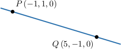

# The Cartesian Equation of a Line

Source: https://www.mathacademy.com/topics/1799?courseId=154
Topic ID: 1799

## Prerequisites

- [The Parametric Equations of a Line](./1920-the-parametric-equations-of-a-line.md)

## Lesson

### Introduction

Suppose we know that the vector equation of the line $l$ is given by

$$

\begin{aligned}3 \\ −2 \\ 5\end{aligned}

$$

and we want to rewrite it using Cartesian coordinates. In other words, we want to create an equation that relates $x,$ $y,$ and $z$ to each other.

We can do this using the following $3$ steps.

**Step 1:** Find the parametric equations for the line.

Substituting $\begin{aligned}𝑥 \\ 𝑦 \\ 𝑧\end{aligned}$ into the equation of $l,$ we get

$$

\begin{aligned}\begin{aligned}𝑥 \\ 𝑦 \\ 𝑧\end{aligned} & =\begin{aligned}3 \\ −2 \\ 5\end{aligned}+𝑡\begin{aligned}6 \\ 5 \\ −1\end{aligned} \\ \begin{aligned}𝑥 \\ 𝑦 \\ 𝑧\end{aligned} & =\begin{aligned}3+6𝑡 \\ −2+5𝑡 \\ 5−𝑡\end{aligned}.\end{aligned}

$$

So, we have the following system:

$$

\begin{aligned}𝑥=3+6𝑡 \\ 𝑦=−2+5𝑡 \\ 𝑧=5−𝑡\end{aligned}

$$

**Step 2:** Solve for $t$ in each of the parametric equations.

$$

\begin{aligned}𝑥=3+6𝑡 \\ 𝑦=−2+5𝑡 \\ 𝑧=5−𝑡\end{aligned}

$$

**Step 3:** Equate the resulting expressions. Because the right-hand side of each equation is equal to $t,$ we can write this system as follows:

$$

\dfrac{x-3}{6}=\dfrac{y+2}{5}=\dfrac{z-5}{-1} = t

$$

We can simplify further by omitting the "$=t$" on the right-hand side, which gives

$$

\dfrac{x-3}{6}=\dfrac{y+2}{5}=\dfrac{z-5}{-1} \,.

$$

And we are done!

This way of writing the equation of a line is called the **Cartesian equation** or **Cartesian canonical equation** (or simply **canonical equation**).

In general, the Cartesian equation of the straight line that passes through the point $P(x_0,y_0,z_0)$ and is parallel to the vector $\mathbf{v}=\langle v_x, v_y, v_z \rangle$ is given by

$$

\dfrac{x-x_0}{v_x}=\dfrac{y-y_0}{v_y}=\dfrac{z-z_0}{v_z} = t, \qquad t \in (-\infty,\infty).

$$

### Example: Finding the Vector Equation of a Line Given in Canonical Form

#### Question

Consider the straight line with the canonical equation $\dfrac{x}{5}=\dfrac{y+3}{3}=\dfrac{z-2}{1}.$ Find the vector equation of the line.

#### Explanation

Remember that the Cartesian (canonical) equation of the straight line that passes through the point $P(x_0,y_0,z_0)$ and is parallel to the vector $\mathbf{v}=\langle v_x, v_y, v_z \rangle$ is given by

$$

\dfrac{x-x_0}{v_x}=\dfrac{y-y_0}{v_y}=\dfrac{z-z_0}{v_z} = t, \qquad t \in (-\infty,\infty).

$$

Comparing the above to our given equation

$$

\dfrac{x}{5}=\dfrac{y-(-3)}{3}=\dfrac{z-2}{1},

$$

we find that our line passes through the point $P(0,-3,2)$ and is parallel to $\mathbf{v}=\langle 5,3,1 \rangle.$ Therefore, its vector equation is

$$

\begin{aligned}𝐫 & =𝐩+𝑡𝐯 \\ 𝐫 & =\begin{aligned}0 \\ −3 \\ 2\end{aligned}+𝑡\begin{aligned}5 \\ 3 \\ 1\end{aligned},\,𝑡∈(−∞,∞).\end{aligned}

$$

### Example: Finding the Cartesian Equation of a Line Given in Parametric or Vector Form

#### Question

Consider the straight line with the parametric equations

$$

\begin{aligned}𝑥=1−2𝑡 \\ 𝑦=4𝑡 \\ 𝑧=−2+3𝑡\end{aligned}

$$

for $t \in (-\infty,\infty).$ Find the Cartesian equation of this line.

#### Explanation

First, let's find the corresponding vector equation as follows:

$$

\begin{aligned}\begin{aligned}𝑥 \\ 𝑦 \\ 𝑧\end{aligned} & =\begin{aligned}1−2𝑡 \\ 4𝑡 \\ −2+3𝑡\end{aligned} \\ \begin{aligned}𝑥 \\ 𝑦 \\ 𝑧\end{aligned} & =\begin{aligned}1 \\ 0 \\ −2\end{aligned}+\begin{aligned}−2𝑡 \\ 4𝑡 \\ 3𝑡\end{aligned} \\ \begin{aligned}𝑥 \\ 𝑦 \\ 𝑧\end{aligned} & =\begin{aligned}1 \\ 0 \\ −2\end{aligned}+𝑡\begin{aligned}−2 \\ 4 \\ 3\end{aligned} \\ 𝐫 & =\begin{aligned}1 \\ 0 \\ −2\end{aligned}+𝑡\begin{aligned}−2 \\ 4 \\ 3\end{aligned},\end{aligned}

$$

where $t \in (-\infty,\infty).$

This implies that the given line passes through the point $P(1,0,-2)$ and is parallel to the vector $\mathbf{v}=\langle -2, 4, 3 \rangle.$ So, its Cartesian (canonical) equation is given by

$$

\dfrac{x-1}{-2}=\dfrac{y}{4}=\dfrac{z-(-2)}{3} = t, \qquad t \in (-\infty,\infty).

$$

Simplifying, we reach

$$

\dfrac{x-1}{-2}=\dfrac{y}{4}=\dfrac{z+2}{3}.

$$

### Finding the Cartesian Equation of a Line When a Component of the Direction Vector is Zero

Suppose we want to write the Cartesian equation for the line with the following vector equation:

$$

\begin{aligned}1 \\ 2 \\ 3\end{aligned}

$$

Using the usual formula, we get

$$

\dfrac{x-1}{4}=\dfrac{y-2}{5}=\dfrac{z-3}{0} = t, \qquad t \in (-\infty,\infty),

$$

or equivalently,

$$

\dfrac{x-1}{4}=\dfrac{y-2}{5}=\dfrac{z-3}{0}.

$$

But the above equation is problematic because $\dfrac{z-3}{0}$ involves division by zero.

However, notice that in our line, the $z$ component always maintains the constant value of $z=3\mathbin{:}$

$$

\begin{aligned}1+4𝑡 \\ 2+5𝑡 \\ 3\end{aligned}

$$

If we solve for $t$ in the parametric equations of the line, we get

$$

\begin{aligned}𝑥=1+4𝑡 \\ 𝑦=2+5𝑡 \\ 𝑧=3\end{aligned}

$$

Only the first two equations have right-hand sides equal to $t,$ so we combine them but keep the third equation separate:

$$

\dfrac{x-1}{4}=\dfrac{y-2}{5}, \; z=3

$$

So, it's as if we removed the $\dfrac{z-3}{0}$ part in the original formula and replaced it with $z=3.$

### Example: Finding the Cartesian Equation of a Line When a Component of the Direction Vector is Zero

#### Question

Find the Cartesian equation for the line with the following vector equation:

$$

\begin{aligned}1 \\ 2 \\ 3\end{aligned}

$$

#### Explanation

Using the usual formula, we get

$$

\dfrac{x-1}{4}=\dfrac{y-2}{0}=\dfrac{z-3}{5} = t, \qquad t \in (-\infty,\infty),

$$

or equivalently

$$

\dfrac{x-1}{4}=\dfrac{y-2}{0}=\dfrac{z-3}{5},

$$

which is problematic because $\dfrac{y-2}{0}$ involves division by zero.

However, notice that in our line, the $y$ component always maintains the constant value of $y=2\mathbin{:}$

$$

\begin{aligned}1+4𝑡 \\ 2 \\ 3+5𝑡\end{aligned}

$$

So, in the Cartesian equation, we remove the $\dfrac{y-2}{0}$ part and instead write $y=2,$ as follows:

$$

\dfrac{x-1}{4}=\dfrac{z-3}{5}, \; y=2

$$

### Example: Finding the Cartesian Equation of a Line Given Two Points on the Line

#### Question

Find a Cartesian equation of the line shown in the figure below.

#### Explanation

We know that the line passes through the points $P\left(-1,1, 0\right)$ and $Q\left(5,-1, 0\right).$ Now, we need to find a vector parallel to the given line. Let's consider the vector $\overrightarrow{PQ}$ which is given by

$$

\begin{aligned}\overset{𝑃𝑄}{} & =⟨5,−1,0⟩−⟨−1,1,0⟩ \\ & =⟨6,−2,0⟩.\end{aligned}

$$

Using the point $P$ and the vector $\overrightarrow{PQ}$, we have that the Cartesian (canonical) equation of the given line is given by

$$

\dfrac{x-(-1)}{6}=\dfrac{y-1}{-2}=\dfrac{z-0}{0} = t, \qquad t \in (-\infty,\infty),

$$

or equivalently

$$

\dfrac{x+1}{6}=\dfrac{y-1}{-2}=\dfrac{z}{0}.

$$

But the above equation is problematic because $\dfrac{z}{0}$ involves division by zero.

However, in our line, the $z$ component is always maintains the constant value $z=0.$ For example, our two points $P\left(-1,1,0\right)$ and $Q\left(5,-1,0\right)$ both have $z$-coordinates of $z=0.$

So, in the Cartesian equation, we remove the $\dfrac{z}{0}$ part and instead write $z=0,$ as follows:

$$

\dfrac{x+1}{6}=\dfrac{y-1}{-2},\; z=0 .

$$
