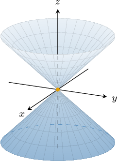
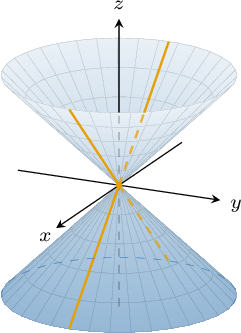
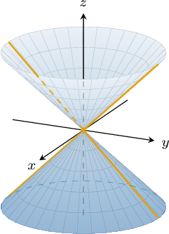
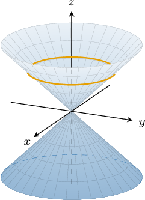
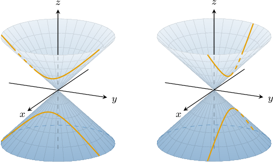
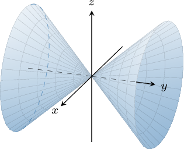
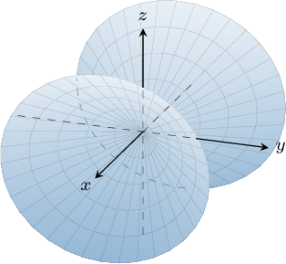

# Elliptic Cones

Source: https://www.mathacademy.com/topics/1894?courseId=154
Topic ID: 1894

## Prerequisites

- [Ellipsoids](./1896-ellipsoids.md)

## Lesson

### Introduction

Consider the quadric surface

$$

z^2 = x^2 + y^2

$$

whose graph is shown below.

This is an example of an **elliptic cone**. It has its **vertex** at the origin, and the $z$-axis is the **axis of symmetry** of the cone.

More generally, the equation of an elliptic cone whose vertex is at $(x_0, y_0, z_0)$ is given by

$$

(z-z_0)^2 = \dfrac{(x-x_0)^2}{a^2} + \dfrac{(y-y_0)^2}{b^2},

$$

where $a$ and $b$ are constants.

### Example: Identifying Properties of Elliptic Cones

#### Question

Given the elliptic cone $\dfrac{(x-2)^2}{4} + \dfrac{(y-2)^2}{2} = \dfrac{(z+1)^2}{3},$ find its intercepts with the $z$-axis.

#### Explanation

To find the $z$-intercepts of the elliptic cone, we plug $x=0$ and $y=0$ into the equation and solve for $z\mathbin{:}$

$$

\begin{aligned}\frac{(0−2)^{2}}{4}+\frac{(0−2)^{2}}{2} & =\frac{(𝑧+1)^{2}}{3} \\ \frac{4}{4}+\frac{4}{2} & =\frac{(𝑧+1)^{2}}{3} \\ 1+2 & =\frac{(𝑧+1)^{2}}{3} \\ 3 & =\frac{(𝑧+1)^{2}}{3} \\ 9 & =(𝑧+1)^{2} \\ 𝑧+1 & =±3 \\ 𝑧 & =−1±3 \\ 𝑧 & =−4,2\end{aligned}

$$

Therefore, the intercepts with the $z$-axis are $(0,0,-4)$ and $(0,0,2).$

### Traces of Elliptic Cones

The traces of an elliptic cone are either intersecting lines, ellipses, hyperbolas, or points.

For example, let's find the traces with the coordinate planes for the elliptic cone given by

$$

z^2 = x^2 + y^2

$$

- The trace of this surface in the $xy$-plane (when $z=0$) is given by the equation which corresponds to the origin $(0,0,0).$

- The trace of this surface in the $xz$-plane (when $y=0$) is given by the equation which corresponds to two lines in the $xz$-plane.

- The trace of this surface in the $yz$-plane (when $x=0$) is given by the equation which corresponds to two lines in the $yz$-plane.

There are a few other cases we should note:

- The trace of our surface with the plane $z=k$ for $k \neq 0$ is an ellipse:

- The traces of our surface with the plane $x=k$ or $y=k$ for $k \neq 0$ are hyperbolas:

### Alternative Orientations of the Axis of Symmetry

So far, we've encountered cones whose axes of symmetry are parallel to the $z$-axis. Let's now consider the cases when a cone is oriented along the $x$- or the $y$-axes.

For an elliptic cone centered at the origin, the other two cases are as follows:

- When the $y^2$ term is isolated on one side, the axis of symmetry is the $y$-axis.

- When the $x^2$ term is isolated on one side, the axis of symmetry is the $x$-axis.

### Example: Finding Traces of Elliptic Cones

#### Question

What is the trace in the $xz$-plane of the elliptic cone $3x^2 + 4y ^2=12(z+3)^2\:?$

#### Explanation

To find the trace in the $xz$-plane, we substitute $y=0$ into the equation of the elliptic cone, as follows:

$$

\begin{aligned}3𝑥^{2}+4⋅0^{2} & =12(𝑧+3)^{2} \\ 3𝑥^{2} & =12(𝑧+3)^{2} \\ 𝑥^{2} & =4(𝑧+3)^{2} \\ ±𝑥 & =2(𝑧+3) \\ ±\frac{𝑥}{2} & =𝑧+3 \\ 𝑧 & =±\frac{𝑥}{2}−3\end{aligned}

$$

This gives us two lines in the $xz$-plane with equations $z = \pm\dfrac{x}{2}-3.$
