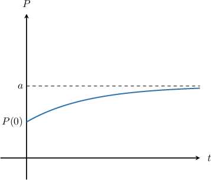

# Inhibited Growth Models With First-Order ODEs

Source: https://www.mathacademy.com/topics/1924?courseId=154
Topic ID: 1924

## Prerequisites

- [Exponential Growth and Decay Models With First-Order ODEs](./876-exponential-growth-and-decay-models-with-first-order-odes.md)

## Lesson

### Introduction

In many real situations, a quantity increases quickly at first, but then the increase slows down and the quantity levels off near some fixed value.

For example, suppose a cold drink is taken out of a refrigerator and placed in a warm room. At first, its temperature rises rapidly because the difference between the drink's temperature and the room temperature is large. As the drink warms up, this difference decreases, and the warming slows down. Eventually, the temperature levels off and approaches the room temperature.

This type of behavior is described by an **inhibited growth model**.

An *inhibited growth equation* models situations where the rate at which a quantity $P$ increases depends on how far it is from a target value $a$, called the **equilibrium value**. This equilibrium value represents the level that the quantity approaches over time.

An inhibited growth equation has the form

$$

\dfrac{\textrm{d}P}{\textrm{d}t} = r(a-P),

$$

and an inhibited growth initial value problem has the form

$$

\dfrac{\textrm{d}P}{\textrm{d}t} = r(a-P), \qquad P(0) = P_0

$$

where $r > 0$ is a constant of proportionality, and $P < a$ for all $t > 0.$

In this model, the equilibrium value $a$ acts as an upper bound. The solution increases over time but never rises above $a$, instead approaching it more and more slowly. The figure below illustrates this behavior.

**Note:** Inhibited growth and inhibited decay use the same basic idea: the rate of change is proportional to the difference between $P$ and the equilibrium value $a$. The only difference is whether the solution approaches $a$ from below (growth) or from above (decay).

Inhibited growth models can be written in expanded form. To identify an expanded equation as inhibited growth, we factorise out the *positive* coefficient of $P.$ For example, the equation

$$

\dfrac{\textrm{d}P}{\textrm{d}t} = 60-12P,

$$

*is* an inhibited growth equation for $P < 5$ and $t \geq 0,$ since it can be expressed with $r=12$ and $a=5$ as

$$

\dfrac{\textrm{d}P}{\textrm{d}t} = 12(5-P).

$$

### Example: Identifying Inhibited Growth Equations and Initial Value Problems

#### Question

Given that $y \lt 60$ and $t \ge 0,$ which of the following is an inhibited growth equation?

1. $\dfrac{\mathrm{d} y}{\mathrm{d} t} = 240 - 4y$

2. $\dfrac{\mathrm{d} y}{\mathrm{d} t} = 4y - 240$

3. $\dfrac{\mathrm{d} y}{\mathrm{d} t} = 4y^2 - 240$

4. $\dfrac{\mathrm{d} y}{\mathrm{d} t} = 4 - 240y$

#### Explanation

An inhibited growth equation has the form

$$

\dfrac{\mathrm{d} y}{\mathrm{d} t} = k(a-y),

$$

where $k > 0$ is a constant of proportionality, and $a > y$ for all $t \ge 0.$

From the given options, the only inhibited growth equation is

$$

\dfrac{\mathrm{d} y}{\mathrm{d} t} = 240 - 4y.

$$

To see this, let's factor the right-hand side of the equation. This gives,

$$

\dfrac{\mathrm{d} y}{\mathrm{d} t} = 4(60-y).

$$

In this case, the constant of proportionality is $k=4,$ and $a=60.$ Note that for inhibited growth, we must have $y \lt 60$ for all $t \ge 0.$

### Modeling Inhibited Growth

Now that we’ve practiced identifying inhibited growth models, let’s work through an example to see how they are used in practice.

Suppose a wildlife reserve is tracking the population of a reintroduced wolf pack. The environment can support a maximum population of $450$ wolves, but the current population is still below this limit. Since monitoring began, the population reached $392$ wolves after $6$ months and $420$ wolves after $12$ months.

Let's construct an inhibited growth model to describe the wolf population in terms of the month $t.$

The rate at which the population $P(t)$ changes is proportional to the difference between the maximum population and its current population. Therefore, we have the inhibited growth equation

$$

\dfrac{\mathrm{d}P}{\mathrm{d}t}=k(a-P),

$$

where $a$ is the maximum population the reserve can sustain, and $k > 0$ is a constant of proportionality.

In our case, $a=450,$ and we have

$$

\dfrac{\mathrm{d}P}{\mathrm{d}t}=k(450-P).

$$

First, we integrate our differential equation by separating the variables:

$$

\begin{aligned}\frac{d𝑃}{450−𝑃} & =𝑘\,d𝑡 \\ ∫\frac{d𝑃}{450−𝑃} & =∫𝑘\,d𝑡 \\ −ln⁡|450−𝑃| & =𝑘𝑡+𝐶\end{aligned}

$$

Since this is the solution to an inhibited growth equation, we have $450 - P > 0$ for all $t \geq 0.$ Next, we solve for $P(t),$ as follows:

$$

\begin{aligned}450−𝑃 & =𝑒^{−𝑘𝑡−𝐶} \\ 450−𝑃 & =𝑒^{−𝐶}𝑒^{−𝑘𝑡} \\ 450−𝑃 & =𝐾𝑒^{−𝑘𝑡} \\ 𝑃 & =450−𝐾𝑒^{−𝑘𝑡}\end{aligned}

$$

Note that $K=e^{-C}$ is a constant of integration.

This is the general solution. On the next slide, we will use the population data to find the specific values for the constants $K$ and $k.$

### Modeling Inhibited Growth (Continued)

Our general solution for the wolf population in month $t$ is $P(t) = 450 - Ke^{-kt}.$ Now, let's find the specific values of our constants.

We're told that, in month $6,$ the population was $392.$ So, applying the condition $P(6) = 392,$ we have

$$

\begin{aligned}𝑃(6) & =392 \\ 450−𝐾𝑒^{−6𝑘} & =392 \\ 𝐾𝑒^{−6𝑘} & =58.\end{aligned}

$$

We're also told that, in month $12,$ the population was $420.$ So, applying the condition $P(12) = 420,$ we get

$$

\begin{aligned}𝑃(12) & =420 \\ 450−𝐾𝑒^{−12𝑘} & =420 \\ 𝐾𝑒^{−12𝑘} & =30.\end{aligned}

$$

Then, by dividing the result of the first condition by the result of the second, we can solve for $k{:}$

$$

\begin{aligned}\frac{𝐾𝑒^{−6𝑘}}{𝐾𝑒^{−12𝑘}} & =\frac{58}{30} \\ 𝑒^{6𝑘} & =\frac{29}{15} \\ 6𝑘 & =ln⁡(\frac{29}{15}) \\ 𝑘 & =\frac{1}{6}ln⁡(\frac{29}{15}).\end{aligned}

$$

Now, substituting back into the result of the first condition, we solve for $K{:}$

$$

\begin{aligned}𝐾 & =58𝑒^{6𝑘} \\ & =58(\frac{29}{15}) \\ & =\frac{1682}{15}.\end{aligned}

$$

Therefore, the wolf population in month $t$ is

$$

P(t) = 450 - \frac{1682}{15}e^{-(t/6)\ln(29/15)}.

$$

### Example: Modeling Inhibited Growth

#### Question

A biologist observed that the growth of the number of fish in a lake is directly proportional to the difference between the lake’s maximum fish population and the current population. Let $P(t)$ be the fish population, measured in number of fish, and let $t \ge 0$ be the time in years. If the maximum fish population that the lake can support is $200$ fish, which differential equation could be used to model the lake’s fish population? Assume that $k > 0$ is a constant of proportionality.

#### Explanation

The rate at which the fish population $P(t)$ of the lake changes is proportional to the difference between the maximum fish population the lake can support and the current fish population. Therefore, we have the differential equation

$$

\dfrac{\textrm d P}{\textrm d t} = k(a - P),

$$

where $a$ is the maximum fish population the lake can support, and $k > 0$ is a constant of proportionality.

In our case, $a = 200 \textrm{fish},$ and we have

$$

\dfrac{\textrm d P}{\textrm d t} = k(200 - P).

$$

### Example: Solving an Inhibited Growth Model

#### Question

In an aquarium, there are initially $20$ fish. After $30$ weeks, the number of fish is $50.$ Assuming inhibited growth, calculate the number of fish after $100$ weeks if the maximum capacity of the aquarium is $90$ fish.

#### Explanation

The rate at which the number of fish $N(t)$ changes is proportional to the difference between the total number of fish and the current number of fish. Therefore, we have the inhibited growth equation

$$

\dfrac{\mathrm{d}N}{\mathrm{d}t}=k\left(a-N\right),

$$

where $a$ is the maximum capacity of the aquarium, and $k > 0$ is a constant of proportionality.

In our case, $a = 90$ fish, and we have

$$

\frac{\mathrm{d} N}{\mathrm{d} t} = k(90-N).

$$

First, we integrate our differential equation by separating the variables:

$$

\begin{aligned}\frac{d𝑁}{90−𝑁} & =𝑘\,d𝑡 \\ ∫\frac{d𝑁}{90−𝑁} & =∫𝑘\,d𝑡 \\ −ln⁡|90−𝑁| & =𝑘𝑡+𝐶\end{aligned}

$$

Since this is the solution to an inhibited growth equation, we have $90 - N > 0$ for all $t \ge 0.$ Next, we solve for $N(t),$ as follows:

$$

\begin{aligned}90−𝑁 & =𝑒^{−𝑘𝑡−𝐶} \\ 90−𝑁 & =𝑒^{−𝐶}𝑒^{−𝑘𝑡} \\ 90−𝑁 & =𝐾𝑒^{−𝑘𝑡} \\ 𝑁 & =90−𝐾𝑒^{−𝑘𝑡}\end{aligned}

$$

Note that $K=e^{-C}$ is a constant of integration.

We're told that the initial number of fish was $20.$ So, we apply the initial condition $N(0)=20,$ and solve for $K{:}$

$$

\begin{aligned}𝑁(0) & =20 \\ 90−𝐾𝑒^{0} & =20 \\ 90−𝐾 & =20 \\ 𝐾 & =70\end{aligned}

$$

Therefore, we have the following expression for $N(t)\mathbin{:}$

$$

N(t)=90 - 70 e^{-kt}

$$

We're also told that, after $30$ weeks, the number of fish is $50.$ So, applying the condition $N(30)=50,$ we can solve for $k{:}$

$$

\begin{aligned}𝑁(30) & =50 \\ 90−70𝑒^{−30𝑘} & =50 \\ 40 & =70𝑒^{−30𝑘} \\ 𝑒^{−30𝑘} & =\frac{4}{7} \\ −30𝑘 & =ln⁡(\frac{4}{7}) \\ 𝑘 & =−\frac{1}{30}ln⁡(\frac{4}{7})\end{aligned}

$$

Therefore, the solution to our initial value problem is

$$

N(t)=90-70e^{(t/30)\,\ln\left(4/7\right)}.

$$

Finally, the number of fish after $t=100$ weeks is

$$

\begin{aligned}𝑁(100) & =90−70𝑒^{(100/30)\,ln⁡(4/7)} \\ & =79.161… \\ & ≈79\,fish,\end{aligned}

$$

rounded to the nearest integer.
