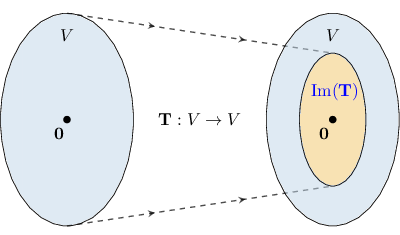

# The Image and Rank of a Linear Transformation

Source: https://www.mathacademy.com/topics/1963?courseId=154
Topic ID: 1963

## Prerequisites

- [The Rank of a Matrix](./1867-the-rank-of-a-matrix.md)
- [The Standard Matrix of a Linear Transformation](../integrated-math-iii-honors/1959-the-standard-matrix-of-a-linear-transformation.md)

## Lesson

### Introduction

The **image** (or **range**) of a linear transformation $\mathbf{T}$ is the set of all vectors $\mathbf{b}$ that the transformation maps to. That is to say

$$

𝐓(𝐮)=𝐛

$$

The diagram below gives a schematic representation of the image of a linear transformation $\mathbf{T}: V \rightarrow V$ for a vector space $V.$

Notice that $\mathbf{0}$ is always in the image of a linear transformation since $\mathbf{T}(\mathbf{0})=\mathbf{0}.$

As an example, let's consider the linear transformation

$$

[\begin{aligned}𝑥 \\ 𝑦\end{aligned}]

$$

Notice that, for example, the vector $\mathbf b = [6,9]^T$ is in the image of the transformation $\mathbf{S}$ since there is another vector $\mathbf{u} = [1,1]^T$ such that $\mathbf{S}(\mathbf{u})=\mathbf{b}{:}$

$$

[\begin{aligned}1 \\ 1\end{aligned}]

$$

### Example: Determining a Component of a Vector in the Image of a Linear Transformation

#### Question

Let $\begin{aligned}𝑥 \\ 𝑦 \\ 𝑧\end{aligned}$ be a linear transformation. Determine the value of $k$ for which the vector $\begin{aligned}4 \\ 𝑘 \\ 8\end{aligned}$ belongs to $\textrm{Im}(\mathbf{T}).$

#### Explanation

The vector $\mathbf{v}$ belongs to $\textrm{Im}(\mathbf{T})$ if there exists a vector $\begin{aligned}𝑥 \\ 𝑦 \\ 𝑧\end{aligned}$ such that $\mathbf{T}(\mathbf{u}) = \mathbf{v}.$

Therefore, we must have

$$

\begin{aligned}\begin{aligned}𝑥+𝑦 \\ −𝑥+𝑦 \\ 2𝑦\end{aligned} & =\begin{aligned}4 \\ 𝑘 \\ 8\end{aligned}.\end{aligned}

$$

This gives the following system of equations:

$$

\begin{aligned}𝑥+𝑦=4 \\ −𝑥+𝑦=𝑘 \\ 2𝑦=8.\end{aligned}

$$

From the third equation, we get $y=4,$ which we substitute into the first equation to get

$$

\begin{aligned}𝑥+𝑦 & =4 \\ 𝑥+4 & =4 \\ 𝑥 & =0.\end{aligned}

$$

Finally, we substitute $x=0$ and $y=4$ into the third equation and obtain

$$

\begin{aligned}−𝑥+𝑦 & =𝑘 \\ 0+4 & =𝑘 \\ 𝑘 & =4.\end{aligned}

$$

Therefore, $\mathbf{v}\in\textrm{Im}(\mathbf{T})$ when $k=4.$

### Determining If a Vector Lies in the Image

In general, the image of a linear transformation $\mathbf{T}$ is equivalent to the column space of its standard matrix $T.$ That is,

$$

𝑇

$$

So to find out if a vector $\mathbf{b}$ is in the image of the linear transformation $\mathbf{T},$ we just need to check if the matrix equation $T\mathbf{x}=\mathbf{b}$ is consistent.

### Example: Determining Whether a Vector Is in the Image of a Linear Transformation

#### Question

The standard matrix $T$ of a linear transformation $\mathbf{T}$ and the vector $\mathbf{b} \in \mathbb{R}^3$ are given below. Determine if there exists a vector $\mathbf{x} \in \mathbb{R}^3$ such that $\mathbf{T}(\mathbf{x})=\mathbf{b}.$ In the affirmative case, find such a vector.

$$

\begin{aligned}2 & 4 & 2 \\ 6 & 4 & −10 \\ 0 & 4 & 8\end{aligned}

$$

#### Explanation

Since $T$ is the standard matix of $\mathbf{T},$ we have $\textrm{Im}(\mathbf{T}) = \textrm{Col}(T).$ In order to determine whether $\mathbf{b}$ lies in $\textrm{Im}(\mathbf{T}),$ we need to check if the equation $T\mathbf{x}=\mathbf{b}$ is consistent.

So, we find the row echelon form of the augmented matrix $[T \,|\, \mathbf{b}],$ as follows:

$$

\begin{aligned}[𝑇\,|\,𝐛] & =\begin{aligned}2 & 4 & 2 & 6 \\ 6 & 4 & −10 & 26 \\ 0 & 4 & 8 & −4\end{aligned} & & \begin{aligned}𝑅_{2}:=𝑅_{2}+(−3)𝑅_{1}\end{aligned} \\ & ∼\begin{aligned}2 & 4 & 2 & 6 \\ 0 & −8 & −16 & 8 \\ 0 & 4 & 8 & −4\end{aligned} & & \begin{aligned}𝑅_{3}:=𝑅_{3}+\frac{1}{2}𝑅_{2}\end{aligned} \\ & ∼\begin{aligned}2 & 4 & 2 & 6 \\ 0 & −8 & −16 & 8 \\ 0 & 0 & 0 & 0\end{aligned} & & \end{aligned}

$$

The reduced matrix above has a zero row, and so the system is consistent. We have two pivot columns (the $1$st and the $2$nd). So, $x_3$ is a free variable. Now, from the second equation, we get

$$

-8x_2-16x_3 = 8 \qquad\Longrightarrow\qquad x_2=-1-2x_3.

$$

Substituting this into the first equation gives

$$

2x_1+4(-1-2x_3)+2x_3 = 6 \qquad\Longrightarrow\qquad x_1=5+3x_3.

$$

As a result, the general solution is given by

$$

\begin{aligned}5+3𝑥_{3} \\ −1−2𝑥_{3} \\ 𝑥_{3}\end{aligned}

$$

Setting $x_3=0,$ we have

$$

\begin{aligned}5 \\ −1 \\ 0\end{aligned}

$$

### The Rank of a Linear Transformation

In general, the rank of a linear transformation $\mathbf{T}$ is equal to the dimension of its image:

$$

\text{rank}(\mathbf{T}) = \text{dim}(\text{Im}(\mathbf{T}))

$$

If the linear transformation $\mathbf{T}$ has the standard matrix $T,$ then the dimension of the image is equal to the rank of $T{:}$

$$

\text{dim}(\text{Im}(\mathbf{T})) = \text{rank}(T)

$$

So, in general, we have

$$

\text{rank}(\mathbf{T}) = \text{rank}(T).

$$

### Example: Calculating the Rank of a Linear Transformation

#### Question

If $\begin{aligned}2 & −3 & −1 & −2 \\ −6 & 5 & −1 & 2 \\ 4 & 1 & 5 & 3 \\ 0 & 0 & 0 & 0\end{aligned}$ is the standard matrix of the linear transformation $\mathbf{T},$ then what is $\text{rank}(\mathbf{T})?$

#### Explanation

In general, $\text{rank}(\mathbf{T}) = \text{dim}(\text{Im}(\mathbf{T})) = \text{rank}(T).$

So, we need to find the rank of the matrix $T.$ We reduce $T$ to row echelon form, as follows:

$$

\begin{aligned}𝑇 & =\begin{aligned}2 & −3 & −1 & −2 \\ −6 & 5 & −1 & 2 \\ 4 & 1 & 5 & 3 \\ 0 & 0 & 0 & 0\end{aligned} & & \begin{aligned}𝑅_{2}:=𝑅_{2}+3𝑅_{1} \\ 𝑅_{3}:=𝑅_{3}+(−2)𝑅_{1}\end{aligned} \\ & ∼\begin{aligned}2 & −3 & −1 & −2 \\ 0 & −4 & −4 & −4 \\ 0 & 7 & 7 & 7 \\ 0 & 0 & 0 & 0\end{aligned} & & \begin{aligned}𝑅_{3}:=𝑅_{3}+\frac{7}{4}𝑅_{2}\end{aligned} \\ & ∼\begin{aligned}2 & −3 & −1 & −2 \\ 0 & −4 & −4 & −4 \\ 0 & 0 & 0 & 0 \\ 0 & 0 & 0 & 0\end{aligned} & & \end{aligned}

$$

Therefore, since $T$ has $2$ pivot columns, we have that

$$

\textrm{rank}(\mathbf{T})=\textrm{rank}(T)=2.

$$
