# Type I and II Regions in Two-Dimensional Space

Source: https://www.mathacademy.com/topics/1979?courseId=154
Topic ID: 1979

## Prerequisites

- [Graphing the Cube Root Function](../algebra-ii/454-graphing-the-cube-root-function.md)
- [Equations of Ellipses Centered at a General Point](../integrated-math-iii-honors/849-equations-of-ellipses-centered-at-a-general-point.md)
- [Describing Planar Regions Using Set-Builder Notation](./4392-describing-planar-regions-using-set-builder-notation.md)

## Lesson

### Introduction

Let's consider the region that lies between the curves ${\color{red}y=f(x)}$ and ${\color{blue}y=g(x)}$ over a closed interval $[a,b]$ on the $x$-axis, as shown below.

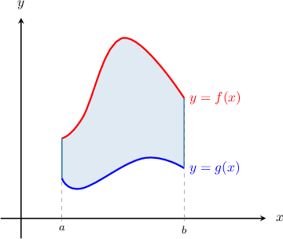

This region is an example of a **type I region**. Generally, a type I region is any region bounded by two vertical lines $x=a$ and $x=b,$ and two curves $y=g(x)$ and $y=f(x),$ where $f$ and $g$ are continuous functions.

Using set notation, a type I region can be written as

$$

D = \big\{ (x,y) \: : \: a \leq x \leq b, \quad g(x) \leq y \leq f(x) \big\}.

$$

In a type I region, any vertical line drawn through the region should intersect the region in a *single* interval, as shown below.

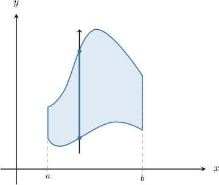

By contrast, the following region is *not* a type I region since there is a vertical line whose intersection with the region results in two *separate* line segments. In other words, the vertical line enters and leaves the region more than once.

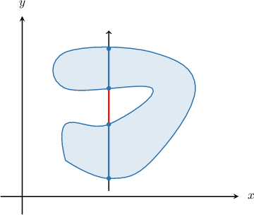

### Example: Identifying Type I Regions

#### Question

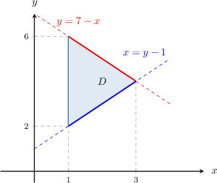

Represent the type I region above using set notation.

#### Explanation

A type I region can be written as

$$

D = \big\{ (x,y) \: : \: a \leq x \leq b, \quad g(x) \leq y \leq f(x) \big\},

$$

where $f$ and $g$ are continuous functions.

To express the given region as a type I region, we first rewrite all of the given curves as functions of $x.$

- The curve $x=y-1$ can be written as $y=x+1.$

- The curve $y=7-x$ is already written as a function of $x.$

Notice that the region lies between the vertical lines $x=1$ and $x=3.$ So, we have $1 \leq x \leq 3.$

We draw a vertical arrow through the region to determine the lower function $g(x)$ and the upper function $f(x)$. A vertical line should intersect the region in a single interval only for it to be a type I region.

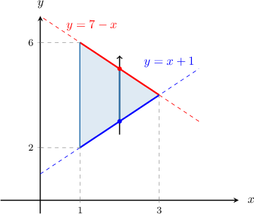

The vertical line enters the region through the lower function $y=x+1$ and leaves through the upper function $y=7-x.$ So, we have $x+1 \leq y \leq 7-x.$

Therefore, we obtain

$$

D= \big\{ (x,y) \: : \: 1 \leq x \leq 3, \: x+1 \leq y \leq 7-x \big\}.

$$

### Type II Regions

Let's consider the region that lies between the curves ${\color{red}x=f(y)}$ and ${\color{blue}x=g(y)}$ over a closed interval $[a,b]$ on the $y$-axis, as shown below.

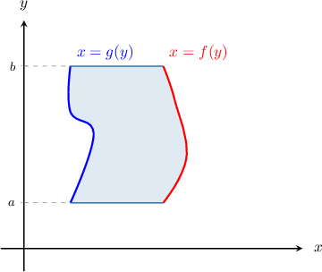

This region is an example of a **type II region**. In general, a type II region is any region that is bounded by two horizontal lines $y=a$ and $y=b,$ and two curves $x=g(y)$ and $x=f(y),$ where $f$ and $g$ are continuous functions.

Using set notation, a type II region can be written as

$$

D = \big\{ (x,y) \: : \: a \leq y \leq b, \quad g(y) \leq x \leq f(y) \big\}.

$$

In a type II region, any horizontal line drawn through the region should intersect the region in a *single* interval, as shown below.

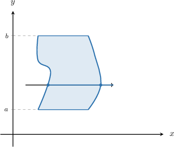

By contrast, the following region is *not* a type II region since there is a horizontal line whose intersection with the region results in two *separate* line segments. In other words, the horizontal line enters and leaves the region more than once.

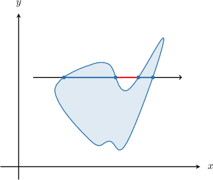

### Example: Identifying Type II Regions

#### Question

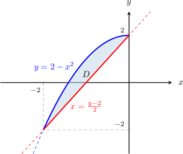

Represent the type II region above using set notation.

#### Explanation

A type II region can be written as

$$

D = \big\{ (x,y) \: : \: a \leq y \leq b, \quad g(y) \leq x \leq f(y) \big\},

$$

where $f$ and $g$ are continuous functions.

To express the given region as a type II region, we first rewrite all of the given curves as functions of $y.$

- The curve $y = 2-x^2$ can be written as $x = -\sqrt{2-y}.$ Note that we have picked the negative square root since $x\leq 0$ in our region.

- The curve $x=\dfrac{y-2}{2}$ is already written as a function of $y.$

Notice that the region lies between the horizontal lines $y=-2$ and $y=2.$ So, we have $-2 \leq y \leq 2.$

We draw a horizontal arrow through the region to determine the left function $g(y)$ and the right function $f(y)$. A horizontal line should intersect the region in a single interval only for it to be a type II region.

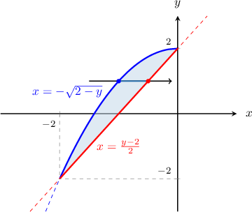

The horizontal line enters the region through the lower function $x=-\sqrt{2-y}$ and leaves through the upper function $x=\dfrac{y-2}{2}.$ So, we have $-\sqrt{2-y} \leq x \leq \dfrac{y-2}{2}.$

Therefore, we obtain

$$

D= \bigg\{ (x,y) \: : \: -2 \leq y \leq 2, \: -\sqrt{2-y} \leq x \leq \dfrac{y-2}{2} \bigg\}.

$$

### Regions that are Neither Type I Nor Type II

In general, a given region can be type I, type II, both, or neither.

For example, let's consider the region in the coordinate plane bounded between the circle ${\color{blue}x^2+y^2=2}$ and the lines ${\color{red}x=-1},$ ${\color{red}x=1},$ ${\color{red}y=-1}$, and ${\color{red}y=1},$ as shown below.

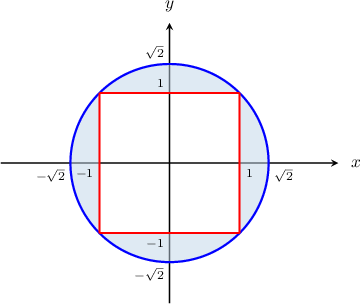

There is a vertical line (for instance, the $y$-axis) whose intersection with the region results in two separate line segments. In other words, the vertical line enters and leaves the region more than once. So, this region *cannot* be a type I region.

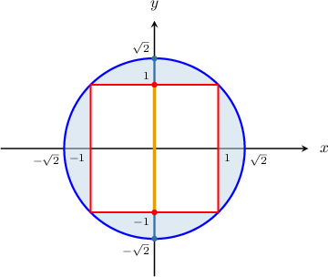

Similarly, there is a horizontal line (for instance, the $x$-axis) whose intersection with the region results in two separate line segments. In other words, the horizontal line enters and leaves the region more than once. So, this region *cannot* be a type II region.

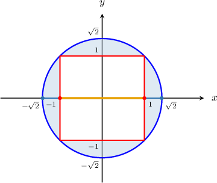

In conclusion, this region is *neither* type I nor type II.

Let's now look at an example that is *both* type I and type II.

### Example: Classifying a Region as Type I, Type II, Both, or Neither

#### Question

Which of the following statements are true regarding the finite region bounded between the parabola $y=x^2$ and the line $y=4?$

1. It is a type I region

2. It is a type II region

3. It's neither a type I nor a type II region

#### Explanation

First, notice that

$$

y=x^2 \qquad\Longrightarrow\qquad x = \pm\sqrt{y}.

$$

Now, let's sketch our region.

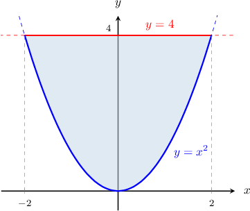

We have the following:

- Any vertical line through the region intersects it on a single interval. Furthermore, we can represent our region as So, this is a type I region.

- Any horizontal line through the region intersects it on a single interval. Furthermore, we can represent our region as So, this is a type II region.

Therefore, the correct answer is "I and II only."
