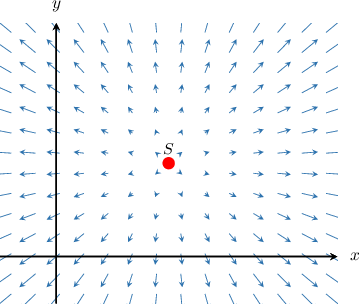
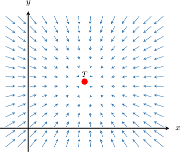
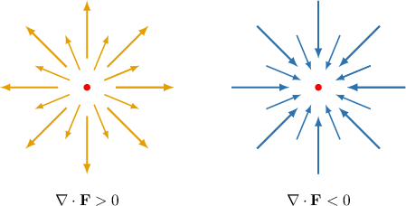
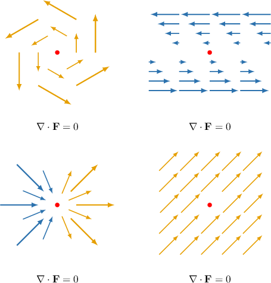
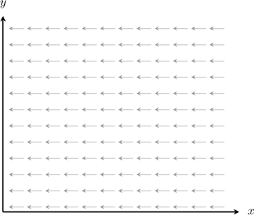
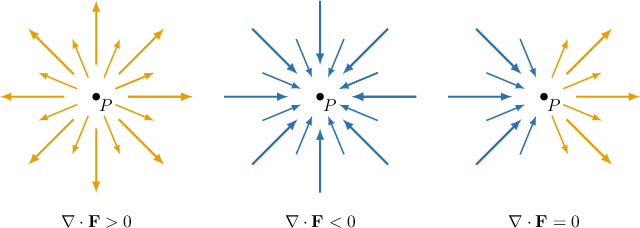

# The Divergence of a Vector Field

Source: https://www.mathacademy.com/topics/2131?courseId=154
Topic ID: 2131

## Prerequisites

- [Partial Differentiability of Multivariable Functions](./1932-partial-differentiability-of-multivariable-functions.md)
- [Visualizing Vector Fields](./3344-visualizing-vector-fields.md)

## Lesson

### Introduction

Suppose that $\mathbf F$ is a vector field on $\mathbb R^2,$ expressed in terms of its component functions as

$$

\mathbf F(x,y) = P(x,y)\,\mathbf i + Q(x,y)\,\mathbf j.

$$

If the first partial derivatives of $P$ and $Q$ exist, then the **divergence** of $\mathbf F,$ denoted $\textrm{div}\,\mathbf F,$ is the scalar given by

$$

\textrm{div}\,\mathbf F = \dfrac{\partial P}{\partial x} + \dfrac{\partial Q}{\partial y}.

$$

Notice that if we define the differential operator $\nabla$ (a.k.a. the "del" operator) as

$$

\nabla = \mathbf i\,\dfrac{\partial }{\partial x} + \mathbf j\,\dfrac{\partial }{\partial y},

$$

then the divergence of $\mathbf F$ is given by the dot product

$$

\textrm{div}\,\mathbf F = \nabla \cdot \mathbf F.

$$

For example, suppose that the vector field $\mathbf F$ is given by

$$

\mathbf F(x,y) = 2xy\, \mathbf i + e^{yx} \, \mathbf j .

$$

Then, we can calculate $\textrm{div}\,\mathbf{F}$ using the dot product formula, as follows:

$$

\begin{aligned}div\,𝐅 & =∇⋅𝐅 \\ & =(𝐢\,\frac{𝜕}{𝜕𝑥}+𝐣\,\frac{𝜕}{𝜕𝑦})⋅(2𝑥𝑦\,𝐢+𝑒^{𝑦𝑥}\,𝐣) \\ & =\frac{𝜕}{𝜕𝑥}(2𝑥𝑦)+\frac{𝜕}{𝜕𝑦}(𝑒^{𝑦𝑥}) \\ & =2𝑦+𝑥𝑒^{𝑦𝑥}\end{aligned}

$$

### Some Important Notes About the Divergence of a Vector Field

There are a few things we should note about the divergence:

- We can only compute the divergence of a *vector* field, and a vector field's divergence is a *scalar* field. So if $G(x,y) = \textrm{div}\,\mathbf F,$ then we have the following map: In contrast, if $f(x,y)$ is a scalar field, then the statement $\textrm{div}\, f$ has no meaning.

- We can easily extend the notion of divergence to three dimensions. So, if $\mathbf F(x,y,z) = P\,\mathbf i + Q\,\mathbf j + R\,\mathbf k,$ then $\textrm{div}\,\mathbf F$ is given by where the three-dimensional differential operator $\nabla$ is given by

- The divergence of a vector field at a point $P$ gives us helpful information about the tendency of the vector field to behave like a source or a sink at $P.$ We'll describe this in more detail shortly.

### Example: Finding the Divergence of a Vector Field in Two Dimensions

#### Question

Consider the vector field $\mathbf{F}=\ln(2x+y)\,\mathbf{i}+ x^2e^{3y}\,\mathbf{j}.$ Evaluate $\nabla \cdot\mathbf{F}$ at the point $(1,0).$

#### Explanation

If $\mathbf{F}=P\,\mathbf{i}+Q\,\mathbf{j}$ is a vector field on $\mathbb{R}^2$ and the partial derivatives of the components of $\mathbf F$ all exist, then the divergence of $\mathbf F$ is the scalar field given by

$$

\nabla\cdot\mathbf{F}=\textrm{div}\,\mathbf F=\dfrac{\partial P}{\partial x}+\dfrac{\partial Q}{\partial y}.

$$

Therefore, we have

$$

\begin{aligned}∇⋅𝐅 & =\frac{𝜕𝑃}{𝜕𝑥}+\frac{𝜕𝑄}{𝜕𝑦} \\ & =\frac{𝜕}{𝜕𝑥}(ln⁡(2𝑥+𝑦))+\frac{𝜕}{𝜕𝑦}(𝑥^{2}𝑒^{3𝑦}) \\ & =\frac{2}{2𝑥+𝑦}+3𝑥^{2}𝑒^{3𝑦}.\end{aligned}

$$

Finally, we evaluate $\textrm{div}\,\mathbf {F}$ at the point $(1,0),$ and obtain

$$

\begin{aligned}(∇⋅𝐅)(1,0) & =\frac{2}{2(1)+0}+3(1)^{2}𝑒^{3(0)} \\ & =1+3 \\ & =4.\end{aligned}

$$

### Example: Finding the Divergence of a Vector Field in Three Dimensions

#### Question

Consider the vector field $\mathbf{F}=(2x-y)^2\,\mathbf{i}+(3y-2z)^2\,\mathbf{j}+(x-2z)^2\,\mathbf{k}.$ Evaluate $\textrm{div}\,\mathbf{F}$ at the point $(1,2,1).$

#### Explanation

If $\mathbf{F}=P\,\mathbf{i}+Q\,\mathbf{j} + R\,\mathbf k$ is a vector field on $\mathbb{R}^3$ and the partial derivatives of the components of $\mathbf F$ all exist, then the divergence of $\mathbf F$ is the scalar field given by

$$

\textrm{div}\,\mathbf F = \nabla\cdot\mathbf{F}=\dfrac{\partial P}{\partial x}+\dfrac{\partial Q}{\partial y}+\dfrac{\partial R}{\partial z}.

$$

Therefore, we have

$$

\begin{aligned}∇⋅𝐅 & =\frac{𝜕𝑃}{𝜕𝑥}+\frac{𝜕𝑄}{𝜕𝑦}+\frac{𝜕𝑅}{𝜕𝑧} \\ & =\frac{𝜕}{𝜕𝑥}((2𝑥−𝑦)^{2})+\frac{𝜕}{𝜕𝑦}((3𝑦−2𝑧)^{2})+\frac{𝜕}{𝜕𝑧}((𝑥−2𝑧)^{2}) \\ & =4(2𝑥−𝑦)+6(3𝑦−2𝑧)−4(𝑥−2𝑧) \\ & =4𝑥+14𝑦−4𝑧.\end{aligned}

$$

Finally, we evaluate $\textrm{div}\,\mathbf {F}$ at the point $(1,2,1),$ and obtain

$$

\begin{aligned}div\,𝐅(1,2,1) & =4(1)+14(2)−4(1) \\ & =28.\end{aligned}

$$

### Physical Interpretation of Divergence

Our goal now is to develop an intuitive understanding of what the divergence of a vector field measures.

Consider the vector field $\mathbf F(x,y)$ and the point $S,$ shown below. Imagine that this vector field represents the velocity field of a stream of flowing water.

We can see from our diagram that $S$ acts like a **source**. You can think of this as an open faucet, pushing water onto the plane and away from itself.

Since $S$ acts like a source, $\textrm{div}\,\mathbf F$ is nonzero. By convention, if a point $S$ acts like a source, the divergence is positive:

$$

\textrm{div}\,\mathbf F > 0

$$

In this particular case, *every* point in our vector field acts as a source. So $\textrm{div}\,\mathbf F > 0$ everywhere.

If we reverse the situation, we get the following:

We can see from our diagram that $T$ acts like a **sink**. You can think of this as an open plughole that sucks in the surrounding water.

Since $T$ acts like a sink, $\textrm{div}\,\mathbf F$ is also nonzero. By convention, if a point $T$ acts like a sink, the divergence is negative:

$$

\textrm{div}\,\mathbf F < 0

$$

Every point in our vector field acts like a sink in this case. So $\textrm{div}\,\mathbf F < 0$ everywhere.

Finally, note that if $\textrm{div}\,\mathbf F = 0$ everywhere in the domain of some vector field $\mathbf F,$ we say that $\mathbf F$ is **solenoidal.**

### Examples of Vector Field With Divergence and Solenoidal Vector Fields

The following two vector fields behave either as a source or a sink. Therefore, they both have divergence.

The following vector fields are solenoidal (i.e., they each have zero divergence).

### Example: Interpreting Divergence

#### Question

Consider the vector field $\mathbf F$ shown above. Which of the following statements are true everywhere in the domain of $\mathbf F?$

1. $\textrm{div}\,\mathbf F = 0$

2. $\textrm{div}\,\mathbf F > 0$

3. $\textrm{div}\,\mathbf F < 0$

4. $\mathbf F$ is solenoidal

#### Explanation

Recall that $\textrm{div}\, \mathbf F = \nabla\cdot\mathbf F$ denotes the divergence of the vector field $\mathbf F.$

Intuitively, the divergence of $\mathbf F$ at a point $P$ measures how much $\mathbf F$ acts like a source or a sink at $P\mathbin{:}$

- If $\mathbf F$ acts like a source at $P,$ then $\nabla \cdot \mathbf F > 0$ at $P.$

- If $\mathbf F$ acts like a sink at $P,$ then $\nabla \cdot \mathbf F < 0$ at $P.$

- If $\mathbf F$ acts like neither a source nor a sink at $P,$ then $\nabla \cdot \mathbf F =0$ at $P.$

If $\nabla \cdot \mathbf F = 0$ everywhere in the domain of $\mathbf F,$ we say that $\mathbf F$ is solenoidal.

With that in mind, let's examine each statement:

- Statement I is true, whereas statements II and III are false. For any point $P,$ the sum of the inward-pointing vectors equals the sum of the outward-pointing vectors. Therefore, $\mathbf F$ acts neither like a source nor a sink.

- Statement IV is true. Since $\nabla \cdot \mathbf F = 0$ everywhere, the vector field $\mathbf F$ is solenoidal.

Therefore, the correct answer is "I and IV only."
