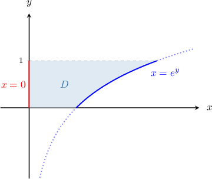
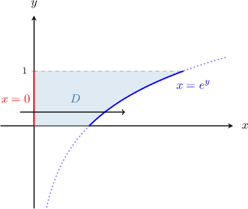
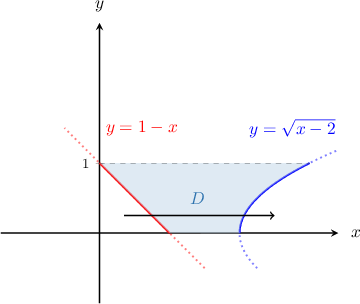
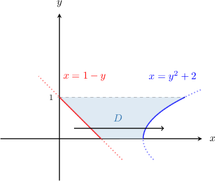
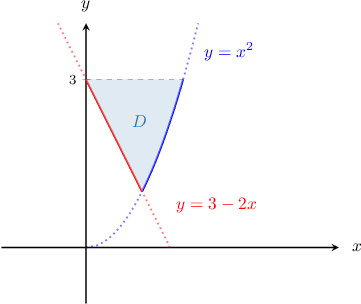
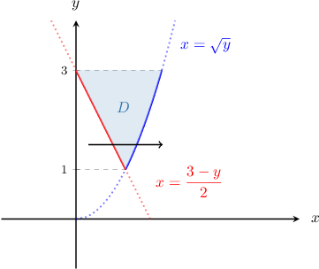
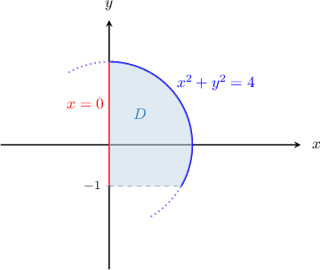
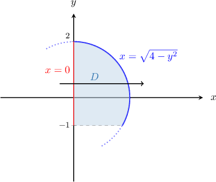

# Double Integrals Over Type II Regions

Source: https://www.mathacademy.com/topics/2152?courseId=154
Topic ID: 2152

## Prerequisites

- [Double Integrals Over Type I Regions](./2151-double-integrals-over-type-i-regions.md)

## Lesson

### Introduction

How do we represent a double integral over a type II region as a repeated integral?

Specifically, let's consider

$$

\displaystyle \iint\limits_D (x+2y) \, \textrm d A, \%= \int_a^b \int_c^d (x+2y) \,\textrm d y\, \textrm d x,

$$

where $D$ is the finite region bounded by the lines $x=0,$ $y=0, y=1$ and the curve $x=e^y,$ as shown below.

First, notice that $D$ is indeed a type II region. To determine the right and left functions, we draw a horizontal arrow through the region, as usual.

Hence, the region $D$ can be defined as

$$

D = \left\{ (x,y) \: : \: {\color{red}0} \leq y \leq {\color{blue}1}, \quad {\color{red}0} \leq x \leq {\color{blue}e^y} \right\}.

$$

Now, we can express the integral as follows:

$$

\begin{aligned}\underset{𝐷}{∬}(𝑥+2𝑦)\,d𝐴 & =\underset{\underset{(lower limit)}{∫}}{\overset{}{(upper limit)}}\underset{\underset{(left function)}{∫}}{\overset{}{(right function)}}(𝑥+2𝑦) d𝑥 d𝑦 \\ & =∫_{10}^{}[∫_{𝑒^{𝑦}0}^{}(𝑥+2𝑦) d𝑥] d𝑦\end{aligned}

$$

And that's our answer! Notice that when we have a type II region,

- the limits for $x$ are functions of $y,$ and

- the limits for $y$ are constants.

### Example: Representing a Double Integral as a Repeated Integral When the Limits are Given

#### Question

If $D$ is the finite region enclosed by the curves $y=\sqrt{x-2}$ and $y=1-x$ from $y=0$ to $y=1,$ as shown below, then what is $\displaystyle \iint\limits_D (x^2y+xy^2) \, \mathrm{d}A$ expressed as a repeated integral?

#### Explanation

First, let's represent $D$ as a type II region. Writing $y=\sqrt{x-2}$ and $y=1-x$ in terms of $y,$ we obtain

$$

\begin{aligned}𝑦=\sqrt{√𝑥−2} & \,⟹\,𝑥=𝑦^{2}+2 \\ 𝑦=1−𝑥 & \,⟹\,𝑥=1−𝑦\end{aligned}

$$

To determine the left and right functions, we draw a horizontal arrow from left to right through the region, as usual.

As a result, we get

$$

D = \bigg\{ (x,y) \: : \: 0 \leq y \leq 1, \quad 1-y \leq x \leq y^2+2 \bigg\}.

$$

Therefore, we can express the integral as follows:

$$

\begin{aligned}\underset{𝐷}{∬}(𝑥^{2}𝑦+𝑥𝑦^{2})\,d𝐴 & =∫_{10}^{}∫_{𝑦^{2}+21−𝑦}^{}(𝑥^{2}𝑦+𝑥𝑦^{2})\,d𝑥\,d𝑦\end{aligned}

$$

### Example: Representing a Double Integral as a Repeated Integral When the Limits are Not Given

#### Question

Consider the finite region $D$ in the $xy$-plane enclosed between the curves $y=x^2$ and $y=3-2x$ below the line $y=3.$ What is $\displaystyle \iint\limits_{D} f\left({x,y} \right) \, \mathrm{d}A\:$ expressed as a repeated integral?

#### Explanation

First, let's make a sketch of our region.

We need to represent $D$ as a type II region. Writing $y=x^2$ and $y=3-2x$ in terms of $y,$ we obtain

$$

\begin{aligned}𝑦=𝑥^{2} & \,⟹\,𝑥=\sqrt{√𝑦} \\ 𝑦=3−2𝑥 & \,⟹\,𝑥=\frac{3−𝑦}{2}\end{aligned}

$$

Now, let's determine the limits of integration.

- To determine the $y$-limits, we need to find the $y$-coordinates of the points at which the curves intersect. So, we set the following equation and solve it for $y\mathbin{:}$ So, since our region lies below the line $y=3,$ the $y$-limits are

- To determine the left and right functions, we draw a horizontal arrow from left to right through the region, as usual.

As a result, we get

$$

D = \big\{ (x,y) \: : \: 1 \leq y \leq 3, \quad \dfrac{3-y}{2} \leq x \leq \sqrt{y} \big\}.

$$

Therefore, we can express the integral as follows:

$$

\begin{aligned}\underset{𝐷}{∬}𝑓(𝑥,𝑦)\,d𝐴 & =∫_{31}^{}∫_{\sqrt{√𝑦}(3−𝑦)/2}^{}𝑓(𝑥,𝑦)\,d𝑥\,d𝑦\end{aligned}

$$

### Evaluating Repeated Integrals With Variable Limits

Suppose that we want to evaluate the repeated integral

$$

\int_{0}^{1}\int_{0}^{e^y} (x+2) \ \mathrm{d} x \, \mathrm{d} y.

$$

Notice that the domain of integration is a type II region.

To compute this integral, we must bear the following important points in mind.

- We start with the inner integral, as usual.

- When integrating with respect to $x,$ we treat $y$ as though it were a constant.

- The limits of integration for the inner integral are functions of $y.$ Once again, we treat $y$ as though it were a constant and substitute the integration limits as usual. After this step, there should be no more $x$'s in our integral.

- Finally, we compute the outer integral.

Let's apply these steps to solve the given problem.

First, we evaluate the inner integral by integrating with respect to $x$, treating $y$ as a constant:

$$

\begin{aligned}∫_{10}^{}[∫_{𝑒^{𝑦}0}^{}(𝑥+2) d𝑥]d𝑦 & =∫_{10}^{}[\frac{𝑥^{2}}{2}+2𝑥]_{𝑒^{𝑦}0}^{} d𝑦 \\ & =∫_{10}^{}(\frac{𝑒^{2𝑦}}{2}+2𝑒^{𝑦}) d𝑦\end{aligned}

$$

Then, we integrate with respect to $y\mathbin{:}$

$$

\begin{aligned}∫_{10}^{}(\frac{𝑒^{2𝑦}}{2}+2𝑒^{𝑦}) d𝑦 & =[\frac{𝑒^{2𝑦}}{4}+2𝑒^{𝑦}]_{10}^{} \\ & =\frac{𝑒^{2}}{4}+2𝑒−(\frac{𝑒^{0}}{4}+2𝑒^{0}) \\ & =\frac{1}{4}(𝑒^{2}+8𝑒−9)\end{aligned}

$$

### Example: Evaluating a Repeated Integral Defined Over a Type II Region

#### Question

Calculate $\displaystyle \int_{\sqrt{\pi}}^{\sqrt{2\pi}} \int_0^{y^2} \frac{\sin y^2}{y} \, \mathrm{d}x \,\mathrm{d}y.$

#### Explanation

The integral is defined over a type II region.

First, we evaluate the inner integral by integrating with respect to $x$, treating $y$ as a constant:

$$

\begin{aligned}∫_{\sqrt{√2𝜋}\sqrt{√𝜋}}^{}∫_{𝑦^{2}0}^{}\frac{sin⁡𝑦^{2}}{𝑦}\,d𝑥\,d𝑦 & =∫_{\sqrt{√2𝜋}\sqrt{√𝜋}}^{}\frac{sin⁡𝑦^{2}}{𝑦}[∫_{𝑦^{2}0}^{}d𝑥]\,d𝑦 \\ & =∫_{\sqrt{√2𝜋}\sqrt{√𝜋}}^{}\frac{sin⁡𝑦^{2}}{𝑦}[𝑥]_{𝑦^{2}0}^{}\,d𝑦 \\ & =∫_{\sqrt{√2𝜋}\sqrt{√𝜋}}^{}\frac{sin⁡𝑦^{2}}{𝑦}(𝑦^{2}−0)\,d𝑦 \\ & =∫_{\sqrt{√2𝜋}\sqrt{√𝜋}}^{}𝑦\,sin⁡𝑦^{2}\,d𝑦\end{aligned}

$$

Then, we integrate with respect to $y\mathbin{:}$

$$

\begin{aligned}∫_{\sqrt{√2𝜋}\sqrt{√𝜋}}^{}𝑦sin⁡𝑦^{2}\,d𝑦 & =[−\frac{1}{2}cos⁡𝑦^{2}]_{\sqrt{√2𝜋}\sqrt{√𝜋}}^{} \\ & =−\frac{1}{2}(cos⁡2𝜋−cos⁡𝜋) \\ & =−1\end{aligned}

$$

### Example: Calculating a Double Integral Defined Over a Type II Region

#### Question

Evaluate the double integral $\displaystyle \iint \limits_{D} xy^2\,\mathrm{d}A,\:$ where $D$ is the region enclosed between the curves $x^2+y^2=4$ and $x=0,$ and above the line $y=-1,$ as shown in the picture.

#### Explanation

Notice that $D$ is a type II region. Since $x \ge 0,$ we obtain the following equations in terms of $y\mathbin{:}$

$$

\begin{aligned}𝑥^{2}+𝑦^{2}=4 & \,⟹\,𝑥=\sqrt{√4−𝑦^{2}} \\ 𝑥=0 & \,⟹\,𝑥=0\end{aligned}

$$

Now, let's determine the limits of integration.

- To determine the $y$-limits, we need to find the $y$-coordinates of the points at which the curves intersect. So, we set the following equation and solve it for $y\mathbin{:}$ So, since our region lies above the line $y=-1,$ the $y$-limits are $-1 \le y \le 2.$

- To determine the left and right functions, we draw a horizontal arrow from left to right through the region, as usual.

As a result, we get

$$

D = \left\{ (x,y) \: : \: -1 \leq y \leq 2, \quad 0 \leq x \leq \sqrt{4-y^2} \right\}.

$$

So, we can express the integral as follows:

$$

\iint \limits_{D} xy^2\,\mathrm{d}A = \int_{-1}^2 \int_0^{\sqrt{4-y^2}}\, xy^2\, \mathrm dx\, \mathrm{d} y

$$

First, we evaluate the inner integral by integrating with respect to $x$, treating $y$ as a constant:

$$

\begin{aligned}∫_{2−1}^{}∫_{\sqrt{√4−𝑦^{2}}0}^{}\,𝑥𝑦^{2}\,d𝑥\,d𝑦 & =∫_{2−1}^{}𝑦^{2}[∫_{\sqrt{√4−𝑦^{2}}0}^{}𝑥\,d𝑥]\,d𝑦 \\ & =∫_{2−1}^{}𝑦^{2}[\frac{𝑥^{2}}{2}]_{\sqrt{√4−𝑦^{2}}0}^{}\,d𝑦 \\ & =∫_{2−1}^{}\frac{𝑦^{2}}{2}(4−𝑦^{2}−0)\,d𝑦 \\ & =∫_{2−1}^{}(2𝑦^{2}−\frac{𝑦^{4}}{2})\,d𝑦\end{aligned}

$$

Then, we integrate with respect to $y\mathbin{:}$

$$

\begin{aligned}∫_{2−1}^{}(2𝑦^{2}−\frac{𝑦^{4}}{2})\,d𝑦 & =[\frac{2}{3}𝑦^{3}−\frac{𝑦^{5}}{10}]_{2−1}^{} \\ & =(\frac{16}{3}−\frac{32}{10})−(−\frac{2}{3}+\frac{1}{10}) \\ & =\frac{27}{10}\end{aligned}

$$
