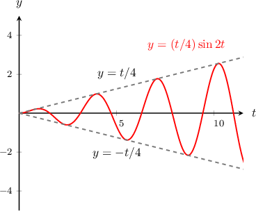
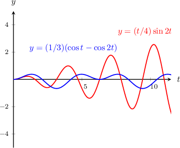

# Forced Oscillators

Source: https://www.mathacademy.com/topics/2526?courseId=154
Topic ID: 2526

## Prerequisites

- [Second-Order Inhomogeneous ODEs With Polynomial Forcing](./881-second-order-inhomogeneous-odes-with-polynomial-forcing.md)
- [Second-Order Inhomogeneous ODEs With Exponential Forcing](./882-second-order-inhomogeneous-odes-with-exponential-forcing.md)
- [Second-Order Inhomogeneous ODEs With Sinusoidal Forcing](./883-second-order-inhomogeneous-odes-with-sinusoidal-forcing.md)
- [Damped Oscillators](./2525-damped-oscillators.md)

## Lesson

### Introduction

A harmonic oscillator is said to be **forced** if it is subject to a nonzero external force $f(t)\mathbin{:}$

$$

y'' + by' + \omega^2 y = f(t)

$$

If the external force $f(t)$ is periodic and its frequency is equal to the frequency of the complementary solution, then the system experiences **resonance** and the amplitude of the oscillations increases without bound over time.

For example, consider the following differential equation which represents a harmonic oscillator subject to a forcing function $\cos(2t)\mathbin{:}$

$$

y''+4y=\cos(2t), \qquad y(0) =0, \qquad y'(0) = 0

$$

The complementary solution $y_c$ here represents simple harmonic motion,

$$

y_c=A\cos(2 t) + B\sin(2 t).

$$

The forcing function $f(t) = \cos(2t)$ has the same frequency as the complementary solution above (both have a frequency of $\Omega = 2 \, \textrm{s}^{-1}$), so the system experiences *resonance*. As a result, the particular solution

$$

y_p = \dfrac{t}{4}\sin(2t)

$$

has an amplitude that is proportional to $t,$ which means that the amplitude will increase over time.

The general solution in this case is

$$

y(t) = A\cos(2 t) + B\sin(2 t) +\dfrac{t}{4}\sin(2t),

$$

and taking into account the initial conditions, we get

$$

y(t)=\dfrac{t}{4}\sin(2t).

$$

Note that the amplitude of his function grows linearly. The graph is shown below.

**Important:** Not all forced oscillators experience resonance. In the above example, if we change the forcing function to $f(t) = \cos(t),$ resulting in the equation

$$

y''+4y=\cos(t), \qquad y(0) =0, \qquad y'(0) = 0,

$$

then the amplitude of the particular solution is constant:

$$

y_p = \dfrac{1}{3}\cos(t)

$$

There is no resonance in this case since the frequency of the external periodic force $f(t)=\cos(t)$ does not coincide with the frequency of the complementary solution, which is $\Omega = 2.$

The general solution in this case is

$$

y(t) = A\cos(2 t) + B\sin(2 t) +\dfrac{1}{3}\cos(t),

$$

and taking into account the initial conditions, we get

$$

y(t)=\dfrac{1}{3}\left(\cos(t)-\cos(2t)\right).

$$

As we can see in the graph below, the amplitude of the solution does not grow.

### Example: Identifying Equations that Represent Forced Harmonic Motion

#### Question

The function $y(t)$ gives the position of a particle at time $t > 0.$ Determine whether each equation is forced or free, and whether it is damped.

1. $y''+y'+3y = t$

2. $y''+ 4y = e^t$

3. $y''+y'+3y = 0$

#### Explanation

The differential equation

$$

y'' + b y' + \omega^2 y = f(t)

$$

is forced if $f(t)$ is not identical to zero, and damped if $b>0.$

With that in mind, let's classify each equation.

- Equation I represents forced harmonic motion with damping. The forcing function $f(t)=t$ is not always zero, and there is a damping term with $b=1>0.$

- Equation II represents forced harmonic motion without damping. The forcing function $f(t)=e^t$ is not always zero, but there is no damping term since $b=0.$

- Equation III represents free (non-forced) harmonic motion with damping. The forcing function $f(t)=0$ is always zero, and there is a damping term with $b=1>0.$

### The Equation of Motion for a Forced Spring-Mass System

Remember that, if an object of mass $m$ is attached to a spring with spring constant $k,$ and the damping coefficient is $c,$ then the equation of motion is

$$

my'' = -cy'-ky.

$$

If there is an external force $F(t),$ then the equation of motion is

$$

m y'' =-cy' -k y + F(t) .

$$

### Example: Constructing a Differential Equation Governing a Forced Harmonic Motion

#### Question

A particle of mass $3\,\textrm{kg}$ is attached to a massless spring. The spring constant associated with the spring is $k = 6\, \textrm{kg/s}^2.$ The particle is also subject to the resistive force that's proportional to the particle's velocity with a damping coefficient $c = 9\, \textrm{kg/s},$ and an external force given by $F(t)=3t^2\,\textrm{N}.$

The position of the particle is $y(t)$ (measured in meters), and $t>0$ is the time in seconds. If the particle moves with forced harmonic motion, what is the governing equation?

#### Explanation

The general equation of forced harmonic motion with damping is

$$

m y'' =-cy' -k y + F(t) .

$$

Substituting our values for $m,$ $k,$ $c$ and $F(t)$ gives

$$

3 y'' =-9y' -6 y+3t^2.

$$

Simplifying and rearranging the above equation, we get

$$

y'' + 3y'+2y = t^2.

$$

### General Solutions to Forced Harmonic Motion Equations

Given a forced harmonic motion equation *without* damping,

$$

y'' + \omega^2 y = f(t),

$$

the complementary solution can be written in three different forms:

1. $y_c = R\cos{(\omega t + \phi_1)}$

2. $y_c = R\sin{(\omega t + \phi_2)}$

3. $y_c =A\cos{\omega t} + B\sin{\omega t}$

Alternatively, given a forced harmonic motion equation *with* damping,

$$

y'' + by' + \omega^2 y = f(t),

$$

if the roots of the characteristic equation are $\lambda = p \pm \textrm{i}q,$ then the complementary solution can be written in three different forms:

1. $y_c = R e^{p t} \cos{(q t + \phi_1)}$

2. $y_c = R e^{p t} \sin{(q t + \phi_2)}$

3. $y_c =e^{p t} \left(A\cos{q t} + B\sin{q t} \right)$

### Example: Identifying Solutions to Forced Harmonic Motion Equations

#### Question

A particle is moving with forced harmonic motion with damping. The position of the particle $y(t)$ at time $t$ is governed by the equation

$$

y''+2y' + 5 y = 50t.

$$

Which of the following could be used to represent the general solution for $y(t)?$

1. $y =Ae^{-t}+Be^{-2t}+25t+5$

2. $y = R e ^ {- t} \cos \left(2t + \phi \right) +10t - 4$

3. $y =e^{-t}\left(A\cos{2t} + B\sin{2t}\right)+10 t-4$

Note that $A$ and $B$ are constants.

#### Explanation

The general solution is the sum of the complementary solution and the particular solution:

$$

y(t) = y_c(t)+y_p(t)

$$

First, we find the complementary solution $y_c(t),$ which is the solution to the homogeneous equation $y''+2y' + 5 y = 0.$ Writing down and solving the characteristic equation gives

$$

\begin{aligned}𝜆^{2}+2𝜆+5 & =0 \\ (𝜆^{2}+2𝜆+1)−1+5 & =0 \\ (𝜆+1)^{2}+4 & =0 \\ (𝜆+1)^{2} & =−4 \\ 𝜆+1 & =±2i \\ 𝜆 & =−1±2i.\end{aligned}

$$

Therefore the complementary function $y_c(t)$ is can be expressed in any of the following forms:

$$

\begin{aligned}𝑦_{𝑐}(𝑡) & =𝑒^{−𝑡}(𝐴cos⁡2𝑡+𝐵sin⁡2𝑡), \\ 𝑦_{𝑐}(𝑡) & =𝑅𝑒^{−𝑡}cos⁡(2𝑡+𝜙), \\ 𝑦_{𝑐}(𝑡) & =𝑅𝑒^{−𝑡}sin⁡(2𝑡+𝜙).\end{aligned}

$$

Next, we find the particular solution $y_p(t).$ Note that the external force $f(t)=50t$ is a linear function. Therefore, we assume that the particular solution is also a linear function,

$$

y_p(t)=\alpha t+\beta.

$$

By substituting the particular solution into the differential equation and equating coefficients, we find that $\alpha = 10$ and $\beta = -4.$ So, the particular solution is

$$

y_p(t)= 10 t - 4.

$$

Finally, then, the general solution is given by the sum of the complementary and particular solutions. So, it can be written in any of the following forms:

$$

\begin{aligned}𝑦(𝑡) & =𝑒^{−𝑡}(𝐴cos⁡2𝑡+𝐵sin⁡2𝑡)+10𝑡−4, \\ 𝑦(𝑡) & =𝑅𝑒^{−𝑡}cos⁡(2𝑡+𝜙)+10𝑡−4, \\ 𝑦(𝑡) & =𝑅𝑒^{−𝑡}sin⁡(2𝑡+𝜙)+10𝑡−4.\end{aligned}

$$

Only II and III match the forms above. Therefore, the correct answer is "II and III only".

### Example: Calculating the Position of a Particle Oscillating With Forced Harmonic Motion at a Moment

#### Question

The position $y(t),$ measured in meters, of a particle oscillating with forced harmonic motion without damping is governed by the equation

$$

y'' + y =2e^{-t},

$$

where $t > 0$ is the time, in seconds. Given that the particle is initially at the origin with zero velocity, find the position of the particle after $\pi$ seconds.

#### Explanation

This is an initial value problem. Since the particle is initially at the origin with zero velocity, the initial conditions are $y(0)=0$ and $y'(0)=0.$ So, we want to solve the initial value problem

$$

y'' + y =2e^{-t}, \quad y(0)=0, \quad y'(0)=0.

$$

First, we find the general solution of the differential equation. The complementary solution $y_c(t)$ represents simple harmonic motion and can be written as

$$

y_c=A\cos{\omega t} + B\sin{\omega t}.

$$

In our case,

$$

\omega^2 = 1\qquad\Longrightarrow\qquad \omega = 1,

$$

so we have

$$

y_c=A\cos{t} + B\sin{t}.

$$

Next, we find the particular solution $y_p(t).$ Note that the external force $f(t) = 2e^{-t}$ is an exponential function, and the constant factor in the exponent $(-1)$ is not a root of the auxiliary equation. Therefore, we assume a particular exponential solution of the form

$$

y_p = \alpha e^{-t},

$$

where $\alpha$ is a constant to be determined.

Substituting $y_p$ into the differential equation and equating coefficients gives $\alpha=1.$ Therefore, the particular solution $y_p(t)$ is

$$

y_p(t) =e^{-t},

$$

and the general solution is

$$

y=A\cos{t} + B\sin{t} + e^{-t}.

$$

Finally, we find the constants $A$ and $B$ using the initial conditions. Substituting $y(0)=0$ gives $A=-1,$ and differentiating $y$ and substituting $y'(0)=0$ gives $B=1.$

So, our solution is

$$

y(t)=-\cos t + \sin{t} +e^{-t}.

$$

To find the position of the particle after $\pi$ seconds, we substitute into the equation $t=\pi$ and get

$$

\begin{aligned}𝑦(𝜋) & =−cos⁡𝜋+sin⁡𝜋+𝑒^{−𝜋} \\ & =(1+𝑒^{−𝜋})\,m.\end{aligned}

$$
