# Nonlinear Transformations of Plane Regions

Source: https://www.mathacademy.com/topics/2832?courseId=154
Topic ID: 2832

## Prerequisites

- [The Parametric Equations of a Line](./1920-the-parametric-equations-of-a-line.md)
- [Parametric Equations of Parabolas Centered at (h,k)](../integrated-math-iii-honors/2837-parametric-equations-of-parabolas-centered-at-h-k.md)
- [The Inverse Function Theorem](./4149-the-inverse-function-theorem.md)

## Lesson

### Introduction

In this lesson, we'll learn how to find the images of simple objects in the plane under the action of nonlinear transformations.

Consider the square region and its boundary in the -plane, where is given by

A sketch of this region, specified with a counterclockwise orientation, is shown below.

Since is specified with an orientation, we refer to it as a **directed boundary.**

Now, consider the transformation defined by

where

Our task is to find the image of under the action of

First, note the following:

- It's easy to check that has no critical points in the *interior* of (we'll discuss why this matters shortly).

- Since 's interior contains no critical points, we only need to find the image of its boundary

- To find the image of we parametrize each *directed* edge and map them individually onto the -plane.

Let's now map each directed edge of to the -plane:

- Consider the image of the side where we have and Substituting into our transformation equations, we obtain So, the image of can be parametrized by Writing these parametric equations in the usual notation, we have These are parametric equations of a line segment. Moreover, the endpoints of are mapped to the -plane as follows: Therefore, the image of is a line segment traversed from the point to

- Consider the image of the side Here, we have and Substituting into our transformation equations, we obtain This horizontal line segment is traversed from the point to the point in the -plane.

- Consider the image of the side Here, we have and (we write the inequality for in this way to show that is traversed *from* the point where *to* the point where). Substituting into our transformation equations, we obtain So, the image of can be parametrized by Writing these in the usual notation, we have These are parametric equations of a parabolic arc. Notice that if we eliminate from the equation, we get which is a right-opening parabola whose vertex is at Moreover, the endpoints of are mapped to the -plane as follows: Therefore, the image of is an arc of a right-opening parabola, traversed from the point to

- Consider the image of the side Here, we have and Substituting into our transformation equations, we obtain This is a horizontal line segment traversed from the point to the point in the -plane.

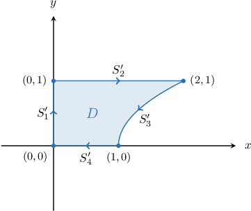

And that's it! We have successfully computed the image of in the -plane.

It's highly recommended that you redo this calculation yourself. Make sure you can construct the image of including its orientation (note that the image of is traversed *clockwise*).

### Example: Finding Part of an Image

#### Question

Consider the square region $\Delta$ in the $uv$-plane, given by

$$

\Delta = \big\{ (u,v) \: : \: 0 \leq u \leq 1, \: 0\leq v \leq 1 \big\},

$$

and the transformation $\mathbf T,$ given by

$$

\mathbf{T}:(u,v) \to (x(u,v),y(u,v)),

$$

where

$$

x = u - v^2, \qquad y = 2v.

$$

The image of the side $S_4$ under the action of $\mathbf T$ is given by

$$

x = \boxed{x(t)}, \qquad y=2t, \qquad 1 \geq t \geq 0.

$$

Find the function $x(t).$

#### Explanation

To map the entire region $\Delta$ onto the $xy$-plane, we consider the transformation of each side. However, in this case, we consider only the side $S_4.$

For the side $S_4,$ we have $u = 0$ and $1 \geq v \geq 0.$ Substituting $u = 0$ into our transformation equations, we obtain

$$

\begin{aligned}(𝑥,𝑦) & =𝐓(𝑢,𝑣) \\ & =(𝑢−𝑣^{2},\,2𝑣) \\ & =(0−𝑣^{2},\,2𝑣) \\ & =(−𝑣^{2},\,2𝑣).\end{aligned}

$$

So, the image of $S_4$ can be parametrized by

$$

x = -v^2, \qquad y=2v, \qquad 1 \geq v \geq 0.

$$

Writing this in the usual notation, we have

$$

x(t) = \boxed{\color{blue}-t^2}, \qquad y(t)=2t, \qquad 1 \geq t \geq 0.

$$

### Example: Cases When a Square’s Side Is Mapped to a Segment

#### Question

Consider the square region $\Delta$ and its **** boundary $\partial\Delta$ in the $uv$-plane, where $\Delta$ is given by

$$

\Delta = \big\{ (u,v) \: : \: 0 \leq u \leq 1, \: 0\leq v \leq 1 \big\},

$$

and the transformation $\mathbf T,$ given by

$$

\mathbf{T}:(u,v) \to (x(u,v),y(u,v)),

$$

where

$$

x = 2u-3v, \qquad y=v^2-3u.

$$

The image of the side $S_3$ under the action of $\mathbf{T}$ is a **** line segment. Find the endpoints of this segment, stated in the order that they are traversed.

#### Explanation

To map the entire region $\Delta$ onto the $xy$-plane, we consider the transformation of each side. However, in this case, we consider only the side $S_3.$

For the side $S_3,$ we have $v=1$ and $1 \geq u \geq 0.$ Substituting $v = 1$ into our transformation equations, we obtain

$$

\begin{aligned}(𝑥,𝑦) & =𝐓(𝑢,𝑣) \\ & =(2𝑢−3𝑣,\,𝑣^{2}−3𝑢) \\ & =(2𝑢−3(1),\,1^{2}−3𝑢) \\ & =(2𝑢−3,1−3𝑢).\end{aligned}

$$

So, the image of $S_3$ can be parametrized by

$$

x=2u-3, \qquad y=1-3u, \qquad 1 \geq u \geq 0.

$$

Writing this in the usual notation, we have

$$

x(t) = 2t-3, \qquad y(t) = 1-3t, \qquad 1 \geq t \geq 0.

$$

This is a line segment with endpoints $(-1,-2)$ and $(-3,1)$ in the $xy$-plane.

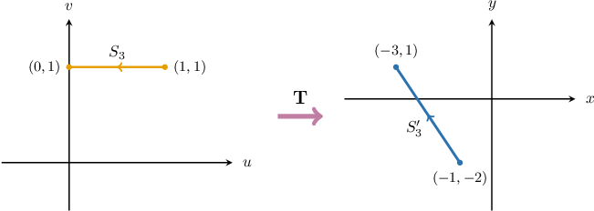

### Example: Cases When a Square’s Side Is Mapped to a Parabola

#### Question

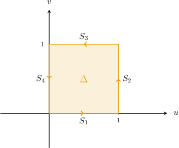

Consider the square region $\Delta$ in the $uv$-plane, given by

$$

\Delta = \big\{ (u,v) \: : \: 0 \leq u \leq 1, \: 0\leq v \leq 1 \big\},

$$

and the transformation $\mathbf T,$ given by

$$

\mathbf{T}:(u,v) \to (x(u,v),y(u,v)),

$$

where

$$

x = ( u + v)^2, \qquad y = \dfrac{u}{v+1}.

$$

Which of the following is the image of the side $S_1$ under the action of $\mathbf{T}?$

#### Explanation

To map the entire region $\Delta$ onto the $xy$-plane, we consider the transformation of each side. However, in this case, we consider only the side $S_1.$

For the side $S_1,$ we have $v = 0$ and $0 \leq u \leq 1.$ Substituting $v = 0$ into our transformation equations, we obtain

$$

\begin{aligned}(𝑥,𝑦) & =𝐓(𝑢,𝑣) \\ & =((𝑢+𝑣)^{2},\,\frac{𝑢}{𝑣+1}) \\ & =((𝑢+0)^{2},\,\frac{𝑢}{0+1}) \\ & =(𝑢^{2},\,𝑢).\end{aligned}

$$

So, the image of $S_1$ can be parametrized by

$$

x = u^2, \qquad y = u, \qquad 0 \leq u \leq 1.

$$

Writing this in the usual notation, we have

$$

x(t) = t^2, \qquad y(t) = t, \qquad 0 \leq t \leq 1.

$$

These are parametric equations of a parabolic arc. Notice that if we eliminate $t$ from the equations, we get

$$

y^2=x

$$

which is a right-opening parabola whose vertex is at $(0,0).$

Moreover, the endpoints of $S_1$ are mapped to the $xy$-plane as follows:

$$

\begin{aligned} & 𝐓:(0,0)→((0+0)^{2},\,\frac{0}{0+1})=(0,0) \\ & 𝐓:(1,0)→((1+0)^{2},\,\frac{1}{0+1})=(1,1)\end{aligned}

$$

Therefore, the image of $S_1$ is an arc of a right-opening parabola, traversed from $(0,0)$ to $(1,1).$

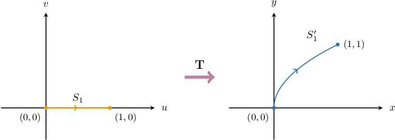

### The Significance of Critical Points

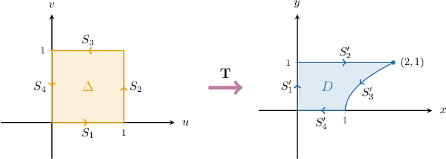

Earlier, we found that the transformation $\mathbf T,$ given by

$$

\mathbf{T}:(u,v) \to \big( v(u^2+1), \: u \big) = \big( u^2v+v, \: u \big) ,

$$

maps the square region $\Delta$ in the $uv$-plane to the region $D$ in the $xy$-plane shown above.

We deduced the image of $\Delta$ by mapping each edge of its boundary. For this method to work, we need to check that $\mathbf T$ has no critical points in the *interior* of $\Delta.$

To check for critical points, we start by computing the Jacobian:

$$

\begin{aligned}\frac{𝜕(𝑥,𝑦)}{𝜕(𝑢,𝑣)} & =\begin{aligned}\frac{𝜕𝑥}{𝜕𝑢} & \frac{𝜕𝑥}{𝜕𝑣} \\ \frac{𝜕𝑦}{𝜕𝑢} & \frac{𝜕𝑦}{𝜕𝑣}\end{aligned}\end{aligned}

$$

For the partial derivatives of $x(u,v),$ we have

$$

\dfrac{\partial x}{\partial u} = \dfrac{\partial }{\partial u}(u^2v+v) = 2uv, \qquad \dfrac{\partial x}{\partial v} = \dfrac{\partial }{\partial v}(u^2v+v) = u^2+1,

$$

and for the partial derivatives of $y(u,v),$ we have

$$

\dfrac{\partial y}{\partial u} = \dfrac{\partial }{\partial u}(u) = 1, \qquad \dfrac{\partial y}{\partial v} = \dfrac{\partial }{\partial v}(u) = 0.

$$

Substituting our partial derivatives into our expression for the Jacobian, we get

$$

\begin{aligned}\frac{𝜕(𝑥,𝑦)}{𝜕(𝑢,𝑣)} & =\begin{aligned}2𝑢𝑣 & 𝑢^{2}+1 \\ 1 & 0\end{aligned} \\ & =−(1+𝑢^{2}).\end{aligned}

$$

Now, note the following:

- The Jacobian is negative everywhere in the $(u,v)$ plane. So, $\mathbf T$ has no critical points inside $\Delta.$

- Since the Jacobian is negative everywhere, the transformation $\mathbf T$ is orientation-reversing everywhere (note, for example, that $\Delta$ and $D$ have opposite orientation).

To apply this method, we require that $\mathbf T$ has no critical points in the *interior* of $\Delta.$ This method works even if the *boundary* of $\Delta$ contains critical points. Let's explore this a little more.

### Critical Points on the Boundary of the Domain

Let's again consider our square region $\Delta{:}$

$$

\Delta = \big\{ (u,v) \: : \: 0 \leq u \leq 1, \: 0\leq v \leq 1 \big\}.

$$

Now consider the transformation $\mathbf T,$ given by

$$

\mathbf{T}:(u,v) \to \big( uv, \: u^2+uv) \big).

$$

The Jacobian matrix determinant of $\mathbf{T}$ is

$$

\begin{aligned}\frac{𝜕(𝑥,𝑦)}{𝜕(𝑢,𝑣)} & =\begin{aligned}\frac{𝜕𝑥}{𝜕𝑢} & \frac{𝜕𝑥}{𝜕𝑣} \\ \frac{𝜕𝑦}{𝜕𝑢} & \frac{𝜕𝑦}{𝜕𝑣}\end{aligned} \\ & =\begin{aligned}𝑣 & 𝑢 \\ 2𝑢+𝑣 & 𝑢\end{aligned} \\ & =−2𝑢^{2}\end{aligned}

$$

Setting the Jacobian equal to zero, we get

$$

-2u^2 = 0\quad\Longrightarrow\quad u = 0.

$$

Therefore, the critical points of $\mathbf{T}$ lie on the line $u = 0.$ This coincides with the side $S_4$ of our square.

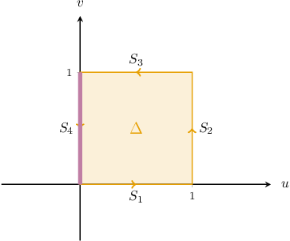

Now, since there are no critical points in the interior of $\Delta,$ we can find its image in the usual way. However, the side $S_4$ may collapse to a single point. So, let's go ahead and finish this example.

### Example: Finding the Image of a Square

#### Question

Consider the square region $\Delta$ in the $uv$-plane, given by

$$

\Delta = \big\{ (u,v) \: : \: 0 \leq u \leq 1, \: 0\leq v \leq 1 \big\}

$$

and the transformation $\mathbf T,$ given by

$$

\mathbf{T}:(u,v) \to (x(u,v),y(u,v)),

$$

where

$$

x = uv, \qquad y = u(u+v).

$$

Find the image of $\Delta$ under the action of $\mathbf{T}.$

#### Explanation

We know that $\mathbf T$ has no critical points in the interior of $\Delta.$ So, to map the entire region $\Delta$ onto the $xy$-plane, we transform each side of $\Delta$ separately:

- Consider the image of the side $S_1,$ where we have $v = 0$ and $0 \leq u \leq 1.$ Substituting $v = 0$ into our transformation equations, we obtain This is a vertical line segment traversed from the point $(0,0)$ to the point $(0,1)$ in the $xy$-plane.

- Consider the image of the side $S_2.$ Here, we have $u = 1$ and $0 \leq v \leq 1.$ Substituting $u = 1$ into our transformation equations, we obtain This is a line segment traversed from the point $(0,1)$ to the point $(1,2)$ in the $xy$-plane.

- Consider the image of the side $S_3.$ Here, we have $v = 1$ and $1 \geq u \geq 0.$ Substituting $v = 1$ into our transformation equations, we obtain This is an upward-opening parabola traversed from the point $(1,2)$ to the point $(0,0)$ in the $xy$-plane.

- Consider the image of the side $S_4.$ Here, we have $u = 0$ and $1 \geq v \geq 0.$ Substituting $u = 0$ into our transformation equations, we obtain This is the point $(0,0)$ in the $xy$-plane.

Drawing the images of the sides of our square, we obtain the following image of $\Delta{:}$

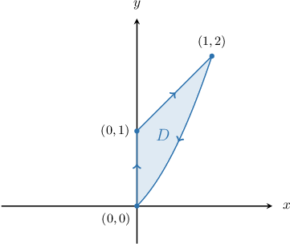

### Critical Points Inside the Domain

Until now, we've specified that our transformation $\mathbf T$ should not contain critical points in the interior of the preimage $\Delta.$ So let's briefly discuss what to do when $\Delta$ contains critical points.

Once again, let's consider the region

$$

\Delta = \big\{ (u,v) \: : \: 0 \leq u \leq 1, \: 0\leq v \leq 1 \big\}

$$

in the $uv$-plane, shown below.

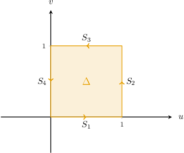

We now consider the image of $\Delta$ under the action of $\mathbf T,$ given by

$$

\mathbf{T}:(u,v) \to \big( uv, \: u^2+v^2 \big).

$$

Let's start by finding the critical points. First, we compute the Jacobian:

$$

\begin{aligned}\frac{𝜕(𝑥,𝑦)}{𝜕(𝑢,𝑣)} & =\begin{aligned}\frac{𝜕𝑥}{𝜕𝑢} & \frac{𝜕𝑥}{𝜕𝑣} \\ \frac{𝜕𝑦}{𝜕𝑢} & \frac{𝜕𝑦}{𝜕𝑣}\end{aligned} \\ & =\begin{aligned}𝑣 & 𝑢 \\ 2𝑢 & 2𝑣\end{aligned} \\ & =2𝑣^{2}−2𝑢^{2} \\ & =2(𝑣+𝑢)(𝑣−𝑢).\end{aligned}

$$

The critical points correspond to the solutions of

$$

\dfrac{\partial (x,y)}{\partial (u,v)} = 0.

$$

Therefore, the critical points are given by

$$

2(v+u)(v-u) = 0\quad\Longrightarrow\quad u=\pm v.

$$

Therefore, the critical points of $\mathbf T$ that lie *inside* $\Delta$ are located on the line $u = v.$

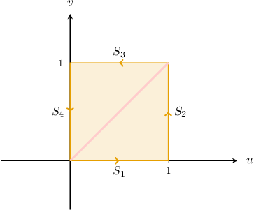

To find the image of $\Delta$ in this case, we divide $\Delta$ into two regions $\Delta_1$ and $\Delta_2$ along the critical line (as shown below) and compute their images separately.

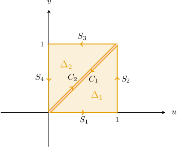

Let's compute the images of these two regions:

- Computing the image of $\Delta_1$'s boundary, we find that $\mathbf{T}(S_1)$ is a vertical line segment traversed from $(0,0)$ to $(0,1),$ $\mathbf{T}(S_2)$ is an upward-opening parabola traversed from $(0,1)$ to $(1,2),$ and $\mathbf{T}(C_1)$ is a line segment traversed from $(1,2)$ to $(0,0).$

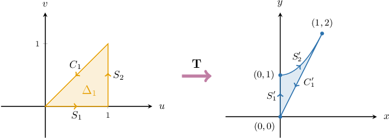

- Similarly, computing the image of $\Delta_2$'s boundary, we find that $\mathbf{T}(C_2),$ a line segment traversed from $(0,0)$ to $(1,2),$ $\mathbf{T}(S_3),$ an upward-opening parabola traversed from $(1,2)$ to $(0,1),$ and $\mathbf{T}(S_4),$ a vertical line segment traversed from $(0,1)$ to $(0,0).$

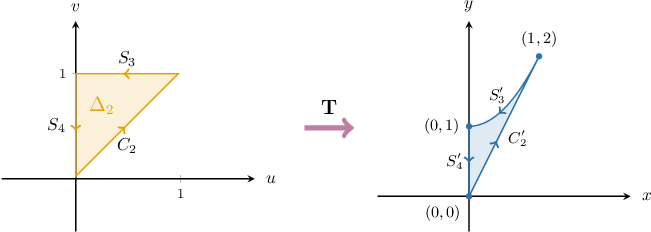

Superimposing the two results, we obtain the following image of $\Delta{:}$

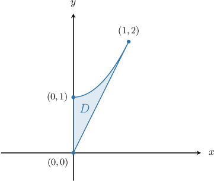

Note that:

- As $(u,v)$ runs over $\Delta$ once, its image $D$ is traced out twice.

- The boundary of $D$ that runs from $(0,0)$ to $(1,2)$ is the image of the critical line $u=v,$ which is *not* a bounding curve of our original region $\Delta.$

### The Jacobian as a Local Area Scale Factor

We'll now justify why the Jacobian determinant gives the (local) area scale factor of a transformation.

Consider a rectangular region $\Delta$ in the $uv$-plane of length $\delta u,$ width $\delta v,$ whose bottom-left corner is at the point $(u_0,v_0),$ as shown below.

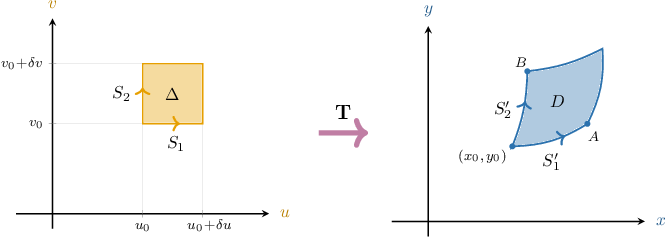

Furthermore, we assume the following:

- $\mathbf T: \mathbb R^2\rightarrow \mathbb R^2$ is a $C^1$ transformation throughout $\Delta,$ and contains no critical points.

- The image of $\Delta$ under the action of $\mathbf T$ is the region $D.$

- The image of $(u_0,v_0)$ is $(x_0,y_0).$

- The image of $S_1$ is $S_1',$ and its endpoints are $(x_0,y_0)$ and $A.$

- The image of $S_2$ is $S_2',$ and its endpoints are $(x_0,y_0)$ and $B.$

Since $S_1'$ is the image of $S_1,$ it can be parametrized by varying $u$ only. Similarly, since $S_2'$ is the image of $S_2,$ it can be parametrized by varying $v$ only. So, the position vectors of $A$ and $B,$ respectively, are given by

$$

[\begin{aligned}𝑥\,(𝑢_{0}+𝛿𝑢,𝑣_{0}) \\ 𝑦\,(𝑢_{0}+𝛿𝑢,𝑣_{0})\end{aligned}]

$$

Now, since $\delta u$ is small, $S_1'$ can be approximated by a line segment. Similarly, since $\delta v$ is small, $S_2'$ can also be approximated by a line segment. Let's construct two vectors $\mathbf{s}_1$ and $\mathbf{s}_2$ that span our two segments, as shown below.

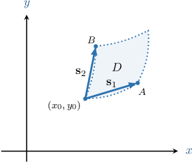

We can find the vector $\mathbf s_1$ by subtracting the position vectors of its endpoints:

$$

\begin{aligned}𝐬_{1}=𝐚−[\begin{aligned}𝑥_{0} \\ 𝑦_{0}\end{aligned}] & =[\begin{aligned}𝑥\,(𝑢_{0}+𝛿𝑢,𝑣_{0}) \\ 𝑦\,(𝑢_{0}+𝛿𝑢,𝑣_{0})\end{aligned}]−[\begin{aligned}𝑥\,(𝑢_{0},𝑣_{0}) \\ 𝑦\,(𝑢_{0},𝑣_{0})\end{aligned}] \\ & =[\begin{aligned}𝑥\,(𝑢_{0}+𝛿𝑢,𝑣_{0})−𝑥\,(𝑢_{0},𝑣_{0}) \\ 𝑦\,(𝑢_{0}+𝛿𝑢,𝑣_{0})−𝑦\,(𝑢_{0},𝑣_{0})\end{aligned}].\end{aligned}

$$

Now, recall that when $\delta u$ is small, we have

$$

\begin{aligned}\frac{𝜕𝑥}{𝜕𝑢}_{(𝑢_{0},𝑣_{0})} & ≈\frac{𝑥\,(𝑢_{0}+𝛿𝑢,𝑣_{0})−𝑥\,(𝑢_{0},𝑣_{0})}{𝛿𝑢} \\ \frac{𝜕𝑦}{𝜕𝑢}_{(𝑢_{0},𝑣_{0})} & ≈\frac{𝑦\,(𝑢_{0}+𝛿𝑢,𝑣_{0})−𝑦\,(𝑢_{0},𝑣_{0})}{𝛿𝑢}.\end{aligned}

$$

Therefore, the vector $\mathbf s_1$ can be approximated as follows:

$$

\begin{aligned}\frac{𝜕𝑥}{𝜕𝑢} \\ \frac{𝜕𝑦}{𝜕𝑢}\end{aligned}

$$

Using similar arguments, we have the following approximation for $\mathbf s_2{:}$

$$

\begin{aligned}\frac{𝜕𝑥}{𝜕𝑣} \\ \frac{𝜕𝑦}{𝜕𝑣}\end{aligned}

$$

The area of $D$ is approximately equal to the area of the parallelogram spanned by $\mathbf s_1$ and $\mathbf s_2.$ Therefore,

$$

\begin{aligned}\,\,| & |\,\, \\ \,\,𝐬_{1} & 𝐬_{2}\,\, \\ \,\,| & |\,\,\end{aligned}

$$

Substituting our approximations for $\mathbf s_1$ and $\mathbf s_2,$ we arrive at the desired result:

$$

\begin{aligned}Area(𝐷) & ≈det\begin{aligned}\,\,𝛿𝑢⋅\frac{𝜕𝑥}{𝜕𝑢} & \,\,𝛿𝑣⋅\frac{𝜕𝑥}{𝜕𝑣}\,\, \\ \,\,𝛿𝑢⋅\frac{𝜕𝑦}{𝜕𝑢} & 𝛿𝑣⋅\frac{𝜕𝑦}{𝜕𝑣}\,\,\end{aligned}_{(𝑢_{0},𝑣_{0})} \\ & =𝛿𝑢𝛿𝑣⋅(\frac{𝜕𝑥}{𝜕𝑢}\frac{𝜕𝑦}{𝜕𝑣}−\frac{𝜕𝑥}{𝜕𝑣}\frac{𝜕𝑦}{𝜕𝑢})_{(𝑢_{0},𝑣_{0})} \\ & =𝛿𝑢𝛿𝑣⋅\frac{𝜕(𝑥,𝑦)}{𝜕(𝑢,𝑣)}_{(𝑢_{0},𝑣_{0})}\end{aligned}

$$
