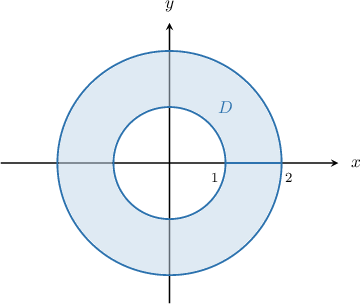
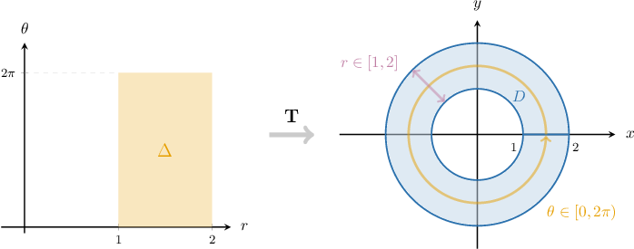
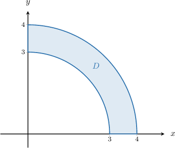
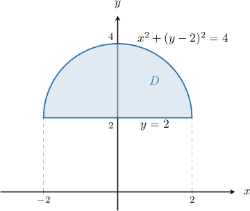
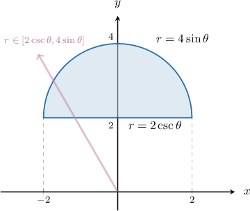
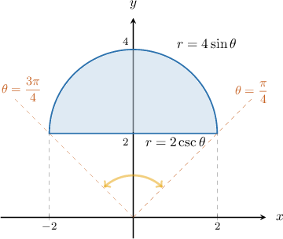
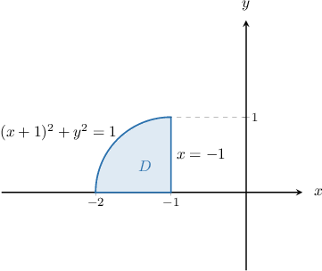
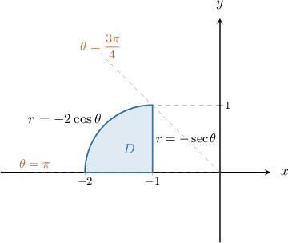
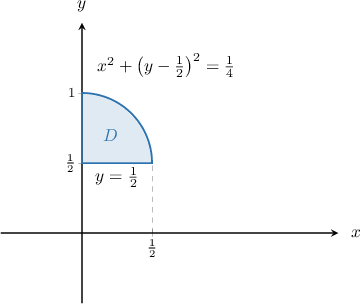
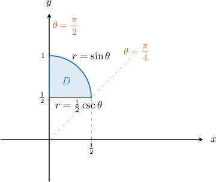

# Double Integrals Between Polar Curves

Source: https://www.mathacademy.com/topics/2835?courseId=154
Topic ID: 2835

## Prerequisites

- [Double Integrals in Plane Polar Coordinates](./2030-double-integrals-in-plane-polar-coordinates.md)

## Lesson

### Introduction

Suppose we want to compute the double integral

$$

\displaystyle \iint\limits_{D}{{\sqrt{x^2 + y^2}\,\mathrm d A}},

$$

where $D$ is a washer enclosed between two circles centered at $(0,0)$ with radii $1$ and $2,$ respectively, as shown below.

The easiest way to solve this problem is to convert it to polar coordinates. Let's define a transformation $\mathbf T$ as

$$

x=r\cos\theta, \qquad y = r\sin\theta.

$$

The preimage of $D$ under the action of $\mathbf T$ is the rectangular region $\Delta,$ given by

$$

\Delta = \big\{ (r,\theta) \: : \: 1 \leq r \leq 2, \: 0 \leq \theta \leq 2\pi \big\}.

$$

The region $D$ and its preimage $\Delta$ are shown below.

The change of variables formula for polar coordinates states

$$

\iint\limits_{D} f(x,y) \ \mathrm d A = \iint\limits_{\Delta} \ f(r\cos\theta, r\sin\theta) \: r \ \mathrm d r \mathrm d \theta.

$$

Therefore, using the change of variables formula, we obtain

$$

\begin{aligned}\underset{𝐷}{∬}\sqrt{√𝑥^{2}+𝑦^{2}}\,d𝐴 & =\underset{Δ}{∬}\sqrt{√(𝑟cos⁡𝜃)^{2}+(𝑟sin⁡𝜃)^{2}}\,𝑟\,d𝑟\,d𝜃 \\ & =∫_{2𝜋0}^{}∫_{21}^{}\sqrt{√𝑟^{2}(cos^{2}⁡𝜃+sin^{2}⁡𝜃)}\,𝑟\,d𝑟\,d𝜃 \\ & =∫_{2𝜋0}^{}∫_{21}^{}\sqrt{√𝑟^{2}}⋅𝑟\,d𝑟\,d𝜃 \\ & =∫_{2𝜋0}^{}∫_{21}^{}𝑟^{2}\,d𝑟\,d𝜃.\end{aligned}

$$

Evaluating this integral, we get

$$

\begin{aligned}∫_{2𝜋0}^{}∫_{21}^{}𝑟^{2}\,d𝑟\,d𝜃 & =∫_{2𝜋0}^{}d𝜃∫_{20}^{}𝑟^{2}\,d𝑟 \\ & =2𝜋∫_{21}^{}𝑟^{2}\,d𝑟 \\ & =2𝜋⋅[\frac{1}{3}𝑟^{3}]_{21}^{} \\ & =\frac{2}{3}𝜋⋅[2^{3}−1^{3}] \\ & =\frac{2}{3}𝜋⋅7 \\ & =\frac{14𝜋}{3}.\end{aligned}

$$

Therefore, we conclude that

$$

\iint\limits_{D}{{\sqrt{x^2 + y^2}\,\mathrm d A}} = \dfrac{14\pi}{3}.

$$

### Example: Converting an Integral Over an Annular Region to Polar Coordinates

#### Question

The region $D$ in the first quadrant is enclosed between the quarter-circles of radii $3$ and $4,$ as shown above. What is $\displaystyle \iint\limits_D \dfrac{1}{x^2+y^2} \: \textrm{d}A$ expressed in polar coordinates?

#### Explanation

We will use the change of variables formula in the form

$$

\iint\limits_{D} f(x,y) \ \mathrm d A = \iint\limits_{\Delta} \ f(r\cos\theta, r\sin\theta) \: r \ \mathrm d r \mathrm d \theta.

$$

The region $D$ represents a portion of the washer enclosed between the circles of radii $3$ and $4$ centered at the origin. In polar coordinates $(r, \theta),$ the region can be expressed as

$$

\Delta = \Big\{ (r,\theta) \: : \: 3 \leq r \leq 4, \: 0 \leq \theta \leq \dfrac{\pi}{2} \Big\}.

$$

Therefore, using the change of variables formula, we obtain

$$

\begin{aligned}\underset{𝐷}{∬}\frac{1}{𝑥^{2}+𝑦^{2}}\,d𝐴 & =\underset{Δ}{∬}\frac{1}{(𝑟sin⁡𝜃)^{2}+(𝑟cos⁡𝜃)^{2}}\,𝑟\,d𝑟d𝜃 \\ & =∫_{𝜋/20}^{}∫_{43}^{}\frac{𝑟}{𝑟^{2}(sin^{2}⁡𝜃+cos^{2}⁡𝜃)}\,d𝑟\,d𝜃 \\ & =∫_{𝜋/20}^{}∫_{43}^{}\frac{1}{𝑟}\,d𝑟\,d𝜃.\end{aligned}

$$

### Writing More Complex Regions in Polar Coordinates

Let's get some more practice at expressing regions in polar coordinates.

Consider the region enclosed by the curve $x^2+(y-2)^2=4$ and the line $y=2,$ as shown below.

This region represents a portion of the disk of radius $2$ centered at $(0,2).$

First, we recall the usual transformations from polar to Cartesian coordinates:

$$

\begin{aligned}𝑥=𝑟cos⁡𝜃 \\ 𝑦=𝑟sin⁡𝜃\end{aligned}

$$

Let's now use the above formulas to write the functions that bound our region in polar coordinates:

- For $x^2+(y-2)^2 = 4,$ we obtain Since $r$ cannot be identical to zero on the entire semicircle, we must have $r = 4\sin\theta.$

- For $y=2,$ we get

Now, let's determine the limits for $r$ and $\theta.$

First of all, note that if we draw an arrow through the region from the origin, it enters the region via the curve $r=2\csc\theta$ and exits via $r=4\sin\theta \mathbin{:}$

Secondly, our curves intersect at the points $(-2,2)$ and $(2,2).$ So, the entire region $D$ lies between the polar lines $\theta=\dfrac{\pi}{4}$ and $\theta=\dfrac{3\pi}{4},$ as depicted below.

Therefore, in polar coordinates $(r, \theta),$ the region can be expressed as follows:

$$

\Delta = \Big\{ (r,\theta) \: : \: 2\csc\theta \leq r \leq 4\sin\theta, \: \dfrac{\pi}{4} \leq \theta \leq \dfrac{3\pi}{4} \Big\}

$$

### Example: Converting an Integral Over a Region Enclosed Between Two Curves to Polar Coordinates

#### Question

The region $D$ is enclosed between the curve $(x+1)^2+y^2=1$ and the line $x=-1,$ as shown above. Express the following double integral in polar coordinates:

$$

\displaystyle \iint\limits_D xy \: \textrm{d}A

$$

#### Explanation

We need to change the coordinate system from Cartesian coordinates to polar coordinates. To do this, we will use the change of variables formula in the form

$$

\iint\limits_{D} f(x,y) \ \mathrm d A = \iint\limits_{\Delta} \ f(r\cos\theta, r\sin\theta) \: r \ \mathrm d r \mathrm d \theta.

$$

Notice that the region $D$ represents a portion of the disk of radius $1$ centered at $(-1,0).$

Cartesian and polar coordinates are connected by the following equations:

$$

\begin{aligned}𝑥=𝑟cos⁡𝜃 \\ 𝑦=𝑟sin⁡𝜃\end{aligned}

$$

With that in mind, let's write our curves in polar coordinates.

- For $(x+1)^2+y^2=1,$ we obtain Since $r$ cannot be identical to zero on the entire semicircle, we must have $r = -2\cos\theta.$

- For $x=-1,$ we get

Now, let's find the limits for the parameter $\theta.$ Our curves intersect at the point $(-1,1).$ So, the entire region $D$ lies between the polar lines $\theta=\dfrac{3\pi}{4}$ and $\theta=\pi,$ as depicted below.

As a result, the region can be expressed in polar coordinates $(r, \theta)$ as

$$

\Delta = \Big\{ (r,\theta) \: : \: -\sec\theta \leq r \leq -2\cos\theta, \: \dfrac{3\pi}{4} \leq \theta \leq {\pi} \Big\}.

$$

Therefore, using the change of variables formula, we obtain

$$

\begin{aligned}\underset{𝐷}{∬}𝑥𝑦\,d𝐴 & =\underset{Δ}{∬}(𝑟cos⁡𝜃⋅𝑟sin⁡𝜃)\,𝑟\,d𝑟d𝜃 \\ & =∫_{𝜋3𝜋/4}^{}∫_{−2cos⁡𝜃−sec⁡𝜃}^{}𝑟^{3}cos⁡𝜃\,sin⁡𝜃\,d𝑟\,d𝜃 \\ & =∫_{𝜋3𝜋/4}^{}cos⁡𝜃\,sin⁡𝜃∫_{−2cos⁡𝜃−sec⁡𝜃}^{}𝑟^{3}\,d𝑟\,d𝜃.\end{aligned}

$$

### Example: Evaluating a Double Integral Over a Region Enclosed Between Two Curves

#### Question

Evaluate the double integral $\displaystyle \iint\limits_D \dfrac{2y}{x^2+y^2} \: \textrm{d}A,$ where the region $D$ is shown above.

#### Explanation

We need to change the coordinate system from Cartesian coordinates to polar coordinates. To do this, we will use the change of variables formula in the form

$$

\iint\limits_{D} f(x,y) \ \mathrm d A = \iint\limits_{\Delta} \ f(r\cos\theta, r\sin\theta) \: r \ \mathrm d r \mathrm d \theta.

$$

Notice that the region $D$ represents a portion of the disk of radius $\dfrac{1}{2}$ centered at $\left(0,\dfrac{1}{2}\right)\!.$

Cartesian and polar coordinates are connected by the following equations:

$$

\begin{aligned}𝑥=𝑟cos⁡𝜃 \\ 𝑦=𝑟sin⁡𝜃\end{aligned}

$$

With that in mind, let's write our curves in polar coordinates.

- For $x^2+\left(y-\dfrac{1}{2} \right)^2=\dfrac14,$ we obtain Since $r$ cannot be identical to zero on the entire semicircle, we must have $r = \sin\theta.$

- For $y=\dfrac{1}{2},$ we get

Now, let's find the limits for the parameter $\theta.$ Our curves intersect at the point $\left(\dfrac{1}{2},\dfrac{1}{2}\right).$ So, the entire region lies between the radial lines $\theta=\dfrac{\pi}{4}$ and $\theta=\dfrac{\pi}{2},$ as depicted below.

As a result, the region can be expressed in polar coordinates $(r, \theta)$ as

$$

\Delta = \Big\{ (r,\theta) \: : \: \dfrac{1}{2}\csc\theta \leq r \leq \sin\theta, \: \dfrac{\pi}{4} \leq \theta \leq \dfrac{\pi}{2} \Big\}.

$$

Therefore, using the change of variables formula, we obtain

$$

\begin{aligned}\underset{𝐷}{∬}\frac{2𝑦}{𝑥^{2}+𝑦^{2}}\,d𝐴 & =\underset{Δ}{∬}\frac{2𝑟sin⁡𝜃}{𝑟^{2}cos^{2}⁡𝜃+𝑟^{2}sin^{2}⁡𝜃}\,𝑟\,d𝑟d𝜃 \\ & =∫_{𝜋/2𝜋/4}^{}∫_{sin⁡𝜃1/2csc⁡𝜃}^{}2sin⁡𝜃\,d𝑟\,d𝜃 \\ & =∫_{𝜋/2𝜋/4}^{}2sin⁡𝜃∫_{sin⁡𝜃1/2csc⁡𝜃}^{}\,d𝑟\,d𝜃 \\ & =∫_{𝜋/2𝜋/4}^{}2sin⁡𝜃[𝑟]_{sin⁡𝜃1/2csc⁡𝜃}^{}\,d𝜃 \\ & =∫_{𝜋/2𝜋/4}^{}2sin⁡𝜃(sin⁡𝜃−\frac{1}{2}csc⁡𝜃)\,d𝜃 \\ & =∫_{𝜋/2𝜋/4}^{}(2sin^{2}⁡𝜃−1)\,d𝜃 \\ & =∫_{𝜋/2𝜋/4}^{}−cos⁡(2𝜃)\,d𝜃 \\ & =−\frac{1}{2}[sin⁡(2𝜃)]_{𝜋/2𝜋/4}^{} \\ & =−\frac{1}{2}(0−sin⁡(\frac{𝜋}{2})) \\ & =\frac{1}{2}.\end{aligned}

$$
