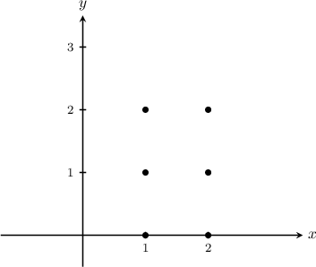
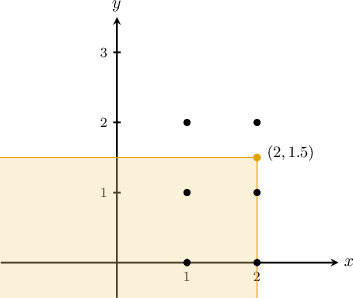
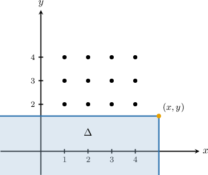
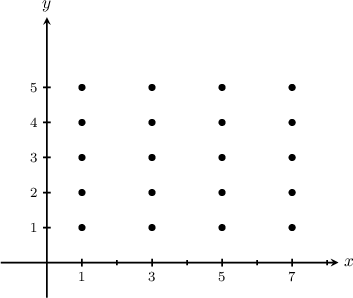
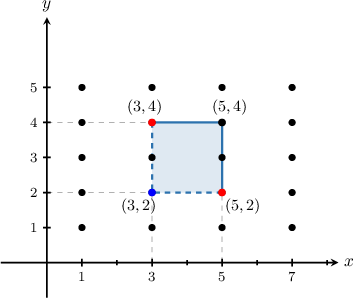
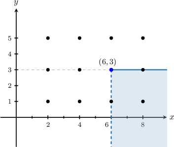
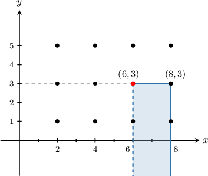
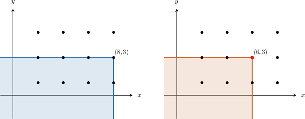

# The Joint CDF of Two Discrete Random Variables

Source: https://www.mathacademy.com/topics/3004?courseId=154
Topic ID: 3004

## Prerequisites

- [Double Summations](./1983-double-summations.md)
- [Cumulative Distribution Functions for Discrete Random Variables](../discrete-mathematics/2024-cumulative-distribution-functions-for-discrete-random-variables.md)
- [Joint Distributions for Discrete Random Variables](./3001-joint-distributions-for-discrete-random-variables.md)

## Lesson

### Introduction

The **joint cumulative distribution function** (or joint CDF) of two discrete random variables $X,$ and $Y$ is defined as

$$

F(x,y) = P( X \leq x, Y \leq y) = \sum\limits_{x_i \leq x} \sum\limits_{y_i \leq y} f(x_i, y_i).

$$

The sets $S_X$ and $S_Y,$ on which the variables $X$ and $Y$ are defined, are the **supports** of $X$ and $Y,$ respectively.

We can see from this definition that the joint CDF is analogous to the cumulative distribution function of a single random variable.

Consider the joint PMF for the discrete random variables $X$ and $Y,$ shown below.

Here, the supports of $X$ and $Y$ are $S_X = \{0, 1 \}$ and $S_Y = \{0, 1, 2 \},$ respectively.

As an example, let's compute $F(1,1).$ By definition, we have

$$

\begin{aligned}𝐹(1,1) & =𝑃(𝑋≤1,𝑌≤1).\end{aligned}

$$

We start by highlighting all cells in the table that correspond to $X \leq 1, Y \leq 1.$

Therefore,

$$

\begin{aligned}𝐹(1,1) & =𝑓(0,0)+𝑓(0,1)+𝑓(1,0)+𝑓(1,1) \\ & =0.1+0.2+0.3+0.2 \\ & =0.8.\end{aligned}

$$

### Example: Evaluating a Joint CDF

#### Question

Let $X$ and $Y$ be discrete random variables with the joint probability mass function $f(x,y)$ shown below.

If $F(x,y)$ is the joint CDF of $X$ and $Y,$ find $F\left(2,1\right).$

#### Explanation

If $X$ and $Y$ are discrete random variables with the joint probability mass function $f(x,y),$ then the corresponding joint CDF is given by

$$

F(x,y) = P(X \leq x, Y \leq y) = \sum\limits_{x_i \leq x} \sum\limits_{y_i \leq y} f(x_i, y_i).

$$

By definition, we have

$$

\begin{aligned}𝐹(2,1) & =𝑃(𝑋≤2,𝑌≤1).\end{aligned}

$$

We start by highlighting all cells in the table that correspond to $X \leq 2, Y \leq 1.$

Therefore, we obtain

$$

\begin{aligned}𝐹(2,1) & =\underset{𝑥≤2}{∑}\underset{𝑦≤1}{∑}𝑓(𝑥,𝑦) \\ & =𝑓(1,−2)+𝑓(1,−1)+𝑓(1,0) \\ & =0.1+0.3+0.05 \\ & =0.45.\end{aligned}

$$

### Geometric Interpretation of the Joint CDF

Consider the joint PMF for the discrete random variables $X$ and $Y,$ shown below.

We can think of each point where $f(x,y)\neq 0$ as a point mass in the plane, where the "probability mass" at each point equals the probability associated with that point.

Now, the joint CDF is given by

$$

F(x,y) = \sum\limits_{x_i \leq x} \sum\limits_{y_i \leq y} f(x_i, y_i).

$$

Geometrically, then, the joint CDF gives the total "probability mass" that lies inside the infinite rectangular region that has its top-right corner at $(x,y)$ and whose sides are parallel to the coordinate axes.

For example, consider the point $(2,1.5)$ and the infinite rectangular region that has its top-right corner at this point, shown below.

The value of $F(2,1.5)$ equals the total "probability mass" contained within this rectangle. That is,

$$

F(2,1.5) = f(1,0) + f(2,0) + f(1,1) + f(2,1).

$$

It's worth highlighting a few important cases:

- If our rectangular region doesn't include any points where the probability is nonzero, then we must have $F(x,y) = 0.$

- If our rectangular region includes *all* points where the probability is nonzero, then we must have $F(x,y) = 1.$

Finally, we note the following properties of the joint CDF:

- $0 \leq F(x,y) \leq 1$

- The marginal CDF of $X$ is given by $F_X(x) = F(x, \infty).$

- The marginal CDF of $Y$ is given by $F_Y(y) = F(\infty, y).$

- $F(\infty, \infty) = 1$

- $F(-\infty,y) = F(x, -\infty) = 0$

- If $X$ and $Y$ are independent random variables, then $F(x,y) = F_X(x) \cdot F_Y(y).$

### Example: Interpreting the Joint CDF Geometrically

#### Question

Suppose and are discrete random variables. Let the joint CDF of and be where the supports of and, respectively, are

Find an expression for the corresponding joint CDF when

#### Explanation

If and are discrete random variables with the joint probability mass function then the corresponding joint CDF is given by

Note the following:

- We can think of each point where as a point mass in the plane, where the "probability mass" at each point equals the probability associated with that point.

- The joint CDF is the total "probability mass" that lies in the infinite rectangular region that has its top-right corner at and whose sides are parallel to the coordinate axis.

Given the supports of and the joint support is a subset of

Let's sketch the points in which contains the joint support. Let's also consider a point where and and a region that lies below and to the left of this point.

Since every value in the support of is at least and there are no support points satisfying Therefore,

### Example: Finding Cumulative Probabilities Given Values From the Joint CDF

#### Question

Suppose and are discrete random variables. Let the joint CDF of and be where

and the supports of and, respectively, are

Find

#### Explanation

Note the following:

- For a given joint PMF we can think of each point where as a point mass in the plane, where the "probability mass" at each point equals the probability associated with that point.

- The joint CDF is the total "probability mass" that lies in the infinite rectangular region that has its top-right corner at and whose sides are parallel to the coordinate axis.

Given the supports of and the joint support is a subset of

Let's sketch the points in which contains the joint support.

Let's sketch the region corresponding to the probability we wish to find.

Geometrically, this region can be obtained as follows:

1. Take the infinite rectangle that has its top-right corner at

2. Subtract the infinite rectangles that have their top-right corners at and

3. Finally, we need to add back the infinite rectangle that has its top-right corner at This is because we subtracted this region twice in step 2.

Therefore, we have

### Example: Further Finding Cumulative Probabilities Given Values From the Joint CDF

#### Question

Suppose and are discrete random variables. Let the joint CDF of and be where

and the supports of and, respectively, are

Find

#### Explanation

Note the following:

- For a given joint PMF we can think of each point where as a point mass in the plane, where the "probability mass" at each point equals the probability associated with that point.

- The joint CDF is the total "probability mass" that lies in the infinite rectangular region that has its top-right corner at and whose sides are parallel to the coordinate axis.

Given the supports of and the joint support is a subset of

Let's plot the points in which contains the joint support, and sketch the region corresponding to the probability we wish to find.

Notice that this region encompasses the same possible support points as the infinite rectangle with its top-right corner at and top-left corner at where the top and right boundaries are included, and the left boundary is excluded.

Geometrically, this region can be obtained by taking all points in the infinite rectangle that has its top-right corner at (the blue region below) and ** all points in the infinite rectangle that has its top-right corner at (the red region below).

Therefore, we have
