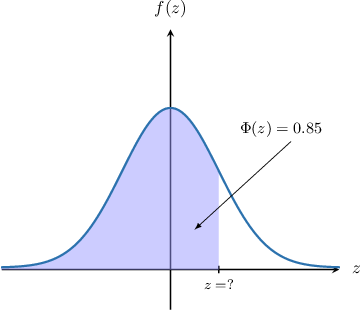
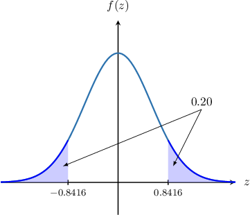

# Percentage Points of the Standard Normal Distribution

Source: https://www.mathacademy.com/topics/3214?courseId=154
Topic ID: 3214

## Prerequisites

- [Introduction to Inverse Functions](../algebra-i/753-introduction-to-inverse-functions.md)
- [Symmetry Properties of the Standard Normal Distribution](./4420-symmetry-properties-of-the-standard-normal-distribution.md)

## Lesson

### Introduction

When working with normally distributed random variables, we often want to find a value of $z$ that gives rise to a specific probability.

For example, suppose that $Z\sim N(0,1),$ and we wish to find the value of $z$ such that

$$

P(Z\leq z) = 0.85.

$$

Therefore, our problem is to find a value of $z$ such that $\Phi(z) = 0.85.$

A good place to start is the CDF table for $\Phi(z)$ around the $z$-values where $\Phi(z)\approx 0.85.$ This part of the table is shown below.

There is no listed value of $z$ where $\Phi(z) = 0.85$ exactly. However, notice that there are values where $\Phi(z)$ is slightly below and slightly above $0.85{:}$

- $\Phi(1.03) = 0.8485 < 0.85$

- $\Phi(1.04) = 0.8508 > 0.85$

Therefore, the required value of $z$ must lie between $1.03$ and $1.04.$ To approximate this value of $z,$ we take the average of these two numbers:

$$

z = \dfrac{1.03 + 1.04}{2} = 1.035

$$

Therefore, we conclude that

$$

\Phi(1.035) \approx 0.85.

$$

Taking the average of two numbers on an interval to find an improved approximation is known as **interval bisection**.

### Example: Estimating the Z-Score for a Given Probability Using Interval Bisection

#### Question

Approximate the value of $z$ such that $P(Z \leq z) = 0.1450$ using interval bisection.

#### Explanation

First, we find the two numbers in the table that $0.1450$ lies between. These numbers are $0.1446$ and $0.1469.$ So, we have the following inequality:

$$

\begin{aligned}0.1446 & <0.1450<0.1469\end{aligned}

$$

Writing the above inequality in terms of $\Phi,$ we have

$$

\begin{aligned}Φ(−1.06) & <Φ(𝑧)<Φ(−1.05).\end{aligned}

$$

So, using interval bisection, we can approximate $z$ as

$$

z \approx \dfrac{-1.06 + (-1.05)}{2} = -1.055.

$$

### Using a Percentage Table To Find the Z-Score for a Given Probability

One final way to find the $z$-score for a given probability is to simply look it up in a **percentage points table**, such as the one below.

This table gives the values of $\Phi^{-1}(p)$ for different values of $p,$ where $p = \Phi(z)$ is the cumulative distribution function for the standard normal distribution.

Let's use the table above to find $z$ such that $P(Z \leq z) = 0.75.$ First, we express the given information in terms of $\Phi{:}$

$$

\begin{aligned}𝑃(𝑍≤𝑧) & =0.75 \\ Φ(𝑧) & =0.75\end{aligned}

$$

So, we are looking for the value of $z$ such that

$$

z = \Phi^{-1}(0.75).

$$

We look for the column in the table that corresponds to $p=0.75,$ and we find that

$$

p = 0.75 \quad \Rightarrow \quad \Phi^{-1}(p) = 0.6745.

$$

Therefore, we have

$$

z = \Phi^{-1}(0.75) = 0.6745.

$$

### Example: Using a Percentage Points Table To Find the Z-Score for a Given Probability

#### Question

The table below gives the values of $\Phi^{-1}(p)$ for different values of $p,$ where $p = \Phi(z)$ is the cumulative distribution function for the standard normal distribution. Find the value of $z$ such that $P(Z \leq z) = 0.60.$

#### Explanation

First, we express the given information in terms of $\Phi{:}$

$$

\begin{aligned}𝑃(𝑍≤𝑧) & =0.60 \\ Φ(𝑧) & =0.60\end{aligned}

$$

So, we are looking for the value of $z$ such that

$$

z = \Phi^{-1} (0.60).

$$

We look for the column in the table that corresponds to $p = 0.60,$ and we find that

$$

p = 0.60 \quad \Rightarrow \quad \Phi^{-1}(p) = 0.2533.

$$

Therefore, we have

$$

z = \Phi^{-1}(0.60) = 0.2533.

$$

### Example: Using a Percentage Points Table and Symmetry To Find the Z-Score for a Given Probability

#### Question

The table below gives the values of $\Phi^{-1}(p)$ for different values of $p,$ where $p = \Phi(z)$ is the cumulative distribution function for the standard normal distribution. Find the value of $z$ such that $P(Z \leq z) = 0.20.$

#### Explanation

From the table, notice that

$$

P(Z\leq 0.8416 ) = 0.80.

$$

Therefore, we have

$$

P(Z\geq 0.8416 ) = 1 - 0.80 = 0.20.

$$

By the symmetry of the standard normal distribution, we have

$$

\Phi(-0.8416) = 0.20.

$$

Therefore, we conclude that

$$

\begin{aligned}Φ(−0.8416) & =0.20 \\ 𝑃(𝑍≤−0.8416) & =0.20.\end{aligned}

$$

Finally, the required value of $z$ is $-0.8416.$
