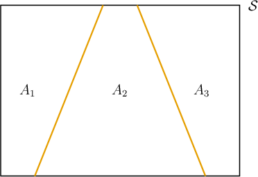
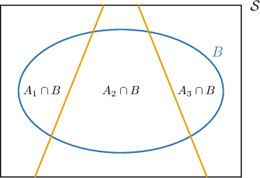

# Extending Bayes' Theorem

Source: https://www.mathacademy.com/topics/3286?courseId=154
Topic ID: 3286

## Prerequisites

- [Extending the Law of Total Probability](./971-extending-the-law-of-total-probability.md)
- [Bayes' Theorem](./3272-bayes-theorem.md)

## Lesson

### Introduction

In this lesson, we will generalize Bayes' theorem to deal with situations where the sample space $\mathcal S$ is partitioned into a disjoint union of multiple events.

Suppose we have three events $A_1,A_2,$ and $A_3$ that form a disjoint union of the sample space $\mathcal S,$ as shown below.

Now consider an event $B$ that also lies in the sample space:

Bayes' theorem states that

$$

P(A_1|B)=\dfrac{P(B|A_1)P(A_1)}{P(B)}.

$$

Now, the law of total probability tells us that

$$

P(B)=P(B|A_1)P(A_1) + P(B|A_2)P(A_2) + P(B|A_3)P(A_3).

$$

Substituting this into Bayes' theorem, we get

$$

P(A_1 | B) = \dfrac{P(B|A_1) P(A_1)}{P(B|A_1)P(A_1) + P(B|A_2)P(A_2) + P(B|A_3)P(A_3)} .

$$

Using similar arguments, we can say that for $A_k$ for $k=1,2,3,$ we have

$$

P(A_k | B) = \dfrac{P(B|A_k) P(A_k)}{P(B|A_1)P(A_1) + P(B|A_2)P(A_2) + P(B|A_3)P(A_3)}

$$

which is usually written more compactly as

$$

P(A_k | B) = \dfrac{P(B|A_k) P(A_k)}{\sum_{i=1}^3 P(B|A_i)P(A_i)}.

$$

It's easy to see how this generalizes. If the disjoint union $A_1 \sqcup A_2 \sqcup \ldots \sqcup A_n$ covers the entire sample space, Bayes' theorem combined with the law of total probability gives us the following:

$$

P(A_k | B) = \dfrac{P(B|A_k) P(A_k)}{\sum_{i=1}^n P(B|A_i)P(A_i)}

$$

Let's see an example of how to apply this theorem.

### Example: Computing a Conditional Probability Using Bayes' Theorem

#### Question

The disjoint union $A_1 \sqcup A_2 \sqcup A_3$ of events $A_1,A_2,A_3$ covers the entire sample space. Compute $P(A_1|B)$ given the following probabilities:

$$

\begin{aligned} & 𝑃(𝐵|𝐴_{1})=0.23, & \\ & 𝑃(𝐵|𝐴_{2})=0.26, & 𝑃(𝐴_{2})=0.3 \\ & 𝑃(𝐵|𝐴_{3})=0.18, & 𝑃(𝐴_{3})=0.4\end{aligned}

$$

#### Explanation

If the disjoint union $A_1 \sqcup A_2 \sqcup \ldots \sqcup A_n$ covers the entire sample space, Bayes' theorem combined with the law of total probability gives us the following:

$$

P(A_k | B) = \dfrac{P(B|A_k) P(A_k)}{P(B)} = \dfrac{P(B|A_k) P(A_k)}{\sum_{i=1}^n P(B|A_i)P(A_i)}

$$

where $k=1,2,\ldots,n.$

In our case, $n=3,$ and $A_1 \sqcup A_2 \sqcup A_3$ covers the entire sample space. Consequently, we have

$$

P(A_1) + P(A_2) + P(A_3) = 1.

$$

As a result,

$$

\begin{aligned}𝑃(𝐴_{1}) & =1−(𝑃(𝐴_{2})+𝑃(𝐴_{3})) \\ & =1−(0.3+0.4) \\ & =0.3.\end{aligned}

$$

Therefore,

$$

\begin{aligned}𝑃(𝐴_{1}|𝐵) & =\frac{𝑃(𝐵|𝐴_{1})𝑃(𝐴_{1})}{\underset{3𝑖=1}{\overset{}{∑}}𝑃(𝐵|𝐴_{𝑖})𝑃(𝐴_{𝑖})} \\ & =\frac{𝑃(𝐵|𝐴_{1})𝑃(𝐴_{1})}{𝑃(𝐵|𝐴_{1})𝑃(𝐴_{1})+𝑃(𝐵|𝐴_{2})𝑃(𝐴_{2})+𝑃(𝐵|𝐴_{3})𝑃(𝐴_{3})} \\ & =\frac{(0.23)(0.3)}{(0.23)(0.3)+(0.26)(0.3)+(0.18)(0.4)} \\ & =\frac{0.069}{0.219} \\ & ≈0.315.\end{aligned}

$$

### Example: Applying Bayes’ Theorem to a Situation in Context

#### Question

A travel agency offers three itineraries, itinerary $1,$ itinerary $2,$ and $3.$ For each itinerary, customers can choose to travel using their own car or the agency's bus.

- Itinerary $1$ is chosen by $25\%$ of the customers, and $60\%$ of those customers travel by bus.

- Itinerary $2$ is chosen by $30\%$ of the customers, and $30\%$ of those customers travel by bus.

- Itinerary $3$ is chosen by $45\%$ of the customers, and $20\%$ of those customers travel by bus.

If $65\%$ of all customers travel with children, and $40\%$ of customers with children choose the bus, what is the probability that a randomly chosen customer that chooses the bus travels with children? Round your answer to $3$ decimal places.

#### Explanation

Let $C$ be the event that a customer travels with children, $B$ be the event that a customer takes the bus, and $I_1, I_2, I_3$ be the event that a customer chooses itinerary $1,$ $2,$ or $3,$ respectively.

Let's break down the information given in the problem statement:

- From the bullet points, we have the following information: The disjoint union $I_1 \sqcup I_2 \sqcup I_3$ covers the entire sample space, and we have

- Since $65\%$ of customers have children, we have

- Since $40\%$ of customers with children choose the bus, we have

We want to find the probability that a randomly chosen customer that chooses the bus travels with children, which is represented as $P(C | B).$

Using Bayes' theorem combined with the law of total probability, we have

$$

\begin{aligned}𝑃(𝐶|𝐵) & =\frac{𝑃(𝐵|𝐶)𝑃(𝐶)}{𝑃(𝐵)} \\ & =\frac{𝑃(𝐵|𝐶)𝑃(𝐶)}{𝑃(𝐵|𝐼_{1})𝑃(𝐼_{1})+𝑃(𝐵|𝐼_{2})𝑃(𝐼_{2})+𝑃(𝐵|𝐼_{3})𝑃(𝐼_{3})} \\ & =\frac{(0.4)(0.65)}{(0.6)(0.25)+(0.3)(0.3)+(0.2)(0.45)} \\ & =\frac{0.26}{0.33} \\ & ≈0.788,\end{aligned}

$$

rounded to $3$ decimal places.

### Example: Solving for an Unknown Conditional Probability

#### Question

Potatoes produced by a particular farm come in three different varieties, variety $1,$ variety $2,$ and variety $3.$

- $36\%$ of the potatoes are of variety $1,$ and $20\%$ of those potatoes weigh more than $100\,\mathrm g.$

- $17\%$ of the potatoes are of variety $2,$ and $6\%$ of those potatoes weigh more than $100\,\mathrm g.$

- $47\%$ of the potatoes are of the variety $3.$

If $16\%$ of potatoes from the entire farm are sold to a local restaurant, $40\%$ of potatoes sold to the restaurant weigh more than $100\,\mathrm g,$ and $15\%$ of potatoes that weigh more than $100\,\mathrm g$ are sold to the restaurant, what is the probability that a randomly selected potato from variety $3$ weighs more than $100\,\mathrm g?$ Round your answer to $3$ decimal places.

#### Explanation

Let $R$ be the event that a potato is sold to the restaurant, $W$ be the event that a potato weighs more than $100\,\mathrm g,$ and $V_1, V_2, V_3$ be the event that a potato is of variety $1,$ $2,$ or $3,$ respectively.

Let's break down the information given in the problem statement:

- From the bullet points, we have the following information: The disjoint union $V_1 \sqcup V_2 \sqcup V_3$ covers the entire sample space, and we have

- Since $16\%$ of potatoes from the entire farm are sold to a local restaurant, we have

- Since $40\%$ potatoes sold to the restaurant weigh more than $100\,\mathrm g,$ we have

- Since $15\%$ of potatoes that weigh more than $100\,\mathrm g$ are sold to the restaurant, we have

We want to find the probability that a randomly chosen potato of variety $3$ weighs more than $100\,\mathrm g,$ which is represented as $P(W | V_3).$

Using Bayes' theorem combined with the law of total probability, we have

$$

\begin{aligned}𝑃(𝑅|𝑊) & =\frac{𝑃(𝑊|𝑅)𝑃(𝑅)}{𝑃(𝑊)} \\ 𝑃(𝑅|𝑊) & =\frac{𝑃(𝑊|𝑅)𝑃(𝑅)}{𝑃(𝑊|𝑉_{1})𝑃(𝑉_{1})+𝑃(𝑊|𝑉_{2})𝑃(𝑉_{2})+𝑃(𝑊|𝑉_{3})𝑃(𝑉_{3})} \\ 0.15 & =\frac{(0.4)(0.16)}{(0.2)(0.36)+(0.06)(0.17)+𝑃(𝑊|𝑉_{3})(0.47)} \\ 0.15 & =\frac{0.064}{0.0822+0.47𝑃(𝑊|𝑉_{3})}.\end{aligned}

$$

Solving this equation for $P(W | V_3),$ we have

$$

\begin{aligned}0.15(0.0822+0.47𝑃(𝑊|𝑉_{3})) & =0.064 \\ 0.0822+0.47𝑃(𝑊|𝑉_{3}) & =\frac{0.064}{0.15} \\ 0.0822+0.47𝑃(𝑊|𝑉_{3}) & =\frac{32}{75} \\ 0.47𝑃(𝑊|𝑉_{3}) & =\frac{32}{75}−0.0822 \\ 𝑃(𝑊|𝑉_{3}) & =\frac{1}{0.47}(\frac{32}{75}−0.0822) \\ 𝑃(𝑊|𝑉_{3}) & ≈0.733\end{aligned}

$$

rounded to three decimal places.
