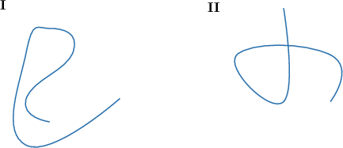
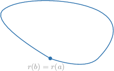
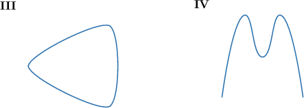
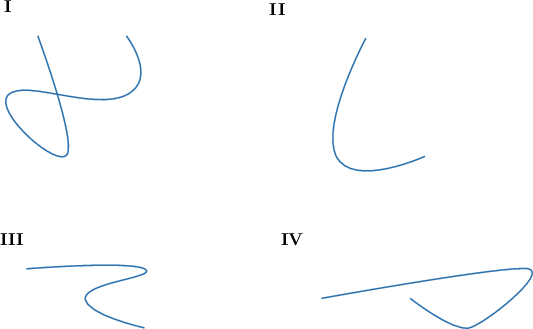
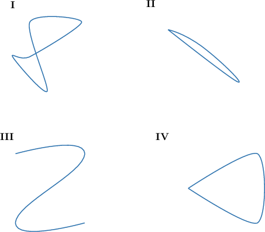
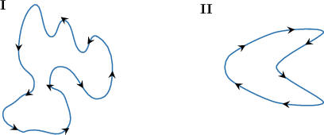
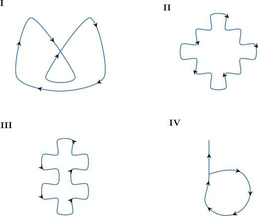

# Simple, Closed, and Oriented Curves

Source: https://www.mathacademy.com/topics/3356?courseId=154
Topic ID: 3356

## Prerequisites

- [Open and Closed Sets](./4097-open-and-closed-sets.md)

## Lesson

### Introduction

A plane curve

$$

\mathbf r:[a,b]\to \Bbb R^2

$$

is said to be **simple** if it doesn’t intersect itself anywhere between its endpoints. Notice that this means that

$$

\mathbf r(t_1)\neq \mathbf r(t_2), \qquad a < t_1< t_2 < b.

$$

For example, curve I shown below is simple while curve II is not simple.

A plane curve is said to be **closed** if its terminal point coincides with its initial point, that is, if

$$

\mathbf r(b)= \mathbf r(a).

$$

For example, curve III shown below is closed, while curve IV is not:

**Watch out!** Curve III is an example of both a closed and simple curve. Notice that an example of a closed but *not* simple curve looks as shown below.

### Example: Identifying Simple Curves

#### Question

Which of the following curves is ** simple?

#### Explanation

A simple curve is a curve that doesn’t intersect itself anywhere between its endpoints.

So, a curve that intersects itself somewhere between its endpoints is not a simple curve. Among the given options, the only that is not a simple curve is the following:

Therefore, the correct option is diagram I.

### Example: Identifying Closed Curves

#### Question

Which of the following curves is ** closed?

#### Explanation

A curve is closed if its terminal point coincides with its initial point. So, a curve whose terminal point does not coincide with its initial point is not closed.

Of the given options, the only one that is not a closed curve is the following:

Therefore, the correct option is diagram III.

### Oriented Curves

A very important (although very hard to prove) result in mathematics states the following:

Any simple and closed curve divides the plane into exactly two regions, one inside the curve and one outside.

Based on this fact, we can define the **orientation** of a simple closed curve as follows:

A simple closed curve is **positively oriented** if, when traveling along it, one always has the curve interior to the left and the curve exterior to the right. Otherwise, the curve is **negatively oriented**.

For example, curve I shown below is positively oriented, while curve II is negatively oriented:

An alternative convenient way of looking at simple oriented curves is that a curve is positively oriented if it is traversed *counterclockwise* and it is negatively oriented if it is traversed *clockwise*.

### Example: Identifying Oriented Curves

#### Question

Which of the following curves is simple, closed, and negatively oriented?

#### Explanation

A simple closed curve is positively oriented if, when traveling along it, one always has the curve interior to the left and the curve exterior to the right. Otherwise, the curve is negatively oriented.

A curve is positively oriented if it is traversed counterclockwise and is negatively oriented if it is traversed clockwise.

With that in mind, let's examine each of the curves:

- Curve I is not simple.

- Curve II is simple, closed, negatively oriented. The arrows indicate that the curve is traversed clockwise.

- Curve III is a simple and closed curve but it is not negatively oriented. The arrows indicate that the curve is traversed counterclockwise, so it is positively oriented.

- Curve IV is neither simple nor closed.

Therefore, the correct answer is "II only."
