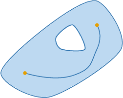
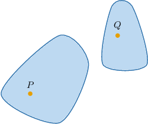
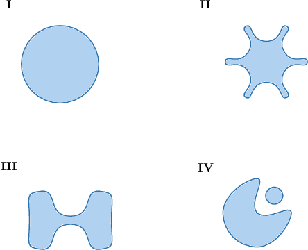
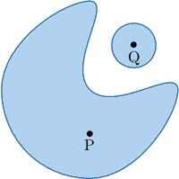
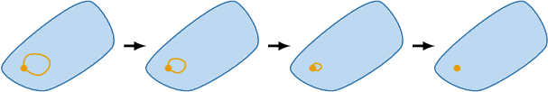
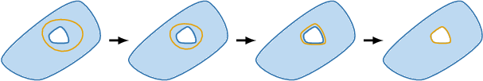
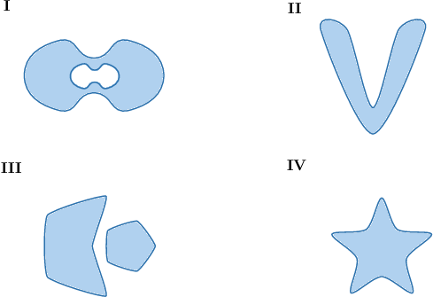

# Connected and Simply-Connected Regions

Source: https://www.mathacademy.com/topics/3357?courseId=154
Topic ID: 3357

## Prerequisites

- [Simple, Closed, and Oriented Curves](./3356-simple-closed-and-oriented-curves.md)

## Lesson

### Introduction

A region $D$ is **connected** if every pair of points in $D$ can be joined by a smooth curve or a path that lies entirely in $D.$

The region below is connected because a smooth path can join any two points.

The region below is not connected. If we take two points $P$ and $Q,$ one in each subregion, we cannot find a path joining these points that lies entirely in the region.

### Example: Identifying Connected Regions

#### Question

Which of the following regions are connected?

#### Explanation

A region $D$ is connected if every pair of points in $D$ can be joined by a smooth curve or a path in $D.$

Among the given options, only regions I, II, and III satisfy this definition.

Region IV does not satisfy this definition. Note that if we take two points $P$ and $Q$, as shown below, there is no path lying entirely within the region that connects them.

### Simply-Connected Regions

A connected region $D$ is **simply connected** if every simple closed curve in $D$ can be contracted to a point.

When we have a connected *plane* region (e.g. a region in the $xy$-plane), determining whether it's simply connected is a little simpler: we just need to check whether the region contains holes.

Plane regions containing holes are not simply connected, since some simple closed curves cannot be contracted to a point:

So, if a connected plane region does not contain any holes, then it is simply connected.

More precisely, a connected *plane* region $D$ is simply connected if every simple closed curve in $D$ encloses only points in $D.$

### Example: Identifying Simply-Connected Regions

#### Question

Which of the regions shown below are simply connected?

#### Explanation

A connected region $D$ is simply connected if every simple closed curve in $D$ can be contracted to a point.

A connected ** region $D$ is simply connected if every simple closed curve in $D$ encloses only points in $D.$ In other words, the region does not contain any holes. Plane regions containing holes are not simply connected, since some simple closed curves cannot be contracted to a point:

With that in mind, let's examine each of the regions:

- Region I is not simply connected. Instead, this is a connected region that contains a hole.

- Region II is simply connected. This is a connected region that does not contain holes.

- Region III is not simply connected. Instead, this is a region that consists of two pieces (it's not connected).

- Region IV is simply connected. This is a connected region that does not contain holes.

Therefore, the correct answer is "II and IV only."

### Example: Identifying Simply-Connected Regions in Euclidian Space

#### Question

Which of the following regions are simply connected?

1. $\{(x,y) \in \mathbb R^2 \: | \: y-x\geq 0\}$

2. $\{(x,y) \in \mathbb R^2 \: | \: (x,y)\neq (0,0)\}$

3. $\{(x,y)\in \mathbb R^2 \: | \: x^2+y^2> 4\}$

#### Explanation

A connected region $D$ is simply connected if every simple closed curve in $D$ can be contracted to a point.

A connected ** region $D$ is simply connected if every simple closed curve in $D$ encloses only points in $D.$ In other words, the region does not contain any holes. Plane regions containing holes are not simply connected, since some simple closed curves cannot be contracted to a point:

Let's now examine our regions in turn.

- Region I is simply connected. Indeed, it is the half-plane $y \geq x.$ So, it's a plane region without holes.

- Region II is ** simply connected since it's a plane region with a hole at $(0,0).$

- Region III is ** simply connected since it's a plane region with a hole. In this case, the hole contains all points on the disc $x^2+y^2 \leq 4$.

Therefore, the correct answer is "I only."
