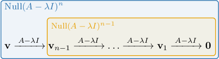

# Ranks of Generalized Eigenvectors

Source: https://www.mathacademy.com/topics/3633?courseId=154
Topic ID: 3633

## Prerequisites

- [Generalized Eigenvectors](./2738-generalized-eigenvectors.md)
- [The Rank-Nullity Theorem](./3836-the-rank-nullity-theorem.md)

## Lesson

### Introduction

For some $n\times n$ matrices, it's possible to construct a basis of $\mathbb{R}^n$ consisting entirely of linearly independent eigenvectors of the matrix.

For example, the matrix

$$

\begin{aligned}4 & 0 & 0 \\ 0 & 2 & 1 \\ 0 & 0 & 5\end{aligned}

$$

has eigenvalues $\lambda_1 = 5, \lambda_2 = 4,$ and $\lambda_3 = 2,$ with corresponding linearly independent eigenvectors

$$

\begin{aligned}0 \\ 1 \\ 3\end{aligned}

$$

These eigenvectors form a basis of $\mathbb R^3.$

However, there exist $n\times n$ matrices whose eigenvectors do *not* form a basis of $\mathbb R^n.$

For example, the matrix

$$

\begin{aligned}4 & 0 & 0 \\ 0 & 4 & 1 \\ 0 & 0 & 4\end{aligned}

$$

has the single eigenvalue ${\color{black}\lambda=4}$ of algebraic multiplicity $3.$ However, there are only two linearly independent eigenvectors corresponding to this eigenvalue, namely

$$

\begin{aligned}1 \\ 0 \\ 0\end{aligned}

$$

Since there are only two linearly independent eigenvectors corresponding to this eigenvalue, we say that the **geometric multiplicity** of ${\color{black}\lambda=4}$ equals $2.$

### Forming a Basis Using Generalized Eigenvectors

So, not every $n\times n$ matrix has the property that its eigenvectors form a basis of $\mathbb R^n.$

Despite this, we have the following theorem:

*For any real $n \times n$ matrix, there is a basis of $\mathbb{R}^n$ consisting of generalized eigenvectors of the matrix.*

To illustrate, let's go back to our matrix

$$

\begin{aligned}4 & 0 & 0 \\ 0 & 4 & 1 \\ 0 & 0 & 4\end{aligned}

$$

where the eigenvectors corresponding to the single eigenvalue $\lambda = 4$ are

$$

\begin{aligned}1 \\ 0 \\ 0\end{aligned}

$$

Remember that $\lambda = 4$ has *algebraic* multiplicity $3$ and *geometric* multiplicity $2.$

Now, it's easy to show that $A$ has a generalized eigenvector of rank $2$ given by

$$

\begin{aligned}0 \\ 0 \\ 1\end{aligned}

$$

and our generalized eigenvectors form the following chains:

$$

\begin{aligned}\underset{𝐰}{\underset{}\begin{aligned}0 \\ 0 \\ 1\end{aligned}}}\overset{}{𝐴−4𝐼\,}\underset{𝐯}{\underset{}\begin{aligned}0 \\ 1 \\ 0\end{aligned}}}\overset{}{𝐴−4𝐼\,}𝟎 & \\ \underset{𝐮}{\underset{}\begin{aligned}1 \\ 0 \\ 0\end{aligned}}}\overset{}{𝐴−4𝐼\,}𝟎 & \end{aligned}

$$

Clearly, ${\color{blue}{\mathbf{u}}}, {\color{blue}{\mathbf{v}}},$ and $\color{red}\mathbf{w}$ form a basis of $\mathbb R^3.$ In particular, our basis consists of

- two eigenvectors ($\color{blue}\mathbf{u}$ and $\color{blue}\mathbf{v}$), and

- one generalized eigenvector whose rank is greater than one ($\color{red}\mathbf{w}$).

Notice that the number of generalized eigenvectors of rank greater than $1$ equals

$$

\begin{aligned}algebraic multiplicity−geometric multiplicity & =3−2=1.\end{aligned}

$$

This is no coincidence. In general, we have the following theorem:

*The number of generalized eigenvectors of rank greater than $1$ that correspond to an eigenvalue $\lambda$ equals the difference between the algebraic multiplicity and the geometric multiplicity of $\lambda.$*

### A Second Example

Suppose that a matrix $A$ has the characteristic polynomial

$$

p(\lambda) = \lambda^4 (1-\lambda)^3(1+\lambda)^7,

$$

and that there are precisely $4$ linearly independent eigenvectors corresponding to $\lambda = -1.$

If a basis of $\mathbb{R}^{14}$ consists of linearly independent generalized eigenvectors of $A$, how many of these generalized eigenvectors of rank greater than $1$ correspond to the eigenvalue $\lambda = -1?$

We note the following:

- In the characteristic polynomial, the root $\lambda =-1$ has multiplicity $7.$ So, the *algebraic* multiplicity of $\lambda = -1$ is $7.$

- However, we're told that there are only $4$ eigenvectors corresponding to $\lambda = -1.$ So, the *geometric* multiplicity of $\lambda = -1$ is $4.$

Therefore, the number of generalized eigenvectors of rank greater than $1$ corresponding to $\lambda = -1$ is

$$

7-4=3.

$$

### Example: Finding the Number of Generalized Eigenvectors of Rank Greater Than One

#### Question

Suppose that a matrix $A$ has characteristic polynomial $p(\lambda) = (1+\lambda) (4-\lambda)^3(\lambda-1)^5,$ and for the eigenvalue $\lambda = 1,$ there are exactly $3$ eigenvectors. If a basis of $\mathbb{R}^{9}$ consists of linearly independent generalized eigenvectors of $A$, how many of these generalized eigenvectors of rank greater than $1$ correspond to the eigenvalue $\lambda = 1?$

#### Explanation

The number of generalized eigenvectors of rank greater than $1$ that correspond to an eigenvalue $\lambda$ equals the difference between the algebraic multiplicity and the geometric multiplicity of $\lambda.$

In the characteristic polynomial

$$

p(\lambda) = (1+\lambda) (4-\lambda)^3(\lambda-1)^5,

$$

we see that the root $\lambda = 1$ has multiplicity $5.$ So the algebraic multiplicity of the eigenvalue $\lambda = 1$ is $5.$

However, there are only $3$ eigenvectors corresponding to the eigenvalue $\lambda = 1,$ so the geometric multiplicity of the eigenvalue $\lambda = 1$ is $3.$

Therefore, the number of generalized eigenvectors of rank greater than $1$ corresponding to $\lambda = 1$ is $5-3=2.$

### The Number of Generalized Eigenvectors of a Given Rank for a Given Eigenvalue

Recall that a generalized eigenvector of rank $n$ corresponding to the eigenvalue $\lambda$ of $A$ is a nonzero vector $\mathbf{v}$ such that

$$

\mathbf{v} \xrightarrow{A- \lambda I} \mathbf{v}_{n-1} \xrightarrow{A- \lambda I} \ldots \xrightarrow{A- \lambda I} \mathbf{v}_1 \xrightarrow{A- \lambda I} \mathbf{0},

$$

where $\mathbf{v}_{n-1}, \mathbf{v}_{n-2},\ldots, \mathbf{v}_{1} \neq \mathbf{0}.$ In other words, $A-\lambda I$ maps $\mathbf{v}$ to $\mathbf{0}$ in $n$ steps. This is equivalent to the following:

$$

(A - \lambda I)^n \mathbf{v} = \mathbf{0} \qquad \textrm{and} \qquad (A - \lambda I)^{n-1} \mathbf{v} \neq \mathbf{0}.

$$

By the definition of the null space of a matrix, $(A - \lambda I)^k \mathbf{v} = \mathbf{0}$ if and only if $\mathbf{v} \in \text{Null}(A-\lambda I)^k.$ This, in turn, means that a generalized eigenvector of rank $n$ lies in $\text{Null}(A-\lambda I)^n$ but not in $\text{Null}(A-\lambda I)^{n-1}.$

For example, suppose that a matrix $A$ has the characteristic polynomial

$$

p(\lambda) = (5-\lambda)^6(\lambda-3)^2(\lambda+4)^5.

$$

In addition, let's assume the following:

- The nullity of $(A+4I)^3$ equals $2.$

- The nullity of $(A+4I)^4$ equals $3.$

If a basis of $\mathbb{R}^{13}$ consists of linearly independent generalized eigenvectors of $A$, how many of these are generalized eigenvectors of rank $4$ corresponding to the eigenvalue $\lambda = -4?$

For the given matrix $A$ with eigenvalue $\lambda = -4,$ a generalized eigenvector of rank $4$ is a vector $\mathbf{v}$ such that

$$

(A + 4I)^4 \mathbf{v} = \mathbf{0} \qquad \textrm{and} \qquad (A + 4I)^3 \mathbf{v} \neq \mathbf{0}.

$$

Notice the following:

- We are given that $\text{Null}(A+4I)^3$ has dimension $2.$ This means that the solutions to $(A +4I)^3 \mathbf{v} = \mathbf{0}$ form a subspace of dimension $2.$

- We are given that $\text{Null}(A+4I)^4$ has dimension $3.$ This means that the solutions to $(A +4I)^4 \mathbf{v} = \mathbf{0}$ form a subspace of dimension $3.$

Now, since $\text{Null}(A+4I)^3$ is a subspace of dimension $2$ in $\text{Null}(A+4I)^4$, which is a subspace of dimension $3,$ our basis can contain only $1$ vector that lies in $\text{Null}(A+4I)^4$ but does not lie in $\text{Null}(A+4I)^3.$

Therefore, there will be

$$

\text{nullity}(A+4I)^4 - \text{nullity}(A+4I)^3 = 3-2=1

$$

generalized eigenvector of rank $4$ corresponding to the eigenvalue $\lambda=-4.$

In general, we have the following theorem:

*The number of linearly independent generalized eigenvectors of rank $n$ corresponding to the eigenvalue $\lambda$ of a matrix $A$ is equal to*

### Example: Finding the Number of Generalized Eigenvectors of a Given Rank Using Nullity

#### Question

Suppose that a matrix $A$ has characteristic polynomial $p(\lambda) = (3+\lambda)^3(\lambda-\pi)^8(\lambda-2)^3,$ the nullity of $(A-\pi I)^3$ equals $4,$ and the nullity of $(A-\pi I)^4$ equals $6.$ If a basis of $\mathbb{R}^{14}$ consists of linearly independent generalized eigenvectors of $A$, how many of these are generalized eigenvectors of rank $4$ corresponding to the eigenvalue $\lambda = \pi?$

#### Explanation

For the given matrix $A$ with eigenvalue $\lambda = \pi,$ a generalized eigenvector of rank $4$ is a vector $\mathbf{v}$ such that

$$

(A - \pi I)^4 \mathbf{v} = \mathbf{0} \quad \textrm{and} \quad (A - \pi I)^3 \mathbf{v} \neq \mathbf{0}.

$$

Notice the following:

- We are given that $\text{Null}(A-\pi I)^3$ has dimension $4.$ This means that the solutions to $(A - \pi I)^3 \mathbf{v} = \mathbf{0}$ form a subspace of dimension $4.$

- We are given that $\text{Null}(A-\pi I)^4$ has dimension $6.$ This means that the solutions to $(A - \pi I)^4 \mathbf{v} = \mathbf{0}$ form a subspace of dimension $6.$

Now, since $\text{Null}(A-\pi I)^3$ is a subspace of dimension $4$ in $\text{Null}(A-\pi I)^4$, which is a subspace of dimension $6,$ our basis can contain only $2$ vectors that lie in $\text{Null}(A-\pi I)^4$ but not in $\text{Null}(A-\pi I)^3.$

Therefore, there will be

$$

\text{nullity}(A-\pi I)^4 - \text{nullity}(A-\pi I)^3 = 6-4=2

$$

generalized eigenvectors of rank $4$ corresponding to the eigenvalue $\lambda=\pi.$

### Example: Finding the Number of Generalized Eigenvectors of a Given Rank

#### Question

Suppose that a matrix $A$ has characteristic polynomial $p(\lambda) = (\lambda-4)^6(\lambda-9)^8,$ the rank of $(A-9I)^3$ equals $9,$ and the rank of $(A-9I)^4$ equals $7.$ If a basis of $\mathbb{R}^{14}$ consists of linearly independent generalized eigenvectors of $A$, how many of these are generalized eigenvectors of rank $4$ corresponding to the eigenvalue $\lambda = 9?$

#### Explanation

For the given matrix $A$ with eigenvalue $\lambda = 9,$ a generalized eigenvector of rank $4$ is a vector $\mathbf{v}$ such that

$$

(A - 9I)^4 \mathbf{v} = \mathbf{0} \quad \textrm{and} \quad (A - 9I)^3 \mathbf{v} \neq \mathbf{0}.

$$

Notice that $A$ must be a $14 \times 14$ matrix.

- Since the rank of $(A-9I)^3$ equals $9,$ then by the rank-nullity theorem, we have that So, the solutions to $(A - 9I)^3 \mathbf{v} = \mathbf{0}$ form a subspace $\text{Null}(A-9I)^3$ of dimension $5$ in $\mathbb{R}^{14}.$

- Since the rank of $(A-9I)^4$ equals $7,$ then by the rank-nullity theorem, we have that So, the solutions to $(A - 9I)^4 \mathbf{v} = \mathbf{0}$ form a subspace $\text{Null}(A-9I)^4$ of dimension $7$ in $\mathbb{R}^{14}.$

Since $\text{Null}(A-9I)^3$ is a subspace of dimension $5$ in $\text{Null}(A-9I)^4$, which is a subspace of dimension $7,$ our basis can contain only $2$ vectors that lie in $\text{Null}(A-9I)^4$ but not in $\text{Null}(A-9I)^3.$

Therefore, there will be

$$

\text{nullity}(A-9I)^4 - \text{nullity}(A-9I)^3 = 7-5=2

$$

generalized eigenvectors of rank $4$ corresponding to the eigenvalue $\lambda=9.$
